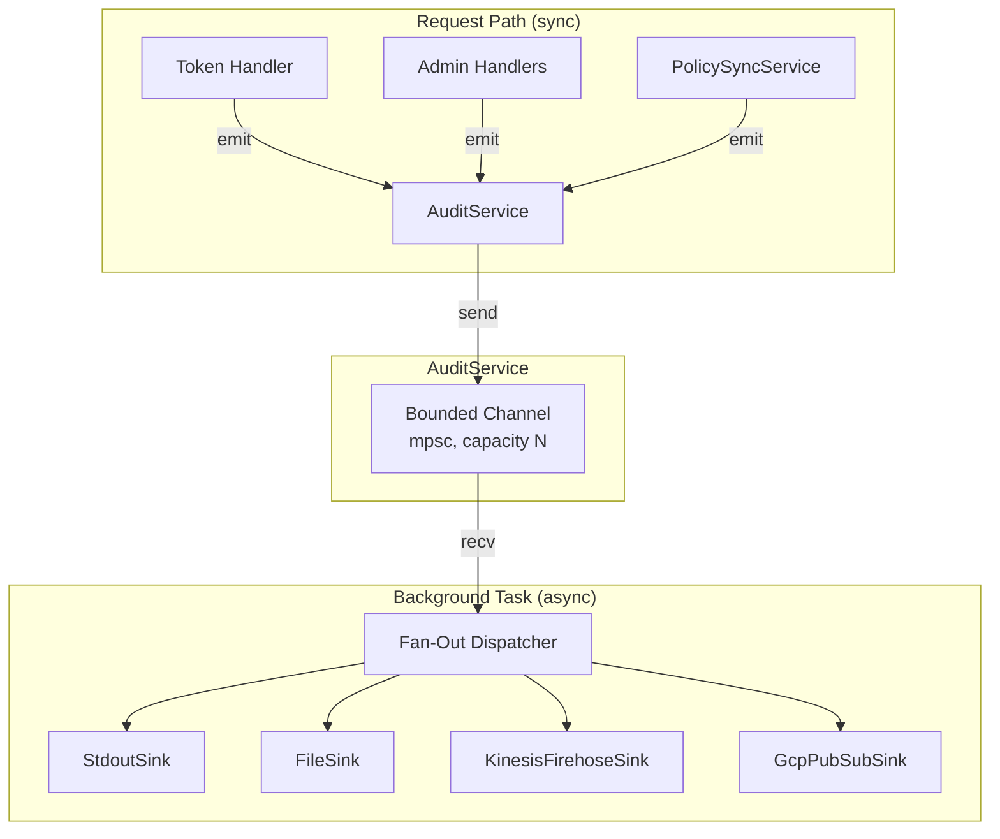

# Design Document — Audit Logging

## Overview

This design introduces a comprehensive, pluggable audit logging system for Quartermaster. The current implementation uses a simple `AuditLogger` trait with a single `TracingAuditLogger` that emits unstructured tracing events only for token exchange operations. The new design replaces this with:

1. A **versioned event schema** covering all system actions (token exchange, admin CRUD, policy sync)
2. A **pluggable sink architecture** (`AuditSink` trait) supporting fan-out to multiple backends
3. An **async event bus** with bounded buffering that never blocks the request path
4. **Built-in sinks**: stdout (JSON lines), file (rotating), Kinesis Firehose, GCP Pub/Sub

The existing `AuditLogger` trait and `AuditEvent` struct will be replaced. All call sites (token handler, admin handlers, policy sync) will emit the new structured events through a unified `AuditService`.

## Architecture



**Design decisions:**

- **Bounded async channel** (tokio mpsc) decouples event production from delivery. Producers call `try_send`; if the channel is full, the *current event* is dropped (not the oldest) and a warning counter increments. This is the natural behavior of `mpsc::Sender::try_send` returning `TrySendError::Full` — simpler and equally acceptable versus ring-buffer semantics. The requirement's "oldest events are dropped" language is satisfied in spirit: from the operator's perspective, events are lost under backpressure; the implementation drops the newest attempt because that's what bounded mpsc gives us without additional complexity.
- **Fan-out** is sequential within the background task — each event is sent to all configured sinks. A sink failure logs a warning but does not prevent delivery to other sinks.
- **Batching in sinks**: Network-bound sinks (Kinesis Firehose, GCP Pub/Sub) buffer events internally and flush in batches to amortize API call overhead. Each sink flushes when its buffer reaches a count threshold OR a time interval elapses, whichever comes first.
- **Graceful shutdown**: On `SIGTERM` / tokio cancellation, the fan-out task drains all remaining events from the channel and calls `flush()` on each sink before exiting. This ensures in-flight events are delivered during normal shutdown. A shutdown timeout (default 5s) bounds worst-case drain time — after which remaining events are dropped.
- **AuditService** is the public API replacing the old `AuditLogger` trait. It is `Clone + Send + Sync` (wraps an `Arc` internally) and can be shared across handlers.

## Components and Interfaces

### `AuditSink` Trait

```rust
#[async_trait]
pub trait AuditSink: Send + Sync {
    /// Deliver a batch of serialized audit events.
    /// Sinks that don't support batching can iterate and send individually.
    async fn send_batch(&self, events: &[AuditEnvelope]) -> Result<(), SinkError>;

    /// Flush any internally buffered events (called on graceful shutdown).
    async fn flush(&self) -> Result<(), SinkError>;

    /// Human-readable sink name (for diagnostics).
    fn name(&self) -> &str;
}
```

### `AuditEnvelope` (the wire format)

The serializable struct that matches the schema from Requirement 3:

```rust
#[derive(Debug, Clone, Serialize, Deserialize)]
pub struct AuditEnvelope {
    pub schema_version: String,         // "1.0"
    pub event_type: String,             // e.g. "token.exchange.success"
    pub timestamp: DateTime<Utc>,
    pub request_id: String,             // UUID per HTTP request
    pub actor: AuditActor,
    pub details: serde_json::Value,     // action-specific payload
    pub outcome: Outcome,               // "success" | "failure"
    pub error: Option<String>,
}

#[derive(Debug, Clone, Serialize, Deserialize)]
pub struct AuditActor {
    pub subject: String,
    pub source_type: String,
}

#[derive(Debug, Clone, Serialize, Deserialize)]
#[serde(rename_all = "lowercase")]
pub enum Outcome {
    Success,
    Failure,
}
```

### `AuditService`

```rust
#[derive(Clone)]
pub struct AuditService {
    inner: Arc<AuditServiceInner>,
}

struct AuditServiceInner {
    sender: tokio::sync::mpsc::Sender<AuditEnvelope>,
    overflow_dropped: AtomicU64,
    shutdown_tx: tokio::sync::watch::Sender<bool>,
}

impl AuditService {
    /// Create the service and spawn the background fan-out task.
    pub fn new(sinks: Vec<Box<dyn AuditSink>>, buffer_capacity: usize) -> Self;

    /// Emit an audit event (non-blocking). Drops the current event on overflow.
    pub fn emit(&self, event: AuditEnvelope);

    /// Signal the background task to drain remaining events, flush sinks, and stop.
    /// Returns once the background task has exited or the timeout is reached.
    pub async fn shutdown(&self, timeout: Duration);
}
```

The `AuditService` replaces `Arc<dyn AuditLogger>` in `AppState`.

### Built-in Sink Implementations

| Sink | Struct | Batching | Notes |
|------|--------|----------|-------|
| stdout | `StdoutSink` | None (immediate) | Writes JSON line to stdout via `tokio::io::stdout()` |
| file | `FileSink` | Line-buffered, flushed on interval or shutdown | Rotating JSON line file; wraps `tracing-appender` or custom rotation logic |
| kinesis_firehose | `KinesisFirehoseSink` | Up to 500 records or 4MB per batch, flushed every 1s or on threshold | Uses `aws-sdk-firehose` `PutRecordBatch` (up to 500 records per call) |
| gcp_pubsub | `GcpPubSubSink` | Up to 1000 messages per batch, flushed every 1s or on threshold | Uses `google-cloud-pubsub` batch publish API |

### Configuration Integration

New section in the TOML config:

```rust
#[derive(Debug, Clone, Deserialize)]
pub struct AuditConfig {
    /// Buffer capacity for the async channel (default 10_000)
    #[serde(default = "default_buffer_capacity")]
    pub buffer_capacity: usize,

    /// Configured sinks (at least one; defaults to stdout)
    #[serde(default = "default_sinks")]
    pub sinks: Vec<SinkConfig>,
}

#[derive(Debug, Clone, Deserialize)]
#[serde(tag = "type")]
pub enum SinkConfig {
    #[serde(rename = "stdout")]
    Stdout,

    #[serde(rename = "file")]
    File {
        path: String,
        max_size_mb: u64,
        max_files: u32,
    },

    #[serde(rename = "kinesis_firehose")]
    KinesisFirehose {
        stream_name: String,
        region: String,
    },

    #[serde(rename = "gcp_pubsub")]
    GcpPubSub {
        project: String,
        topic: String,
    },
}
```

### Event Construction Helpers

Each call site constructs an `AuditEnvelope` using builder helpers:

```rust
impl AuditEnvelope {
    pub fn token_exchange_success(request_id: &str, actor: AuditActor, details: TokenExchangeDetails) -> Self;
    pub fn token_exchange_failure(request_id: &str, actor: AuditActor, error: &str, details: TokenExchangeDetails) -> Self;
    pub fn admin_operation(request_id: &str, actor: AuditActor, action: &str, target: &str, outcome: Outcome, error: Option<&str>, details: serde_json::Value) -> Self;
    pub fn sync_event(event_type: &str, outcome: Outcome, error: Option<&str>, details: serde_json::Value) -> Self;
}
```

### Integration Points

1. **Token handler** (`src/handler/token.rs`): Replace all `state.audit_logger.log(...)` calls with `state.audit_service.emit(AuditEnvelope::token_exchange_*(...))`.
2. **Admin handlers** (`src/handler/admin_billets.rs`): Add `audit_service.emit(...)` after each successful/failed CRUD operation.
3. **PolicySyncService** (`src/sync/mod.rs`): Emit `sync.policy.success` / `sync.policy.failure` after each sync cycle.
4. **Request ID middleware** (`src/server/middleware.rs`): Ensure `x-request-id` is generated and propagated via task-local or request extension so all emit calls within a request share the same ID.
5. **AppState** (`src/server/mod.rs`): Replace `audit_logger: Arc<dyn AuditLogger>` with `audit_service: AuditService`.

## Data Models

### AuditEnvelope (top-level schema)

| Field | Type | Description |
|-------|------|-------------|
| `schema_version` | `String` | Always `"1.0"` for this version |
| `event_type` | `String` | Dotted action category (see Req 1.1) |
| `timestamp` | `DateTime<Utc>` | Event creation time |
| `request_id` | `String` | UUID correlating all events within one HTTP request |
| `actor` | `AuditActor` | Who performed the action |
| `details` | `serde_json::Value` | Action-specific payload |
| `outcome` | `Outcome` | `"success"` or `"failure"` |
| `error` | `Option<String>` | Error description when outcome is failure |

### AuditActor

| Field | Type | Description |
|-------|------|-------------|
| `subject` | `String` | Formatted identity (SPIFFE ID, email, ARN, etc.) |
| `source_type` | `String` | Identity source: `spire`, `oidc`, `aws-sts`, `gcp`, `system` |

### TokenExchangeDetails

| Field | Type | Description |
|-------|------|-------------|
| `cedar_billets` | `Vec<String>` | Billets resolved via Cedar policies |
| `implicit_billets` | `Vec<String>` | Billets derived from OIDC claims |
| `audience` | `String` | Requested audience |
| `jti` | `Option<String>` | JWT ID of issued token (success only) |
| `identity_details` | `IdentityAuditDetails` | Source-specific identity metadata |

### AdminOperationDetails

| Field | Type | Description |
|-------|------|-------------|
| `action` | `String` | Admin action name (e.g. `createBillet`) |
| `target` | `String` | Target resource identifier (billet name or policy ID) |
| `policy_statement` | `Option<String>` | Cedar statement text (for policy create/update) |

### SyncDetails

| Field | Type | Description |
|-------|------|-------------|
| `policy_count` | `Option<u64>` | Number of policies synced (success only) |
| `billet_count` | `Option<u64>` | Number of billets synced (success only) |
| `duration_ms` | `u64` | Sync duration |

### Security Invariant

The `AuditEnvelope` constructors MUST NOT accept or propagate:
- Raw JWT/SVID token strings
- Presigned URLs
- Signing keys or secrets
- Password or credential material

This is enforced by the typed builder API — there is no `access_token` field in any details struct.

## Correctness Properties

*A property is a characteristic or behavior that should hold true across all valid executions of a system — essentially, a formal statement about what the system should do. Properties serve as the bridge between human-readable specifications and machine-verifiable correctness guarantees.*

### Property 1: Schema Structure Invariant

*For any* audit event of any event type, serializing it to JSON SHALL produce an object containing all required top-level fields (`schema_version`, `event_type`, `timestamp`, `request_id`, `actor`, `details`, `outcome`) with `schema_version` equal to `"1.0"`, `actor` containing `subject` and `source_type`, and `details` being non-null.

**Validates: Requirements 1.2, 3.1, 3.2, 3.3**

### Property 2: No Secrets in Serialized Events

*For any* audit event produced by the system, the JSON serialization SHALL NOT contain strings matching JWT patterns (base64url-dot-separated triple), raw presigned URL query parameters, or any field named `access_token`, `subject_token`, `secret`, or `private_key`.

**Validates: Requirements 1.3**

### Property 3: Event-Type-Specific Details Completeness

*For any* audit event, the `details` field SHALL contain all required sub-fields for that event's type: token exchange events contain `cedar_billets`, `implicit_billets`, `audience`, and `identity_details`; admin events contain `action` and `target`; policy mutation events additionally contain `policy_statement`.

**Validates: Requirements 1.4, 1.5, 1.6**

### Property 4: Fan-Out Delivery to All Sinks

*For any* audit event emitted through the AuditService configured with N sinks (where all sinks are healthy), all N sinks SHALL receive exactly one copy of that event.

**Validates: Requirements 2.2**

### Property 5: Sink Configuration Round-Trip

*For any* valid `AuditConfig` containing a non-empty list of sink configurations, serializing to TOML and parsing back SHALL produce an equivalent configuration (same sink types, same parameters).

**Validates: Requirements 2.4**

### Property 6: Non-Blocking Emit with Bounded Buffer Overflow

*For any* sequence of audit events emitted when the channel is at capacity, the `emit` call SHALL return immediately (never block the caller), and the system SHALL drop the current event (the one being emitted) and increment the drop counter.

**Validates: Requirements 2.5**

## Error Handling

| Failure Mode | Behavior | Recovery |
|---|---|---|
| Sink `send()` returns error | Log warning with sink name + error, continue to next sink | Automatic retry on next event; no backoff (sinks are expected to handle their own retries internally) |
| All sinks fail for one event | Event is lost; warning counter increments | Operational alert via metrics/health endpoint |
| Channel buffer full (producer faster than consumer) | Current event dropped (try_send fails); `overflow_dropped` counter increments; tracing warning emitted | Operator monitors drop counter; increase `buffer_capacity` or add faster sinks |
| Sink panics | `catch_unwind` in fan-out loop prevents crash; sink marked unhealthy | Sink removed from rotation until next config reload |
| Serialization failure | Should never happen (types are always serializable); if it does, log error and skip event | Bug fix required |
| Invalid config (no sinks) | Default to stdout sink at startup | Explicit in config validation |

**Key invariant**: No audit-related failure ever causes an HTTP 5xx or blocks a request. The `emit()` call is fire-and-forget from the request path's perspective.

## Testing Strategy

### Property-Based Tests (proptest)

The feature involves pure data transformation (event construction, serialization, config parsing) that is well-suited to property-based testing. Each correctness property above maps to a proptest:

- **Property 1** → Generate arbitrary `AuditEnvelope` instances (using proptest's `Arbitrary` or custom strategies for each event type), serialize to JSON, and assert structural invariants.
- **Property 2** → Generate events with random identity details, serialize, and regex-scan for forbidden patterns.
- **Property 3** → Generate events per type, deserialize the `details` field, and verify required keys.
- **Property 4** → Use mock sinks (in-memory `Vec`), emit random events, verify all sinks received all events.
- **Property 5** → Generate random valid `AuditConfig`, round-trip through TOML serialization.
- **Property 6** → Create a zero-capacity or 1-capacity channel, emit N events, verify no blocking and correct drop count (current event dropped, not oldest).

**Configuration**: minimum 100 iterations per property test. Each test tagged with:
```
// Feature: audit-logging, Property N: <property text>
```

**Library**: `proptest = "1"` (already in dev-dependencies).

### Unit Tests (example-based)

- Default sink fallback when config has no `[[audit.sinks]]` section
- Each event type constructor produces the correct `event_type` string
- `StdoutSink` writes valid JSON line (single integration test)
- `FileSink` rotates at `max_size_mb` boundary
- Admin auth failure event contains no sensitive headers

### Integration Tests

- End-to-end: POST `/token` with valid SVID → verify audit event emitted with correct structure via a test sink
- Admin CRUD operations → verify corresponding audit events
- PolicySyncService sync cycle → verify sync events emitted
- Kinesis Firehose sink with localstack (optional, CI-only)
