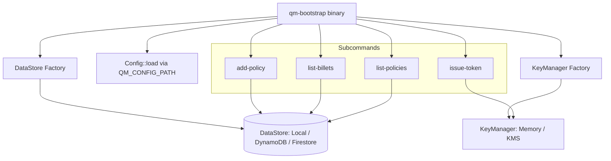

# Design Document — Bootstrap CLI (`qm-bootstrap`)

## Overview

The `qm-bootstrap` binary is a CLI tool that shares the Quartermaster library crate, enabling operators to seed billets, policies, and admin tokens into the backing DataStore without a running server. It reads the same configuration file (`QM_CONFIG_PATH`), connects to the same DataStore backend, and uses the same KeyManager for JWT signing.

The CLI is intentionally minimal — four subcommands, no server dependencies, no authorization layer. It exists as an escape hatch for initial deployment bootstrap and operational debugging.

### Design Rationale

- **Same binary crate, separate `[[bin]]` target**: The CLI reuses all library code via `use quartermaster::{config, datastore, keymanager}` without duplicating logic.
- **No scope validation on add-policy**: The server's `PolicyCrudService` enforces resource scope validation for non-system billets. The bootstrap CLI skips this intentionally — it's used to seed system billet policies before the server starts.
- **Short-lived tokens only**: The `issue-token` subcommand hardcodes a 10-minute TTL and the subject `bootstrap:admin`, making tokens unsuitable for persistent access.

## Architecture



### Execution Flow

1. Parse CLI arguments via `clap` (derive API)
2. Load `Config` from `QM_CONFIG_PATH`
3. Build `DataStore` via `datastore::factory::build_datastore`
4. Build `KeyManager` via `keymanager::factory::build_key_manager` (only for `issue-token`)
5. Dispatch to subcommand handler
6. Exit with code 0 on success, code 1 on error

## Components and Interfaces

### Binary Entry Point (`src/bin/qm_bootstrap.rs`)

```rust
use clap::{Parser, Subcommand};

#[derive(Parser)]
#[command(name = "qm-bootstrap", about = "Quartermaster bootstrap CLI")]
struct Cli {
    #[command(subcommand)]
    command: Commands,
}

#[derive(Subcommand)]
enum Commands {
    /// Add a Cedar policy to a billet (from file or stdin)
    AddPolicy {
        /// Target billet name
        billet: String,
        /// Path to Cedar policy file, or "-" for stdin
        source: String,
    },
    /// List all billets
    ListBillets,
    /// List policies for a billet
    ListPolicies {
        /// Billet name
        billet: String,
    },
    /// Issue a short-lived admin JWT
    IssueToken {
        /// One or more billet names to include in the token
        billets: Vec<String>,
    },
}
```

### Subcommand Handlers

Each handler is an `async fn` that takes references to the shared infrastructure (`DataStore`, `KeyManager`, `Config`) and returns `Result<(), CliError>`.

```rust
pub enum CliError {
    /// Configuration loading failed
    ConfigError(String),
    /// DataStore operation failed
    DataStoreError(String),
    /// Cedar parsing failed
    CedarParseError(String),
    /// Billet not found
    BilletNotFound(String),
    /// Key/signing error
    SigningError(String),
    /// I/O error (reading stdin/file)
    IoError(String),
}
```

### Handler: `add_policy`

```rust
async fn add_policy(
    data_store: &dyn DataStore,
    billet: &str,
    source: &str,
) -> Result<(), CliError> {
    // 1. Read Cedar statement from file or stdin
    let statement = read_source(source)?;
    // 2. Parse and validate Cedar syntax (reject invalid)
    validate_cedar_syntax(&statement)?;
    // 3. Verify billet exists
    verify_billet_exists(data_store, billet).await?;
    // 4. Generate UUID, build PolicyRecord, write to DataStore
    let policy_id = Uuid::new_v4().to_string();
    write_policy(data_store, billet, &policy_id, &statement).await?;
    // 5. Print policy_id to stdout
    println!("{}", policy_id);
    Ok(())
}
```

### Handler: `issue_token`

```rust
async fn issue_token(
    key_manager: &dyn KeyManager,
    config: &Config,
    billets: &[String],
) -> Result<(), CliError> {
    // 1. Build claims: iss=issuer, sub="bootstrap:admin", aud=issuer, exp=now+600
    let claims = build_bootstrap_claims(config, billets);
    // 2. Sign JWT using KeyManager
    let token = sign_jwt(key_manager, &claims)?;
    // 3. Print raw JWT to stdout (no newline prefix, no formatting)
    print!("{}", token);
    Ok(())
}
```

### Handler: `list_billets`

```rust
async fn list_billets(data_store: &dyn DataStore) -> Result<(), CliError> {
    let billets = data_store.list_billets().await?;
    if billets.is_empty() {
        println!("no billets found");
    } else {
        for b in billets {
            println!("{} — {}", b.name, b.description);
        }
    }
    Ok(())
}
```

### Handler: `list_policies`

```rust
async fn list_policies(data_store: &dyn DataStore, billet: &str) -> Result<(), CliError> {
    let policies = data_store.list_policies_for_billet(billet).await?;
    if policies.is_empty() {
        println!("no policies found for '{}'", billet);
    } else {
        for p in policies {
            let first_line = p.statement.lines().next().unwrap_or("(empty)");
            println!("[{}] {}", p.policy_id, first_line);
        }
    }
    Ok(())
}
```

## Data Models

The CLI operates on the existing data models from the `quartermaster` crate — no new models are introduced.

### Reused Types

| Type | Source | Usage |
|------|--------|-------|
| `Config` | `quartermaster::config` | Load configuration |
| `DataStore` (trait) | `quartermaster::datastore` | All data operations |
| `BilletRecord` | `quartermaster::datastore` | list-billets |
| `PolicyRecord` | `quartermaster::datastore` | list-policies, add-policy |
| `KeyManager` (trait) | `quartermaster::keymanager` | issue-token signing |

### Bootstrap JWT Claims

The `issue-token` command produces a JWT with this structure:

```json
{
  "iss": "<config.issuer>",
  "sub": "bootstrap:admin",
  "aud": "<config.issuer>",
  "billets": ["<billet1>", "<billet2>"],
  "iat": <unix_timestamp>,
  "exp": <unix_timestamp + 600>,
  "jti": "<uuid-v4>"
}
```

This matches the existing `quartermaster::domain::token::Claims` struct, with hardcoded `sub` and fixed 10-minute TTL.

## Correctness Properties

*A property is a characteristic or behavior that should hold true across all valid executions of a system — essentially, a formal statement about what the system should do. Properties serve as the bridge between human-readable specifications and machine-verifiable correctness guarantees.*

### Property 1: Cedar syntax validation rejects invalid input

*For any* string that is not a valid Cedar PolicySet, calling `validate_cedar_syntax` on it SHALL return an error. Conversely, for any valid Cedar PolicySet string, validation SHALL succeed.

**Validates: Requirements 3.1**

### Property 2: Billet existence precondition

*For any* billet name, if `get_billet` returns `None` for that name, then `add_policy` SHALL fail with a "billet not found" error without writing any policy record.

**Validates: Requirements 3.2**

### Property 3: Policy ID is a valid UUID

*For any* successful `add_policy` invocation (valid Cedar statement, existing billet), the returned policy_id SHALL be a valid UUID v4 string.

**Validates: Requirements 3.3**

### Property 4: No resource scope validation on bootstrap add-policy

*For any* valid Cedar policy statement (regardless of its resource scope), `add_policy` SHALL accept it without performing resource scope validation — even if the resource references a different billet or is unconstrained.

**Validates: Requirements 3.5**

### Property 5: JWT claim round-trip correctness

*For any* configured issuer string and any list of billet names, `issue_token` SHALL produce a JWT whose decoded claims satisfy: `iss == issuer`, `sub == "bootstrap:admin"`, `aud == issuer`, `billets == input_billets`, and `exp - iat == 600`.

**Validates: Requirements 4.1, 4.2**

### Property 6: JWT output is raw token format

*For any* valid `issue_token` invocation, the stdout output SHALL consist of exactly one string matching the JWT format (`<base64url>.<base64url>.<base64url>`) with no surrounding whitespace or extra formatting.

**Validates: Requirements 4.3**

### Property 7: list-billets output format

*For any* list of N `BilletRecord` items (N ≥ 1), the `list_billets` formatter SHALL produce exactly N lines, each matching the pattern `<name> — <description>`.

**Validates: Requirements 5.1**

### Property 8: list-policies output format

*For any* list of N `PolicyRecord` items (N ≥ 1), the `list_policies` formatter SHALL produce exactly N lines, each matching the pattern `[<policy_id>] <first_line_of_statement>`.

**Validates: Requirements 5.2**

## Error Handling

| Scenario | Behavior | Exit Code |
|----------|----------|-----------|
| `QM_CONFIG_PATH` not set or file unreadable | Print error to stderr | 1 |
| Invalid TOML / config validation failure | Print config error to stderr | 1 |
| DataStore connection failure | Print connection error to stderr | 1 |
| Cedar syntax invalid (`add-policy`) | Print parse error to stderr | 1 |
| Billet not found (`add-policy`) | Print "billet not found" to stderr | 1 |
| Signing key unavailable (`issue-token`) | Print key error to stderr | 1 |
| No subcommand / unknown subcommand | Print usage (clap handles this) | 1 |
| Empty list (`list-billets`, `list-policies`) | Print "none found" to stdout | 0 |
| Successful operation | Print result to stdout | 0 |

All errors are printed to stderr. Successful output goes to stdout only. This enables clean piping: `TOKEN=$(qm-bootstrap issue-token quartermaster-admin)`.

## Testing Strategy

### Unit Tests

- **Cedar validation wrapper**: Test with a handful of known-valid and known-invalid Cedar strings
- **Output formatters**: Test `format_billet_line` and `format_policy_line` with specific examples
- **Claim building**: Test `build_bootstrap_claims` with fixed inputs, verify fields

### Property-Based Tests (proptest)

Property-based tests provide universal correctness guarantees across randomly generated inputs. The project already uses `proptest` (see `Cargo.toml` dev-dependencies).

**Configuration:**
- Minimum 100 iterations per property
- Each test references its design property via tag comment

**Tag format:** `Feature: bootstrap-cli, Property {N}: {description}`

**Properties to implement:**
1. Cedar syntax validation (Property 1) — generate random strings, verify valid Cedar parses and invalid doesn't
2. Billet existence precondition (Property 2) — generate random names, mock DataStore returning None
3. Policy ID is valid UUID (Property 3) — generate random valid policies + existing billets, verify UUID output
4. No scope validation (Property 4) — generate policies with arbitrary resource scopes, verify acceptance
5. JWT claim round-trip (Property 5) — generate random issuers + billet lists, decode and verify claims
6. JWT output format (Property 6) — generate random inputs, verify output matches JWT regex
7. list-billets format (Property 7) — generate random BilletRecord lists, verify line count and format
8. list-policies format (Property 8) — generate random PolicyRecord lists, verify line count and format

### Integration Tests

- End-to-end test: build CLI, create temp config with local DataStore, run `add-policy`, verify `list-policies` shows it
- End-to-end test: `issue-token` produces a JWT verifiable with the JWKS from the same key

### Test Library

- `proptest` (already in dev-dependencies) for property-based testing
- `mockall` (already in dev-dependencies) for mocking `DataStore` trait
- `tempfile` (already in dev-dependencies) for temporary config/data directories
