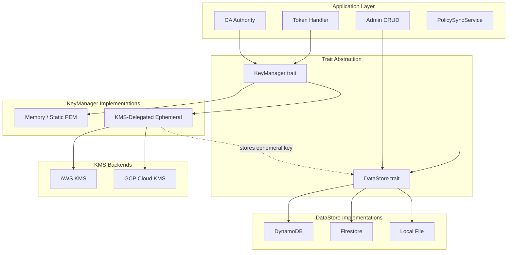
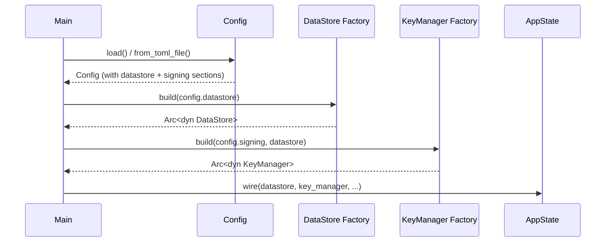
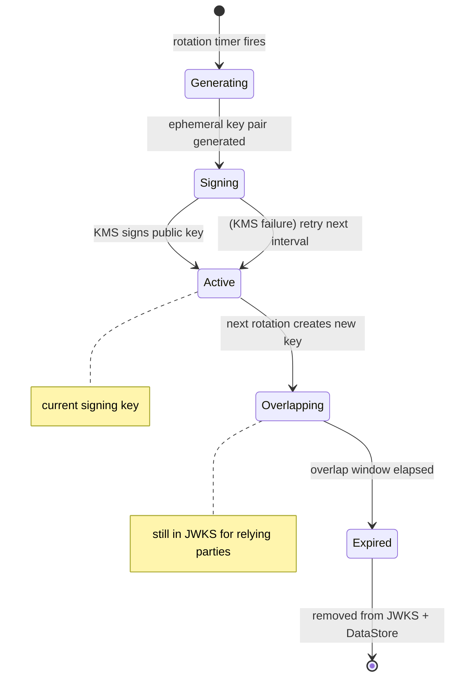

# Design Document — Cross-Cloud Backend Abstraction

## Overview

Quartermaster currently hard-codes AWS DynamoDB for persistent storage and an in-memory static key for JWT/certificate signing. This design introduces two abstraction layers — `DataStore` and `KeyManager` — that decouple the service from specific cloud providers. Implementations can be selected at startup via TOML configuration, enabling deployment on AWS (DynamoDB + KMS), GCP (Firestore + Cloud KMS), or local/dev environments (file-backed storage + in-memory keys) without code changes.

### Design Goals

- **Zero business-logic branching**: `PolicySyncService`, `CedarAuthorizer`, token exchange, and certificate issuance call trait methods — they never inspect which backend is active.
- **Cost-efficient production signing**: The `kms_delegated` model calls KMS once per rotation interval (not per token), keeping HSM-level trust at negligible cost.
- **Local-first development**: Default configuration requires no cloud credentials. `local` DataStore + `memory` KeyManager run entirely on the developer's machine.
- **Incremental migration**: The existing `DynamoClient` trait methods map 1:1 to the new `DataStore` trait, making the DynamoDB implementation a thin adapter.

### Key Design Decisions

| Decision | Rationale |
|----------|-----------|
| Single `DataStore` trait (not separate Policy/Billet traits) | Keeps the abstraction surface small; operations are interrelated (cascade delete, sync). |
| `KeyManager` covers both JWT and CA signing | Both need the same operations (sign, publish JWKS, rotate). Separate instances carry different keys. |
| Ephemeral key stored in DataStore | Ensures all instances converge on the same active key without leader election. |
| Write-through cache for local backend | Simplicity over performance — local is for dev/test, not high-throughput production. |
| `async_trait` on both traits | All cloud SDK calls are async; even the local file backend benefits from non-blocking I/O in Tokio. |

---

## Architecture



### Startup Wiring (bootstrap)



---

## Components and Interfaces

### DataStore Trait

The `DataStore` trait replaces the existing `DynamoClient` trait with cloud-agnostic naming. All methods use domain types (not DynamoDB AttributeValue).

```rust
use async_trait::async_trait;

/// Errors from data store operations.
#[derive(Debug, Clone)]
pub enum DataStoreError {
    /// The requested item was not found.
    NotFound(String),
    /// A conflict occurred (e.g., duplicate key on create).
    Conflict(String),
    /// Backend connectivity or serialization error.
    Internal(String),
}

/// Billet metadata record.
#[derive(Debug, Clone, Serialize, Deserialize)]
pub struct BilletRecord {
    pub name: String,
    pub description: String,
    pub associated_aws_roles: Vec<String>,
    pub associated_gcp_sas: Vec<String>,
    pub tags: Vec<String>,
    pub created_at: String,
    pub updated_at: String,
}

/// Policy record.
#[derive(Debug, Clone, Serialize, Deserialize)]
pub struct PolicyRecord {
    pub billet_name: String,
    pub policy_id: String,
    pub statement: String,
    pub description: String,
    pub created_at: String,
    pub updated_at: String,
}

/// Ephemeral key record (used by kms_delegated KeyManager).
#[derive(Debug, Clone, Serialize, Deserialize)]
pub struct EphemeralKeyRecord {
    pub key_id: String,
    pub public_key_pem: String,
    pub private_key_encrypted: Vec<u8>,  // encrypted at rest by KMS
    pub kms_attestation: Vec<u8>,        // KMS signature over public key
    pub algorithm: String,
    pub created_at: String,
    pub expires_at: String,
    pub purpose: String,  // "signing" or "ca"
}

#[cfg_attr(test, mockall::automock)]
#[async_trait]
pub trait DataStore: Send + Sync {
    // ── Billet Operations ──
    async fn create_billet(&self, record: &BilletRecord) -> Result<(), DataStoreError>;
    async fn get_billet(&self, name: &str) -> Result<Option<BilletRecord>, DataStoreError>;
    async fn update_billet(&self, record: &BilletRecord) -> Result<(), DataStoreError>;
    async fn delete_billet_cascade(&self, name: &str) -> Result<u32, DataStoreError>;
    async fn list_billets(&self) -> Result<Vec<BilletRecord>, DataStoreError>;

    // ── Policy Operations ──
    async fn create_policy(&self, record: &PolicyRecord) -> Result<(), DataStoreError>;
    async fn get_policy(&self, billet_name: &str, policy_id: &str) -> Result<Option<PolicyRecord>, DataStoreError>;
    async fn update_policy(&self, record: &PolicyRecord) -> Result<(), DataStoreError>;
    async fn delete_policy(&self, billet_name: &str, policy_id: &str) -> Result<(), DataStoreError>;
    async fn list_policies_for_billet(&self, billet_name: &str) -> Result<Vec<PolicyRecord>, DataStoreError>;
    async fn list_all_policies(&self) -> Result<Vec<PolicyRecord>, DataStoreError>;

    // ── Ephemeral Key Operations (used by kms_delegated KeyManager) ──
    async fn put_ephemeral_key(&self, record: &EphemeralKeyRecord) -> Result<(), DataStoreError>;
    async fn get_active_ephemeral_keys(&self, purpose: &str) -> Result<Vec<EphemeralKeyRecord>, DataStoreError>;
    async fn delete_expired_ephemeral_keys(&self, purpose: &str, before: &str) -> Result<u32, DataStoreError>;

    // ── Health ──
    async fn ping(&self) -> Result<(), DataStoreError>;
}
```

### KeyManager Trait

```rust
use async_trait::async_trait;
use jsonwebtoken::{Algorithm, EncodingKey, Header};
use serde_json::Value;

/// Errors from key management operations.
#[derive(Debug, Clone)]
pub enum KeyError {
    /// Key material could not be loaded or generated.
    KeyUnavailable(String),
    /// Signing operation failed.
    SigningFailed(String),
    /// KMS communication failure (degraded state).
    KmsUnavailable(String),
}

/// Health status for the key manager.
#[derive(Debug, Clone, PartialEq, Eq)]
pub enum KeyHealth {
    /// Key is fresh and within rotation interval.
    Healthy,
    /// Key is functional but older than expected (KMS may be unreachable).
    Degraded { reason: String },
    /// No usable key available.
    Unhealthy { reason: String },
}

#[async_trait]
pub trait KeyManager: Send + Sync {
    /// Returns the current encoding key for JWT/cert signing.
    fn encoding_key(&self) -> &EncodingKey;

    /// Returns the JWT header (includes kid, alg).
    fn header(&self) -> &Header;

    /// Returns the full JWKS (current + overlapping previous keys).
    fn jwks(&self) -> &Value;

    /// Returns the current active key's ID.
    fn key_id(&self) -> &str;

    /// Returns the signing algorithm.
    fn algorithm(&self) -> Algorithm;

    /// Check health of the key manager (rotation freshness, KMS reachability).
    async fn health(&self) -> KeyHealth;

    /// Trigger a key rotation check. No-op for memory backend.
    /// For kms_delegated: checks if rotation is due and performs it.
    async fn maybe_rotate(&self) -> Result<(), KeyError>;
}
```

### Relationship to Existing `SigningManager` Trait

The existing `SigningManager` trait remains as a thin synchronous interface for the token issuer (which only needs `encoding_key()`, `header()`, `jwks()`, `key_id()`). `KeyManager` is a superset that adds `health()`, `maybe_rotate()`, and `algorithm()`. The `MemoryKeyManager` implements both. For `KmsDelegatedKeyManager`, a `SigningManagerAdapter` wraps it:

```rust
/// Adapter that exposes a KeyManager as a SigningManager for backward compatibility.
pub struct SigningManagerAdapter {
    key_manager: Arc<dyn KeyManager>,
}

impl SigningManager for SigningManagerAdapter {
    fn encoding_key(&self) -> &EncodingKey { self.key_manager.encoding_key() }
    fn header(&self) -> &Header { self.key_manager.header() }
    fn jwks(&self) -> &Value { self.key_manager.jwks() }
    fn key_id(&self) -> &str { self.key_manager.key_id() }
}
```

---

## Data Models

### Configuration Model (TOML)

```rust
#[derive(Debug, Clone, Deserialize)]
pub struct DataStoreConfig {
    #[serde(default = "default_datastore_backend")]
    pub backend: DataStoreBackend,

    pub dynamodb: Option<DynamoDbConfig>,
    pub firestore: Option<FirestoreConfig>,
    pub local: Option<LocalStoreConfig>,
}

#[derive(Debug, Clone, Deserialize, PartialEq, Eq)]
#[serde(rename_all = "lowercase")]
pub enum DataStoreBackend {
    Dynamodb,
    Firestore,
    Local,
}

fn default_datastore_backend() -> DataStoreBackend {
    DataStoreBackend::Local
}

#[derive(Debug, Clone, Deserialize)]
pub struct DynamoDbConfig {
    pub region: String,
    #[serde(default = "default_billets_table")]
    pub billets_table: String,
    #[serde(default = "default_policies_table")]
    pub policies_table: String,
}

#[derive(Debug, Clone, Deserialize)]
pub struct FirestoreConfig {
    pub project: String,
    #[serde(default = "default_collection_prefix")]
    pub collection_prefix: String,
}

#[derive(Debug, Clone, Deserialize)]
pub struct LocalStoreConfig {
    #[serde(default = "default_local_path")]
    pub path: String,
}

#[derive(Debug, Clone, Deserialize)]
pub struct SigningBackendConfig {
    #[serde(default = "default_signing_backend")]
    pub backend: SigningBackend,

    pub memory: Option<MemorySigningConfig>,
    pub kms_delegated: Option<KmsDelegatedConfig>,
}

#[derive(Debug, Clone, Deserialize, PartialEq, Eq)]
#[serde(rename_all = "lowercase")]
pub enum SigningBackend {
    Memory,
    KmsDelegated,
}

fn default_signing_backend() -> SigningBackend {
    SigningBackend::Memory
}

#[derive(Debug, Clone, Deserialize)]
pub struct MemorySigningConfig {
    pub key_path: String,
}

#[derive(Debug, Clone, Deserialize)]
pub struct KmsDelegatedConfig {
    #[serde(default = "default_rotation_interval")]
    pub rotation_interval: String,  // e.g., "6h"
    #[serde(default = "default_key_overlap")]
    pub key_overlap: String,        // e.g., "24h"
    #[serde(default = "default_ephemeral_algorithm")]
    pub ephemeral_algorithm: String,

    pub aws_kms: Option<AwsKmsConfig>,
    pub gcp_kms: Option<GcpKmsConfig>,
}

#[derive(Debug, Clone, Deserialize)]
pub struct AwsKmsConfig {
    pub key_arn: String,
    pub region: String,
}

#[derive(Debug, Clone, Deserialize)]
pub struct GcpKmsConfig {
    pub key_name: String,
}
```

### Ephemeral Key Lifecycle State



### Storage Layout — Local File Backend

```
{path}/
├── billets/
│   ├── payments.json
│   └── analytics.json
├── policies/
│   ├── payments/
│   │   ├── p1.json
│   │   └── p2.json
│   └── analytics/
│       └── p3.json
└── keys/
    ├── signing_active.json
    └── signing_previous.json
```

### Storage Layout — Firestore

Policy documents use a flat document ID with a separator (`__`) to avoid Firestore interpreting slashes as subcollection paths. The `billet_name` field on each policy document enables efficient querying via `where("billet_name", "==", name)`.

```
{prefix}-billets/                       (collection)
├── payments (document)                 {name, description, tags, ...}
└── analytics (document)

{prefix}-policies/                      (collection)
├── payments__p1 (document)             {billet_name: "payments", policy_id: "p1", statement, ...}
├── payments__p2 (document)             {billet_name: "payments", policy_id: "p2", statement, ...}
└── analytics__p3 (document)            {billet_name: "analytics", policy_id: "p3", statement, ...}

{prefix}-keys/                          (collection)
├── signing_current (doc)               {key_id, public_key_pem, ...}
└── signing_previous (doc)
```

Document ID construction: `format!("{}__{}", billet_name, policy_id)` — the `__` separator is safe because billet names and policy IDs are restricted to alphanumeric, hyphen, and underscore characters (no double-underscores allowed in names).

---

## Implementation Details

### DynamoDB DataStore (`DynamoDataStore`)

Thin adapter around the existing `AwsDynamoClient`. The implementation:
- Maps `BilletRecord` ↔ DynamoDB `AttributeValue` items (same schema as today)
- Maps `PolicyRecord` ↔ DynamoDB items (same composite key: `billet_name` PK + `policy_id` SK)
- `delete_billet_cascade` uses Query to find all policies for the billet, then BatchWriteItem in batches of 25 (DynamoDB limit). The returned `u32` count accumulates across all batches. Existing logic from `AwsDynamoClient::delete_policies_for_billet` serves as the basis.
- Ephemeral keys stored in a dedicated DynamoDB table (`{prefix}-keys`) with `purpose` as PK and `key_id` as SK

### Firestore DataStore (`FirestoreDataStore`)

- Uses the `google-cloud-firestore` crate (or `firestore` crate from crates.io)
- Billets collection: documents keyed by `{billet_name}`
- Policies collection: flat documents keyed by `{billet_name}__{policy_id}` (double-underscore separator avoids Firestore interpreting slashes as subcollection paths). Each document carries a `billet_name` field for query filtering.
- `get_policy(billet_name, policy_id)` constructs the document ID as `format!("{}__{}", billet_name, policy_id)` and fetches directly
- `list_policies_for_billet` uses a Firestore query with `where("billet_name", "==", name)` — this works because `billet_name` is a top-level field on every policy document
- `delete_billet_cascade` queries all policies with matching `billet_name`, then deletes the billet document and all matched policy documents in batched writes (max 500 ops per Firestore batch; loop if more)
- Server timestamps via `FieldValue::server_timestamp()`
- Strong consistency is the default for Firestore in Native mode (single-region)

### Local File DataStore (`LocalDataStore`)

- Wraps a `tokio::sync::RwLock<LocalState>` where `LocalState` holds in-memory maps
- On every write: serialize to JSON, write to temp file, `rename()` atomically (crash-safe)
- On startup: walk the directory tree, deserialize all JSON files into memory
- `list_all_policies()`: return all values from the in-memory map (no disk I/O)
- `delete_billet_cascade()`: remove from memory + `tokio::fs::remove_dir_all` on the billet's policy directory

### Memory KeyManager (`MemoryKeyManager`)

Wraps the existing `StaticKeyManager` with the new `KeyManager` trait:
- `health()` → always `Healthy`
- `maybe_rotate()` → no-op
- All other methods delegate directly to `StaticKeyManager`

### KMS-Delegated KeyManager (`KmsDelegatedKeyManager`)

Core fields:
```rust
pub struct KmsDelegatedKeyManager {
    /// Current active ephemeral key (for signing).
    active_key: RwLock<EphemeralKeyState>,
    /// Previous key(s) still in JWKS overlap window.
    previous_keys: RwLock<Vec<EphemeralKeyState>>,
    /// KMS client (trait object for testability).
    kms_client: Arc<dyn KmsClient>,
    /// DataStore for persisting/reading ephemeral keys.
    data_store: Arc<dyn DataStore>,
    /// Configuration.
    config: KmsDelegatedConfig,
    /// Purpose identifier ("signing" or "ca").
    purpose: String,
}

struct EphemeralKeyState {
    encoding_key: EncodingKey,
    header: Header,
    jwk: Value,      // single JWK entry
    key_id: String,
    created_at: chrono::DateTime<chrono::Utc>,
    expires_at: chrono::DateTime<chrono::Utc>,
}
```

Rotation flow:
1. `maybe_rotate()` checks if `active_key.created_at + rotation_interval < now`
2. If rotation due:
   a. Generate new EC P-256 key pair via `ring`
   b. Compute `kid` = base64url(SHA-256(JWK Thumbprint)) per RFC 7638
   c. Call `kms_client.sign(public_key_der)` → get attestation
   d. Persist `EphemeralKeyRecord` to DataStore
   e. Move current `active_key` to `previous_keys`
   f. Set new key as `active_key`
3. If KMS call fails: log warning, continue with current key, set health → `Degraded`

JWKS construction:
```rust
fn jwks(&self) -> &Value {
    // Combine active_key.jwk + all previous_keys[*].jwk where expires_at > now
    json!({ "keys": [active_jwk, ...previous_jwks] })
}
```

### KMS Client Trait (internal)

```rust
#[async_trait]
pub trait KmsClient: Send + Sync {
    /// Sign the given data with the KMS key. Returns the signature bytes.
    async fn sign(&self, data: &[u8]) -> Result<Vec<u8>, KeyError>;
    /// Verify a signature against the KMS public key.
    async fn verify(&self, data: &[u8], signature: &[u8]) -> Result<bool, KeyError>;
}
```

Implementations: `AwsKmsClient` (using `aws-sdk-kms`) and `GcpKmsClient` (using `google-cloud-kms` or REST API).

---

## Integration Points

### PolicySyncService

Current signature:
```rust
pub fn new(dynamo_client: Arc<dyn DynamoClient>, ...) -> Self
```

New signature:
```rust
pub fn new(data_store: Arc<dyn DataStore>, ...) -> Self
```

Method mapping:
- `scan_all_policies()` → `data_store.list_all_policies()`
- `list_billet_metadata()` → `data_store.list_billets()`

### AppState

The `AppState` struct in `src/server/mod.rs` changes:
```rust
pub struct AppState {
    // Replace:
    //   pub dynamo_client: Arc<dyn DynamoClient>,
    // With:
    pub data_store: Arc<dyn DataStore>,

    // Replace:
    //   pub signing_manager: Arc<dyn SigningManager>,
    // With:
    pub signing_manager: Arc<dyn SigningManager>,  // unchanged type, but backed by KeyManager
    pub signing_key_manager: Arc<dyn KeyManager>,  // for health checks and rotation

    // ... rest unchanged
}
```

### Bootstrap

`bootstrap_system_billets` changes parameter from `&dyn DynamoClient` to `&dyn DataStore`.

### BilletCrudService / PolicyCrudService

Accept `Arc<dyn DataStore>` instead of `Arc<dyn DynamoClient>`.

### Token Handler / CA Handler

No changes — they interact through `SigningManager` (which is now backed by `KeyManager` internally).

### Health Endpoint

Enhanced to report:
- DataStore health: `data_store.ping()`
- KeyManager health: `key_manager.health()` → reports Healthy/Degraded/Unhealthy

---

## Correctness Properties

*A property is a characteristic or behavior that should hold true across all valid executions of a system — essentially, a formal statement about what the system should do. Properties serve as the bridge between human-readable specifications and machine-verifiable correctness guarantees.*

### Property 1: DataStore CRUD Round-Trip

*For any* valid `BilletRecord` or `PolicyRecord`, writing it to any DataStore implementation and immediately reading it back SHALL produce an equivalent record (fields match, modulo server-generated timestamps).

**Validates: Requirements 1.6, 3.1**

### Property 2: DataStore Behavioral Equivalence

*For any* sequence of DataStore operations (creates, reads, updates, deletes, lists) applied to two different DataStore implementations starting from the same initial state, the observable results (return values of reads and lists) SHALL be identical.

**Validates: Requirements 1.3, 1.5, 7.1, 7.3**

### Property 3: Cascade Delete Completeness

*For any* billet with N associated policies (where N ≥ 0), calling `delete_billet_cascade` SHALL result in `get_billet` returning `None` AND `list_policies_for_billet` returning an empty list for that billet name.

**Validates: Requirements 2.3, 3.5**

### Property 4: Listing Correctness

*For any* set of policies written across M billets, `list_all_policies()` SHALL return exactly the set of all written policies, and `list_policies_for_billet(b)` SHALL return exactly the policies written for billet `b` and no others.

**Validates: Requirements 3.3, 3.4**

### Property 5: Configuration Backend Selection

*For any* valid TOML configuration string specifying a `backend` value in `[datastore]` or `[signing]`, parsing the configuration SHALL select the corresponding backend type. When no backend is specified, the default SHALL be `local` for DataStore and `memory` for KeyManager.

**Validates: Requirements 1.4, 3.8, 4.3, 5.3**

### Property 6: KeyManager Signing Round-Trip

*For any* KeyManager implementation and any arbitrary payload, signing the payload and then verifying the signature using the public key from `jwks()` SHALL succeed. The `kid` in the JWT header SHALL match a `kid` present in the JWKS response.

**Validates: Requirements 4.2, 5.1, 6.1**

### Property 7: JWKS Key Lifecycle

*For any* `KmsDelegatedKeyManager` with configured `rotation_interval` R and `key_overlap` O, after a rotation event at time T: the JWKS SHALL contain both the new key and the previous key for the duration [T, T+O), and SHALL contain only the new key after T+O.

**Validates: Requirements 6.3, 6.4, 6.5**

### Property 8: Key ID Determinism

*For any* EC P-256 key pair, computing the key ID (base64url(SHA-256(JWK Thumbprint per RFC 7638))) SHALL be deterministic — computing it multiple times on the same key material SHALL always produce the same value.

**Validates: Requirements 6.8**

### Property 9: KMS Fault Tolerance

*For any* `KmsDelegatedKeyManager` where the KMS client returns an error during `maybe_rotate()`, the active signing key SHALL remain unchanged, `encoding_key()` SHALL continue to return a usable key, and `health()` SHALL report `Degraded`.

**Validates: Requirements 6.12**

### Property 10: Local File Path Determinism

*For any* valid billet name and policy ID (containing only alphanumeric, hyphen, underscore characters), the local DataStore SHALL produce a file path matching the pattern `{base}/policies/{billet_name}/{policy_id}.json` for policies and `{base}/billets/{billet_name}.json` for billets.

**Validates: Requirements 3.2**

---

## Error Handling

### DataStore Errors

| Error Variant | Trigger | Handler Response |
|---------------|---------|------------------|
| `NotFound` | GET/DELETE on non-existent key | 404 (CRUD endpoints) or skip (sync) |
| `Conflict` | CREATE with existing key | 409 Conflict |
| `Internal` | Network timeout, serialization failure | 503 + retry (sync), 500 (CRUD) |

### KeyManager Errors

| Error Variant | Trigger | Handler Response |
|---------------|---------|------------------|
| `KeyUnavailable` | PEM file unreadable, no ephemeral key loaded | Startup failure (fatal) |
| `SigningFailed` | Encoding error during JWT creation | 500 Internal Server Error |
| `KmsUnavailable` | KMS network timeout during rotation | Continue with current key, health → Degraded |

### Degraded States

The health endpoint reports overall system health:
```json
{
  "status": "degraded",
  "checks": {
    "datastore": "healthy",
    "signing_key": "degraded: key age exceeds 2x rotation_interval",
    "policy_sync": "healthy"
  }
}
```

Degraded thresholds:
- KeyManager: key age > `rotation_interval × 2`
- DataStore: ping fails but last sync succeeded within `policy_sync_interval × 3`

---

## Testing Strategy

### Unit Tests

- **DataStore trait compliance**: Each implementation gets a shared test suite (`datastore_compliance_tests!` macro) exercising all CRUD operations, edge cases (not-found, conflict), and concurrent access.
- **KeyManager implementations**: Verify signing, JWKS construction, and kid computation for both `MemoryKeyManager` and `KmsDelegatedKeyManager` (with mocked `KmsClient`).
- **Configuration parsing**: Test all valid backend combinations, defaults, and error cases.
- **Rotation logic**: Use `tokio::time::pause()` to simulate time advancement and verify rotation triggers, overlap windows, and fault handling.

### Property-Based Tests

Property-based tests use the `proptest` crate (already in dev-dependencies) with minimum 100 iterations per property.

- **Property 1 (round-trip)**: Generate random `BilletRecord` and `PolicyRecord` values, write/read through each DataStore implementation, assert equality.
- **Property 2 (behavioral equivalence)**: Generate random operation sequences, apply to `LocalDataStore` and assert results match expected model.
- **Property 3 (cascade delete)**: Generate billets with random numbers of policies, cascade delete, assert all removed.
- **Property 4 (listing)**: Generate random multi-billet datasets, verify list operations return correct subsets.
- **Property 5 (config parsing)**: Generate random valid config TOML fragments, verify backend selection.
- **Property 6 (signing round-trip)**: Generate random payloads, sign with each KeyManager, verify with public key from JWKS.
- **Property 7 (JWKS lifecycle)**: Simulate time-based rotation, verify JWKS key count at various points.
- **Property 8 (kid determinism)**: Generate random EC keys, compute kid twice, assert equality.
- **Property 9 (fault tolerance)**: Mock KMS failures during rotation, verify key remains usable.
- **Property 10 (path determinism)**: Generate valid names, verify path construction.

**Configuration**:
- Each property test: minimum 100 iterations
- Tag format: `Feature: cross-cloud-backends, Property {N}: {title}`

### Integration Tests

- Run DataStore compliance suite against real DynamoDB (localstack), Firestore emulator, and local filesystem.
- Run KMS-delegated rotation against localstack KMS.
- Full token-exchange flow with each DataStore × KeyManager combination.

### Test Infrastructure

```rust
/// Macro that generates the full DataStore compliance test suite for any implementation.
macro_rules! datastore_compliance_tests {
    ($create_store:expr) => {
        #[tokio::test]
        async fn test_billet_crud_round_trip() { /* ... */ }
        #[tokio::test]
        async fn test_policy_crud_round_trip() { /* ... */ }
        #[tokio::test]
        async fn test_cascade_delete() { /* ... */ }
        #[tokio::test]
        async fn test_list_all_policies() { /* ... */ }
        #[tokio::test]
        async fn test_list_policies_for_billet() { /* ... */ }
        #[tokio::test]
        async fn test_not_found() { /* ... */ }
        #[tokio::test]
        async fn test_conflict_on_duplicate_create() { /* ... */ }
        #[tokio::test]
        async fn test_ping() { /* ... */ }
    };
}
```

Each implementation module invokes:
```rust
#[cfg(test)]
mod tests {
    datastore_compliance_tests!(|| LocalDataStore::new_temp());
}
```
