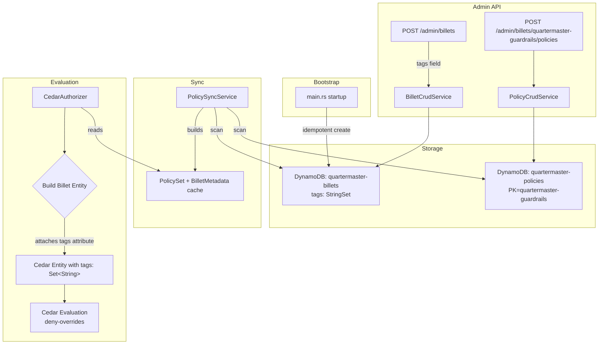

# Design Document — Billet Tags & Global Guardrail Policies

## Overview

This feature adds two complementary capabilities to the Quartermaster authorization system:

1. **Billet Tags**: Key/value metadata tags (`key:value` format) stored on billet records and surfaced as Cedar entity attributes at evaluation time. This enables policy authors to write rules that target categories of billets rather than referencing individual billet names.

2. **Guardrail Policies**: A reserved system billet (`quartermaster-guardrails`) that holds `forbid`-only Cedar policies. These policies are included in the global PolicySet and evaluated on every authorization request. Cedar's built-in deny-overrides semantics ensure that guardrail `forbid` policies override any `permit` policy from any other billet — no special evaluation path required.

### Design Rationale

- Tags avoid N×M policy explosion — instead of writing a `forbid` per-billet, operators write one `forbid` that conditions on `resource.tags`.
- Guardrails leverage Cedar's native deny-overrides rather than introducing custom pre/post evaluation hooks, keeping the authorization path simple and auditable.
- The `quartermaster-guardrails` billet uses the same storage and sync mechanisms as all other billets — the only special treatment is validation (forbid-only) and lifecycle protection (cannot be deleted).

## Architecture



### Key Architectural Decisions

1. **No special evaluation path for guardrails**: Guardrail policies are stored in the same `quartermaster-policies` table, synced by the same `PolicySyncService`, and evaluated in the same `PolicySet`. Cedar's deny-overrides semantics handle precedence natively.

2. **Tags stored as `StringSet` in DynamoDB**: Tags are stored as a DynamoDB `StringSet` (SS type) on the billets table. This allows efficient attribute-level updates and maps directly to Cedar's `Set<String>` type.

3. **Tag format validation at the API layer**: Tags are validated on write (API handlers/service) using a regex pattern. Invalid tags are rejected before persistence.

4. **Forbid-only validation via Cedar AST inspection**: When creating/updating policies on `quartermaster-guardrails`, the system parses the Cedar statement and inspects each policy's effect. If any policy has `permit` effect, the request is rejected.

5. **Bootstrap is idempotent**: On startup, the system calls `get_billet_metadata` for both system billets; if absent, it creates them. If present, no action is taken.

## Components and Interfaces

### 1. Tag Validation Module

A new utility function (or inline logic in `BilletCrudService`) that validates tag format:

```rust
/// Validates that a tag conforms to `key:value` format where both key and value
/// are non-empty and contain only [a-zA-Z0-9\-_.] characters.
pub fn validate_tag(tag: &str) -> Result<(), String>;

/// Validates a slice of tags, returning the first invalid tag as an error.
pub fn validate_tags(tags: &[String]) -> Result<(), String>;
```

**Regex pattern**: `^[a-zA-Z0-9][a-zA-Z0-9\-_.]*:[a-zA-Z0-9][a-zA-Z0-9\-_.]*$`

### 2. BilletCrudService Changes

- **`create`**: Accepts an additional `tags: Vec<String>` parameter. Validates tags before persistence.
- **`update`**: Accepts an optional `tags: Option<Vec<String>>` parameter. Validates if present.
- **`get` / `get_with_policies`**: Returns `tags` in the response.
- **`delete` / `delete_cascade`**: Adds `quartermaster-guardrails` to the protected billet list (alongside `quartermaster-admin`).

### 3. DynamoDB Schema Changes

`BilletMetadata` struct gains a `tags: Vec<String>` field. The `quartermaster-billets` DynamoDB table stores these as a `StringSet` (SS) attribute.

```rust
pub struct BilletMetadata {
    pub name: String,
    pub description: String,
    pub associated_aws_roles: Vec<String>,
    pub associated_gcp_sas: Vec<String>,
    pub tags: Vec<String>,  // NEW
    pub updated_at: String,
}
```

### 4. PolicySyncService Changes

The `PolicySyncService` already caches `BilletMetadata` via `list_billet_metadata()`. With the `tags` field added to `BilletMetadata`, tags are automatically available in the cached state — no additional sync logic needed.

A new method provides tag lookup:

```rust
impl PolicySyncService {
    /// Returns the tags for a given billet name from cached metadata.
    /// Returns an empty vec if the billet is not found in the cache.
    pub async fn billet_tags(&self, billet_name: &str) -> Vec<String>;
}
```

### 5. Billet Entity Enrichment (Cedar Evaluation)

When constructing Cedar `Entity` objects for Billet resources during authorization, the system now attaches a `tags` attribute:

```rust
// In CedarAuthorizer (or a helper function):
fn build_billet_entity(name: &str, tags: &[String]) -> Entity {
    let uid = make_entity_uid("Billet", name)?;
    let attrs = HashMap::from([
        ("tags".to_string(), string_set_expr(tags)),
    ]);
    Entity::new(uid, attrs, HashSet::new())
}
```

This replaces the current `Entity::new_no_attrs(...)` call for billet entities.

#### Enrichment Scope by Evaluation Path

The `build_billet_entity` function must be applied in two distinct locations in `CedarAuthorizer`:

1. **`batch_is_authorized`** (assumeBillet evaluation): Billet entities are constructed as **resources**. Tags are attached so guardrail policies can condition on `resource.tags` (e.g., `resource.tags.contains("human-only")`).

2. **`is_authorized_admin`** (admin action evaluation): Billet entities appear as both the **resource** (the billet being managed) AND the **principal** (the billet performing the action).
   - **Resource side**: Tags MUST be enriched — guardrail policies like `resource.tags.contains("immutable:true")` depend on this.
   - **Principal side**: Tags are also enriched for consistency. The `PolicySyncService` cache makes the data available for both, and attaching tags uniformly avoids a class of bugs where a future policy author expects `principal.tags` to be available. The cost is negligible (one extra attribute lookup per evaluation).

**Design decision**: Enrich both principal and resource billet entities with tags. This keeps the entity builder simple (one function, always attaches tags) and avoids surprising behavior if a policy author later writes a principal-side tag condition. The alternative (resource-only enrichment) would save nothing meaningful and create an asymmetry that's easy to forget during maintenance.

### 6. Guardrail Policy Validation

Added to `PolicyCrudService` — when the owning billet is `quartermaster-guardrails`, an additional validation step inspects each policy in the parsed `PolicySet`:

```rust
impl PolicyCrudService {
    /// Validates that all policies in the statement have `forbid` effect.
    /// Returns an error if any policy has `permit` effect.
    fn validate_forbid_only(statement: &str) -> Result<(), PolicyCrudError>;
}
```

This uses `PolicySet::policies()` iterator and checks `policy.effect()` for each policy.

### 7. Resource Scope Bypass for Guardrails

The existing `validate_resource_scope` check in `PolicyCrudService` enforces that `assumeBillet` policies reference the owning billet as their resource. Guardrail policies must be exempt from this check — they intentionally reference other billets, use unconstrained `resource`, or condition on `resource.tags`.

When `billet_name == "quartermaster-guardrails"`, the resource scope validation is skipped entirely.

### 8. Bootstrap Service

A new function invoked during startup (in `main.rs`) after DynamoDB client initialization:

```rust
pub async fn bootstrap_system_billets(dynamo_client: &dyn DynamoClient) -> Result<(), DynamoError>;
```

This idempotently creates:
- `quartermaster-guardrails` with description "System billet for global guardrail (forbid) policies" and tags `["system:true"]`
- `quartermaster-admin` with description "Bootstrap admin billet" and tags `["system:true"]`

### 9. Admin API Handler Changes

- `CreateBilletRequest` / `UpdateBilletRequest`: Add optional `tags` field.
- `BilletMetadataResponse`: Add `tags` field.
- Existing policy CRUD handlers remain unchanged — the `PolicyCrudService` handles guardrail validation internally.

## Data Models

### DynamoDB: `quartermaster-billets` Table

| Attribute | Type | Description |
|-----------|------|-------------|
| `name` (PK) | String | Billet name |
| `description` | String | Human-readable description |
| `associated_aws_roles` | List<String> | Mapped AWS IAM roles |
| `associated_gcp_sas` | List<String> | Mapped GCP service accounts |
| `tags` | StringSet | Tags in `key:value` format (NEW) |
| `updated_at` | String | ISO 8601 timestamp |

### DynamoDB: `quartermaster-policies` Table (unchanged)

| Attribute | Type | Description |
|-----------|------|-------------|
| `billet_name` (PK) | String | Owning billet name |
| `policy_id` (SK) | String | UUID |
| `statement` | String | Cedar policy text |
| `description` | String | Human-readable description |
| `created_at` | String | ISO 8601 timestamp |
| `updated_at` | String | ISO 8601 timestamp |

Guardrail policies use `billet_name = "quartermaster-guardrails"` — no schema change needed.

### Cedar Entity Model

```cedar
entity Billet = {
    tags: Set<String>,
};
```

At evaluation time, each `Billet` entity is constructed with its tags from cached metadata. Policies can reference `resource.tags` using `contains()`:

```cedar
forbid(principal, action, resource)
when { resource.tags.contains("sensitivity:high") && context.environment != "production" };
```

### Rust Structs

```rust
// API request (create)
pub struct CreateBilletRequest {
    pub name: String,
    pub description: String,
    pub associated_aws_roles: Vec<String>,
    pub associated_gcp_sas: Vec<String>,
    pub tags: Vec<String>,  // NEW
}

// API request (update)
pub struct UpdateBilletRequest {
    pub description: Option<String>,
    pub associated_aws_roles: Option<Vec<String>>,
    pub associated_gcp_sas: Option<Vec<String>>,
    pub tags: Option<Vec<String>>,  // NEW
}

// API response
pub struct BilletMetadataResponse {
    pub name: String,
    pub description: String,
    pub associated_aws_roles: Vec<String>,
    pub associated_gcp_sas: Vec<String>,
    pub tags: Vec<String>,  // NEW
    pub updated_at: String,
}
```


## Correctness Properties

*A property is a characteristic or behavior that should hold true across all valid executions of a system — essentially, a formal statement about what the system should do. Properties serve as the bridge between human-readable specifications and machine-verifiable correctness guarantees.*

### Property 1: Tag format validation preserves only valid tags

*For any* string, the tag validator accepts it if and only if it matches the pattern `key:value` where both key and value are non-empty and consist only of alphanumeric characters, hyphens, underscores, and dots. Specifically: for any string composed of valid characters with exactly one colon separating non-empty parts, `validate_tag` returns Ok; for any other string (empty key, empty value, disallowed characters, missing colon, multiple colons in wrong positions), `validate_tag` returns Err.

**Validates: Requirements 1.3, 1.4**

### Property 2: Tag persistence round-trip

*For any* billet name and *for any* set of valid tags, storing the billet metadata with those tags and then retrieving it (either directly via `get_billet_metadata` or via entity construction at evaluation time) SHALL produce a `tags` attribute that is equal to the original tag set (order-independent).

**Validates: Requirements 1.1, 2.1, 2.2**

### Property 3: Protected billet deletion invariant

*For any* attempt to delete a billet named `quartermaster-guardrails` or `quartermaster-admin`, the `BilletCrudService` SHALL return a `ProtectedBillet` error regardless of caller context or system state.

**Validates: Requirements 3.2**

### Property 4: Forbid-only policy validation

*For any* syntactically valid Cedar policy statement, when the owning billet is `quartermaster-guardrails`: if every policy in the statement has `forbid` effect (with or without `when`/`unless` clauses), validation succeeds; if any policy has `permit` effect, validation rejects with an appropriate error.

**Validates: Requirements 3.3, 5.1, 5.2, 5.3, 5.4**

### Property 5: Guardrail policies bypass resource scope validation

*For any* syntactically valid Cedar `forbid` statement with any resource scope (unconstrained `resource`, `resource == Billet::"other-billet"`, or condition on `resource.tags`), when the owning billet is `quartermaster-guardrails`, the policy creation/update SHALL succeed without resource scope validation errors.

**Validates: Requirements 3.4**

### Property 6: Deny-overrides — guardrail forbid always wins

*For any* Cedar evaluation where a `permit` policy grants access and a guardrail `forbid` policy denies it for the same principal/action/resource combination, the final decision SHALL be Deny. This holds across both `assumeBillet` and admin actions.

**Validates: Requirements 4.1, 4.2, 4.3**

### Property 7: Bootstrap idempotence

*For any* initial database state (system billets present or absent), invoking the bootstrap function SHALL result in both `quartermaster-guardrails` and `quartermaster-admin` existing with their expected descriptions and `system:true` tag. Invoking bootstrap a second time on the same state SHALL produce no changes (idempotent).

**Validates: Requirements 8.1, 8.2, 8.3**

## Error Handling

| Scenario | HTTP Code | Error Message |
|----------|-----------|---------------|
| Invalid tag format on create/update | 400 | `"invalid tag '<tag>': must be key:value format with alphanumeric, hyphen, underscore, or dot characters"` |
| Permit policy on guardrails billet | 400 | `"guardrail policies must be forbid-only; permit policies are not allowed on the quartermaster-guardrails billet"` |
| Delete protected billet | 403 | `"billet '<name>' is protected and cannot be deleted"` |
| Unauthenticated guardrail management | 401 | `"missing or malformed credentials"` |
| Unauthorized guardrail management | 403 | `"insufficient privileges"` |
| Bootstrap DynamoDB failure | startup log | Warning logged; service continues (degraded). Bootstrap retries on next startup. |
| Tag-less billet evaluation | N/A | Empty tag set attached — no error, policies conditioning on tags simply don't match. |

### Graceful Degradation

- If `list_billet_metadata` fails during sync, tags from the previous successful sync are preserved (existing behavior of `PolicySyncService`).
- If a billet has no metadata in the cache (race condition between creation and sync), it receives an empty tag set — guardrail policies conditioning on tags will not match, which is safe (fail-closed for tag-based restrictions until sync catches up).

## Testing Strategy

### Property-Based Tests (using `proptest`)

Each correctness property maps to a property-based test with minimum 100 iterations:

1. **Tag validation property** (Property 1): Generate random strings — valid charset+format vs invalid. Verify `validate_tag` correctly classifies each.
2. **Tag round-trip property** (Property 2): Generate random valid tag sets. Store via mock DynamoDB, retrieve, and verify equality. Also test entity construction produces matching tags attribute.
3. **Protected billet deletion property** (Property 3): Generate random caller contexts. Attempt deletion of protected billets. Verify always rejected.
4. **Forbid-only validation property** (Property 4): Generate random Cedar forbid statements (with/without when/unless). Verify accepted. Generate permit statements. Verify rejected.
5. **Resource scope bypass property** (Property 5): Generate random Cedar forbid statements with diverse resource scopes. Verify accepted for `quartermaster-guardrails`.
6. **Deny-overrides property** (Property 6): Generate random permit+forbid policy combinations targeting the same resource. Evaluate. Verify deny decision.
7. **Bootstrap idempotence property** (Property 7): Generate random initial states. Run bootstrap twice. Verify convergence and stability.

### Unit Tests (example-based)

- API handler tests: verify request/response serialization with tags field
- Specific error message assertions for guardrail validation failures
- Bootstrap creates both billets with correct defaults
- Admin authorization required for guardrail operations (existing auth path)

### Integration Tests

- End-to-end: create billet with tags → create guardrail forbid policy → evaluate assumeBillet → verify deny
- PolicySyncService loads guardrail policies into PolicySet
- DynamoDB StringSet storage for tags (if testing against local DynamoDB)

### Test Configuration

- Property-based testing library: `proptest` (already available in Rust ecosystem, well-maintained)
- Minimum iterations: 100 per property test
- Tag format: **Feature: guardrails, Property {number}: {property_text}**
