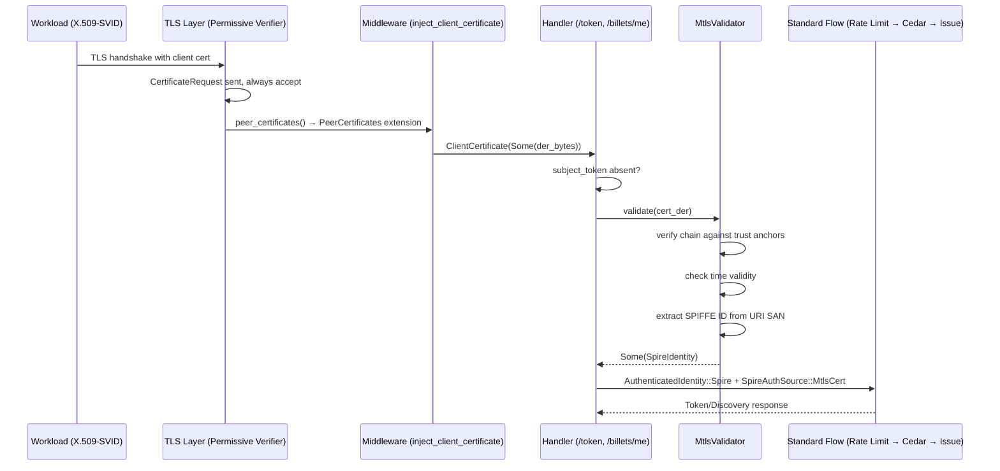

# Design Document — mTLS Client Certificate Identity Source

## Overview

This feature completes the mTLS client certificate identity source in Quartermaster by fixing the broken TLS verifier and wiring the existing `MtlsValidator` into the token exchange and billet discovery handlers. The design follows a "permissive TLS, strict application-layer validation" pattern: the TLS layer accepts all connections regardless of client certificate validity, while the application layer (`MtlsValidator`) performs trust chain verification, time validity checks, and SPIFFE ID extraction against the configured X.509 trust bundle.

### Key Design Decisions

1. **Permissive TLS verifier over strict WebPKI**: Using a custom `ClientCertVerifier` that always succeeds (replacing the broken `WebPkiClientVerifier`) allows trust bundle rotation without server restart and enables graceful fallback to `subject_token` when no valid cert is presented.

2. **Reuse `AuthenticatedIdentity::Spire` variant**: mTLS-derived identities produce the same `SpireIdentity` struct as JWT-SVIDs. This avoids duplicating Cedar entity construction, billet resolution, and token issuance logic. The only distinction is the `SpireAuthSource` enum (for audit `source_type`).

3. **Token precedence**: Explicit `subject_token` always wins over mTLS identity. This prevents confusion when both are present and allows backward-compatible operation.

## Architecture



### Component Interaction

The architecture has three layers:

1. **TLS Layer** (`src/server/tls.rs`): Custom `ClientCertVerifier` that sends `CertificateRequest` but never rejects. Passes raw DER bytes through `peer_certificates()`.

2. **Middleware Layer** (`src/server/middleware.rs`): Extracts the leaf certificate from `PeerCertificates` into `ClientCertificate(Option<Vec<u8>>)` extension. Already implemented.

3. **Application Layer** (handlers + `MtlsValidator`): Handlers check for `subject_token` first; if absent, attempt mTLS identity extraction via `MtlsValidator::validate()`. Already partially implemented in handlers.

## Components and Interfaces

### 1. Custom ClientCertVerifier (`src/server/tls.rs`)

The current code uses `WebPkiClientVerifier::builder(empty_roots).allow_unauthenticated().build()` which panics because an empty `RootCertStore` is invalid for WebPKI verification. The fix replaces this with a custom `ClientCertVerifier` implementation.

```rust
/// A permissive client certificate verifier that:
/// - Sends CertificateRequest to solicit client certs
/// - Always returns Ok from verify_client_cert (no TLS-layer rejection)
/// - Passes raw certificate bytes through for application-layer validation
#[derive(Debug)]
struct PermissiveClientCertVerifier {
    /// Supported signature verification algorithms (required by rustls).
    supported_schemes: Vec<rustls::SignatureScheme>,
}

impl rustls::server::danger::ClientCertVerifier for PermissiveClientCertVerifier {
    fn offer_client_auth(&self) -> bool { true }
    fn client_auth_mandatory(&self) -> bool { false }

    fn root_hint_subjects(&self) -> &[rustls::DistinguishedName] { &[] }

    fn verify_client_cert(
        &self,
        _end_entity: &rustls::pki_types::CertificateDer<'_>,
        _intermediates: &[rustls::pki_types::CertificateDer<'_>],
        _now: rustls::pki_types::UnixTime,
    ) -> Result<rustls::server::danger::ClientCertVerified, rustls::Error> {
        Ok(rustls::server::danger::ClientCertVerified::assertion())
    }

    fn verify_tls12_signature(...) -> Result<...> { ... }
    fn verify_tls13_signature(...) -> Result<...> { ... }
    fn supported_verify_schemes(&self) -> Vec<rustls::SignatureScheme> {
        self.supported_schemes.clone()
    }
}
```

The `build_tls_config()` function replaces the `WebPkiClientVerifier` with `Arc::new(PermissiveClientCertVerifier::new())`.

### 2. MtlsValidator (`src/domain/identity/mtls.rs`)

Already implemented. Key interface:

```rust
impl MtlsValidator {
    pub fn from_pem(ca_pem: &[u8], trust_domain: &str) -> Result<Self, MtlsError>;
    pub fn validate(&self, cert_der: &[u8]) -> Option<SpireIdentity>;
}
```

Validation steps:
1. Parse DER → `X509Certificate`
2. Check time validity (`not_before` ≤ now ≤ `not_after`)
3. Verify signature chains to a trust anchor (issuer DN match + signature verification)
4. Extract first `spiffe://{trust_domain}/...` URI SAN
5. Parse environment/region from path segments

Returns `None` on any failure (silent fallback).

### 3. Handler Integration (`src/handler/token.rs`, `src/handler/billets_discovery.rs`)

Already implemented. Both handlers follow the same pattern:

```rust
let (identity, auth_source) = if let Some(subject_token) = form.subject_token {
    // Token dispatch (existing path)
    ...
} else if let Some(mtls_identity) = extract_mtls_identity(&client_cert, &state) {
    (AuthenticatedIdentity::Spire(mtls_identity), SpireAuthSource::MtlsCert)
} else {
    return Err(DomainError::invalid_request(
        "subject_token is required when no client certificate is presented",
    ));
};
```

### 4. SpireAuthSource Enum (`src/domain/identity/mod.rs`)

Already implemented:

```rust
#[derive(Debug, Clone, Copy, PartialEq, Eq)]
pub enum SpireAuthSource {
    JwtSvid,
    MtlsCert,
}
```

Used by `source_type_for_spire_identity()` to return `"spire"` or `"mtls-spiffe"` for audit logging.

### 5. ClientCertificate Middleware (`src/server/middleware.rs`)

Already implemented. Extracts first cert from `PeerCertificates` (injected by TLS layer):

```rust
#[derive(Clone, Debug)]
pub struct ClientCertificate(pub Option<Vec<u8>>);
```

## Data Models

### Configuration

```toml
[server.tls]
cert_path = "/etc/quartermaster/tls/server.crt"
key_path = "/etc/quartermaster/tls/server.key"

[identity.spire]
trust_domain = "example.com"
jwks_path = "/run/spire/agent/jwks.json"      # JWT-SVID signing keys
x509_bundle_path = "/run/spire/agent/bundle.pem" # X.509-SVID CA trust bundle
audience = "quartermaster.example.com"
```

### Identity Flow Data

| Field | Source | Value |
|-------|--------|-------|
| `spiffe_id` | URI SAN from client cert | `spiffe://example.com/env/prod/region/us-east-1/workload/api` |
| `trust_domain` | Configured on `MtlsValidator` | `example.com` |
| `environment` | Parsed from SPIFFE path | `prod` |
| `region` | Parsed from SPIFFE path | `us-east-1` |
| `audience` | N/A for X.509-SVIDs | `[]` (empty) |
| `auth_source` | Determined at handler layer | `SpireAuthSource::MtlsCert` |
| `source_type` (audit) | Derived from auth_source | `"mtls-spiffe"` |

### Token Exchange Form (updated)

```rust
pub struct TokenExchangeForm {
    pub grant_type: Option<String>,
    pub subject_token: Option<String>,       // Now optional
    pub subject_token_type: Option<String>,  // Required only when subject_token is present
    pub audience: Option<String>,
    pub csr: Option<String>,
    pub billets: Option<String>,
}
```


## Correctness Properties

*A property is a characteristic or behavior that should hold true across all valid executions of a system — essentially, a formal statement about what the system should do. Properties serve as the bridge between human-readable specifications and machine-verifiable correctness guarantees.*

### Property 1: Permissive verifier never rejects

*For any* DER-encoded byte sequence presented as a client certificate (valid, expired, self-signed, malformed, or empty chain), the `PermissiveClientCertVerifier::verify_client_cert` SHALL return `Ok(ClientCertVerified)` — never an `Err`.

**Validates: Requirements 1.2**

### Property 2: SPIFFE ID extraction round-trip

*For any* X.509 certificate that: (a) chains to a trust anchor in the configured bundle, (b) is time-valid, and (c) contains a `spiffe://{trust_domain}/...` URI SAN, `MtlsValidator::validate()` SHALL return `Some(SpireIdentity)` where `spiffe_id` equals the URI SAN value, `trust_domain` equals the configured trust domain, and `environment`/`region` are correctly parsed from path segments.

**Validates: Requirements 2.2**

### Property 3: Invalid certificates produce None

*For any* DER-encoded certificate that fails at least one of: (a) chain verification against the trust bundle, (b) time validity check, or (c) contains no `spiffe://{trust_domain}/...` URI SAN, `MtlsValidator::validate()` SHALL return `None`.

**Validates: Requirements 2.3, 2.4**

### Property 4: mTLS fallback when subject_token is absent

*For any* request to `/token` or `/billets/me` where `subject_token` is absent and `ClientCertificate` contains a cert that `MtlsValidator` validates successfully, the handler SHALL use the extracted `SpireIdentity` as `AuthenticatedIdentity::Spire` with `SpireAuthSource::MtlsCert`.

**Validates: Requirements 3.2, 4.1**

### Property 5: Explicit token takes precedence over mTLS

*For any* request to `/token` or `/billets/me` where both `subject_token` is present AND a valid client certificate is presented, the handler SHALL use the identity from token dispatch (ignoring the mTLS identity entirely).

**Validates: Requirements 3.4, 4.2**

## Error Handling

### TLS Layer Errors

| Condition | Behavior | HTTP Status |
|-----------|----------|-------------|
| Server cert/key file not found | Panic at startup (fail-fast) | N/A |
| Server cert/key malformed PEM | Panic at startup | N/A |
| TLS handshake failure (protocol error) | Log debug, drop connection | N/A |
| Client cert absent | Handshake succeeds, `ClientCertificate(None)` | N/A |
| Client cert malformed/expired/self-signed | Handshake succeeds, cert bytes passed through | N/A |

### Application Layer Errors

| Condition | Behavior | HTTP Status |
|-----------|----------|-------------|
| No `subject_token` AND no valid client cert | Return error | 400 |
| `subject_token` present but invalid | Return error | 401 |
| `subject_token_type` missing when token present | Return error | 400 |
| `MtlsValidator` not configured (no x509_bundle_path) | mTLS path unavailable, fall through to 400 | 400 |
| Cert DER unparseable | `validate()` → None, fall through | 400 (if no token) |
| Cert expired | `validate()` → None, fall through | 400 (if no token) |
| Cert untrusted (wrong CA) | `validate()` → None, fall through | 400 (if no token) |
| Cert has no SPIFFE SAN | `validate()` → None, fall through | 400 (if no token) |
| Cert has wrong trust domain | `validate()` → None, fall through | 400 (if no token) |
| Rate limit exceeded | Return error | 429 |

### Design Principle

The mTLS validation is **never** an error in itself. `MtlsValidator::validate()` returns `Option<SpireIdentity>` — `None` means "this cert doesn't give us an identity" and the handler falls through to the next authentication option (subject_token) or returns 400 if nothing is available. This keeps the error surface minimal and predictable.

## Testing Strategy

### Unit Tests

- `PermissiveClientCertVerifier::verify_client_cert` returns Ok for valid, expired, self-signed, and garbage certs
- `PermissiveClientCertVerifier::offer_client_auth` returns true, `client_auth_mandatory` returns false
- `MtlsValidator::from_pem` handles: valid bundle, empty PEM, non-cert PEM, malformed cert DER
- `MtlsValidator::validate` handles: valid SPIFFE cert, expired cert, untrusted cert, no SAN, wrong trust domain
- `extract_mtls_identity` helper: returns None when validator is None, None when cert is None, Some when valid
- `source_type_for_spire_identity(MtlsCert)` returns `"mtls-spiffe"`
- Handler precedence: token wins, mTLS fallback, 400 when neither

### Property-Based Tests

Property-based tests use the `proptest` crate (already in dev-dependencies). Each property test runs a minimum of 100 iterations.

| Property | Test Approach | Generator Strategy |
|----------|--------------|-------------------|
| P1: Permissive verifier | Generate arbitrary byte sequences as "cert DER", call verify_client_cert | `proptest::collection::vec(any::<u8>(), 0..1024)` |
| P2: SPIFFE extraction | Generate valid certs with random SPIFFE IDs (varying trust domain paths, environments, regions) | Custom generator producing certs via openssl with parameterized SPIFFE URIs |
| P3: Invalid certs → None | Generate certs with one of: wrong CA signature, expired time, missing SAN, wrong trust domain | Enum strategy selecting a failure mode, then generating cert matching that mode |
| P4: mTLS fallback | Generate random SPIFFE IDs, build mock AppState with MtlsValidator, call handler with no subject_token | Combine arb SPIFFE ID with arb environment/region |
| P5: Token precedence | Generate both a random token identity and random mTLS identity, call handler with both | Pair of independent identity generators |

### Integration Tests

- End-to-end TLS connection test: connect with client cert, verify token exchange completes
- End-to-end without client cert: connect without cert, send subject_token, verify works
- `build_tls_config` does not panic (regression for the WebPkiClientVerifier bug)

### Test Configuration

```rust
// Tag format for property tests:
// Feature: mtls-identity, Property {N}: {description}

proptest! {
    #![proptest_config(ProptestConfig::with_cases(100))]

    #[test]
    fn prop_permissive_verifier_never_rejects(cert_der in ...) {
        // Feature: mtls-identity, Property 1: Permissive verifier never rejects
        ...
    }
}
```
