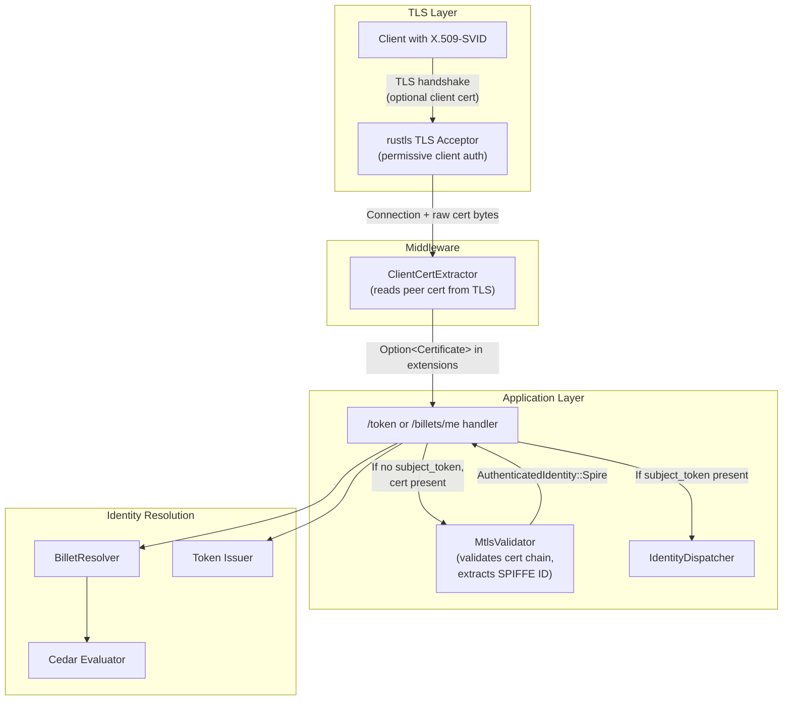

# Design Document — mTLS Client Certificate Identity Source

## Overview

This design adds X.509 client certificates (SPIRE X.509-SVIDs) as an identity source for Quartermaster's token exchange and billet discovery endpoints. When a workload presents a valid client certificate during the TLS handshake, Quartermaster extracts the SPIFFE ID from the certificate's URI SAN and uses it as the authenticated identity — eliminating the need for a `subject_token` in the request body.

The design follows a **permissive TLS + application-layer validation** pattern:
- The TLS listener accepts all connections regardless of client cert presence or issuer (no handshake rejection).
- The application layer validates client certs against configured SPIRE trust bundles.
- The existing `AuthenticatedIdentity::Spire` variant is reused for mTLS-derived identities, with only the audit `source_type` differing (`"mtls-spiffe"` vs `"spire"`).

This approach keeps the TLS layer simple (no need to reload trust bundles at the TLS level) and consolidates all identity validation logic in the application layer where it can participate in error reporting, audit logging, and graceful fallback.

## Architecture



### Decision Rationale

- **Permissive TLS**: Using `rustls` with `WebPkiClientVerifier` set to allow unauthenticated connections means we never reject at handshake. This simplifies certificate rotation (no TLS restarts needed when trust bundles change) and provides uniform error reporting through the application layer.
- **Reuse SpireIdentity variant**: Since X.509-SVIDs and JWT-SVIDs both carry the same SPIFFE ID and follow the same trust model, reusing the `SpireIdentity` struct avoids duplicating Cedar entity construction, selector enrichment, and billet resolution logic. The only difference is the transport mechanism.
- **Middleware-based cert extraction**: Injecting the client cert into request extensions via middleware keeps handler code clean and allows both `/token` and `/billets/me` handlers to access the cert without coupling to TLS implementation details.
- **Explicit X.509 trust bundle separation**: SPIRE's JWT JWKS (`jwks_path`) contains public signing keys for JWT-SVID verification — these are *not* CA certificates. For X.509-SVID cert chain validation, you need the actual CA cert PEM (root/intermediates that signed the X.509-SVIDs). A new `x509_bundle_path` field in `[identity.spire]` provides this. When absent, mTLS identity is disabled even if TLS is configured, making activation explicit and safe.

## Components and Interfaces

### 1. TLS Configuration (`src/config/mod.rs`)

New optional TLS configuration section:

```rust
/// TLS configuration for the server listener.
#[derive(Debug, Clone, Deserialize)]
pub struct TlsConfig {
    /// Path to the PEM-encoded server certificate.
    pub cert_path: String,
    /// Path to the PEM-encoded server private key.
    pub key_path: String,
}
```

Added to `ServerConfig`:

```rust
pub struct ServerConfig {
    pub host: String,
    pub port: u16,
    pub admin_addr: Option<String>,
    /// Optional TLS configuration. If absent, the server listens on plain HTTP.
    pub tls: Option<TlsConfig>,
}
```

### 1b. SpireSourceConfig Change (`src/config/identity.rs`)

New optional field for the X.509 CA bundle:

```rust
pub struct SpireSourceConfig {
    pub trust_domain: String,
    pub jwks_path: String,
    pub server_addr: Option<String>,
    pub audience: String,
    /// Optional path to PEM-encoded CA certificates for X.509-SVID chain validation.
    /// These are the root/intermediate CAs that issued the X.509-SVIDs (NOT the JWKS keys).
    /// When absent, mTLS identity source is disabled.
    pub x509_bundle_path: Option<String>,
}
```

**Startup logic**: `MtlsValidator` is constructed only when *both* `[server.tls]` is configured AND `[identity.spire].x509_bundle_path` is present. If either is missing, `AppState.mtls_validator = None`.

### 2. TLS Acceptor Setup (`src/server/tls.rs`)

New module that builds a `rustls::ServerConfig` with:
- Server certificate and private key loaded from config paths.
- Client certificate verification set to **optional** (allow unauthenticated).
- No client CA roots configured at TLS layer — all verification deferred to application layer.

```rust
pub fn build_tls_config(tls_config: &TlsConfig) -> Result<rustls::ServerConfig, TlsSetupError>;
```

Uses `rustls::server::WebPkiClientVerifier::builder(...).allow_unauthenticated()` to accept connections with or without client certs.

### 3. Client Certificate Extraction Middleware (`src/server/middleware.rs`)

An axum middleware/extractor that reads the peer certificate from the TLS connection and injects it into request extensions:

```rust
/// Newtype for an optional client certificate extracted from the TLS session.
#[derive(Clone, Debug)]
pub struct ClientCertificate(pub Option<Vec<u8>>);
```

The certificate bytes (DER-encoded) are extracted from `tokio-rustls`'s connection metadata and placed into request extensions, accessible by handlers via `Extension<ClientCertificate>`.

### 4. mTLS Validator (`src/domain/identity/mtls.rs`)

New module responsible for application-layer client certificate validation:

```rust
/// Validates a client certificate against the SPIRE X.509 trust bundle
/// and extracts the SPIFFE ID from the URI SAN.
///
/// Constructed from the CA certificates at `x509_bundle_path` (NOT from `jwks_path`,
/// which contains JWT signing keys for a different purpose).
pub struct MtlsValidator {
    /// Trust anchor certificates (CA certs from SPIRE X.509 trust bundle).
    trust_anchors: Vec<webpki::TrustAnchor>,
    /// The expected SPIFFE trust domain for validation.
    trust_domain: String,
}

impl MtlsValidator {
    /// Creates a new validator from PEM-encoded CA certificates loaded from
    /// `[identity.spire].x509_bundle_path`.
    ///
    /// Returns `Err` if the PEM is malformed or contains no valid CA certs.
    pub fn from_pem(ca_pem: &[u8], trust_domain: &str) -> Result<Self, MtlsError>;

    /// Validates a DER-encoded client certificate.
    ///
    /// Returns `Some(SpireIdentity)` if the cert:
    /// 1. Chains to a trust anchor from `x509_bundle_path`
    /// 2. Is not expired
    /// 3. Contains a `spiffe://` URI SAN matching the expected trust domain
    ///
    /// Returns `None` (not an error) if validation fails — allowing fallback.
    pub fn validate(&self, cert_der: &[u8]) -> Option<SpireIdentity>;
}
```

### 5. Handler Changes (`src/handler/token.rs`, `src/handler/billets_discovery.rs`)

Both handlers adopt a unified identity resolution pattern:

```rust
// 1. Try explicit subject_token first (existing path)
// 2. If absent, try mTLS identity from request extensions
// 3. If neither available, return 400

let identity = if let Some(subject_token) = form.subject_token {
    // Explicit token always takes precedence
    let subject_token_type = form.subject_token_type.ok_or_else(|| ...)?;
    state.identity_dispatcher.validate(&subject_token, &subject_token_type).await?
} else if let Some(mtls_identity) = extract_mtls_identity(&extensions, &state.mtls_validator) {
    mtls_identity
} else {
    return Err(DomainError::invalid_request(
        "subject_token is required when no client certificate is presented"
    ));
};
```

### 6. Audit Source Type Differentiation

The `source_type_for_identity` function gains awareness of mTLS origin. Since `AuthenticatedIdentity::Spire` is reused, a flag or wrapper indicates the transport origin:

```rust
/// Wrapper indicating whether a SpireIdentity came from JWT or mTLS.
pub enum SpireAuthSource {
    JwtSvid,
    MtlsCert,
}
```

The audit logging uses `"mtls-spiffe"` when the source is `MtlsCert`, and `"spire"` for `JwtSvid`.

### 7. AppState Changes

```rust
pub struct AppState {
    // ... existing fields ...
    /// mTLS client certificate validator.
    /// `None` when:
    /// - `[identity.spire]` is not configured, OR
    /// - `[identity.spire].x509_bundle_path` is absent, OR
    /// - `[server.tls]` is absent
    pub mtls_validator: Option<Arc<MtlsValidator>>,
}
```

## Data Models

### SpireIdentity (unchanged)

```rust
pub struct SpireIdentity {
    pub spiffe_id: String,
    pub trust_domain: String,
    pub environment: String,
    pub region: String,
    pub audience: Vec<String>,
}
```

When constructed from mTLS, `environment` and `region` are extracted from the SPIFFE ID path segments (same parsing as JWT-SVID), and `audience` is set to an empty vec (X.509-SVIDs don't carry audience claims).

### MtlsError

```rust
pub enum MtlsError {
    /// Trust bundle PEM parsing failed.
    InvalidTrustBundle(String),
    /// Certificate DER parsing failed.
    InvalidCertificate(String),
}
```

### Configuration TOML Example

```toml
[server]
host = "0.0.0.0"
port = 8443

[server.tls]
cert_path = "/etc/quartermaster/tls/server.crt"
key_path = "/etc/quartermaster/tls/server.key"

[identity.spire]
trust_domain = "example.com"
jwks_path = "/run/spire/agent/jwks.json"           # JWT-SVID verification (public signing keys)
x509_bundle_path = "/run/spire/agent/bundle.pem"   # X.509 CA certs for mTLS chain validation
audience = "quartermaster.example.com"
```

**Important distinction**: `jwks_path` provides JWKS public keys for JWT-SVID signature verification. `x509_bundle_path` provides the PEM-encoded CA certificates (root/intermediate) that issued X.509-SVIDs. These are separate artifacts in SPIRE. The `MtlsValidator` is constructed *only* from `x509_bundle_path`. If `x509_bundle_path` is absent, `mtls_validator` in AppState is `None` and mTLS identity is disabled (even if `[server.tls]` is configured).

## Correctness Properties

*A property is a characteristic or behavior that should hold true across all valid executions of a system — essentially, a formal statement about what the system should do. Properties serve as the bridge between human-readable specifications and machine-verifiable correctness guarantees.*

### Property 1: TLS Permissive Passthrough

*For any* DER-encoded X.509 certificate (valid, expired, self-signed, or no certificate at all), the TLS handshake SHALL succeed and the certificate (if presented) SHALL be accessible to the application layer unchanged.

**Validates: Requirements 1.2, 1.3, 1.4**

### Property 2: SPIFFE ID Extraction Correctness

*For any* DER-encoded X.509 certificate, `MtlsValidator::validate` SHALL return `Some(SpireIdentity)` if and only if the certificate chains to a configured trust anchor AND contains a `spiffe://` URI SAN matching the configured trust domain. Otherwise, it SHALL return `None`.

**Validates: Requirements 2.1, 2.2, 2.3, 2.4**

### Property 3: mTLS Identity Fallback Produces SpireIdentity

*For any* valid SPIFFE ID extracted from a client certificate via mTLS, when `subject_token` is absent in the request, the system SHALL use a `SpireIdentity` with that SPIFFE ID as the authenticated identity and follow the standard SPIRE resolution path (selector enrichment → Cedar evaluation → billet resolution).

**Validates: Requirements 3.2, 4.1, 5.1**

### Property 4: Explicit Token Precedence Over mTLS

*For any* request where both a valid `subject_token` and a valid mTLS client certificate are present, the authenticated identity SHALL always be derived from the `subject_token`, never from the client certificate.

**Validates: Requirements 3.4, 4.2**

### Property 5: Audit Source Type Differentiation

*For any* mTLS-authenticated request, the audit log `source_type` field SHALL be `"mtls-spiffe"`, distinct from `"spire"` which is used for JWT-SVID authenticated requests.

**Validates: Requirements 5.3**

## Error Handling

| Condition | Response | Audit |
|-----------|----------|-------|
| No `subject_token` and no client cert | HTTP 400: `"subject_token is required when no client certificate is presented"` | Failure event with empty actor |
| No `subject_token`, client cert present but invalid (doesn't chain to trust bundle) | HTTP 400: same message as above (cert is silently ignored) | Failure event with empty actor |
| No `subject_token`, client cert valid but no `spiffe://` URI SAN | HTTP 400: same message (cert is silently ignored) | Failure event with empty actor |
| `subject_token` present but invalid | HTTP 401: existing token validation error | Failure event with token type |
| TLS config references missing cert/key file | Startup panic with clear error message | N/A (server doesn't start) |
| `x509_bundle_path` references missing file | Startup panic with clear error message | N/A (server doesn't start) |
| Trust bundle PEM at `x509_bundle_path` is malformed | Startup panic with clear error message | N/A (server doesn't start) |
| Client cert DER is malformed | Silently ignored (returns `None` from validator) | No audit (no identity established) |

Key principle: **mTLS validation never produces errors visible to the client.** If the cert can't be validated, it's silently ignored and the system falls through to requiring `subject_token`. This prevents information leakage about trust bundle configuration.

## Testing Strategy

### Unit Tests

- **Config parsing**: Verify `[server.tls]` deserialization, absence = `None`, required fields validated.
- **SPIFFE ID parsing from URI SAN**: Test extraction from various cert structures.
- **Handler precedence logic**: Test the if/else chain with mocked identity sources.
- **Audit source_type mapping**: Verify `"mtls-spiffe"` vs `"spire"` for the two transport paths.

### Property-Based Tests (proptest)

Property-based testing is well-suited to this feature because:
- Certificate validation is a pure function (cert bytes → Option<SpireIdentity>).
- The input space is large (arbitrary certificates with varying SANs, chains, validity periods).
- Precedence logic has clear universal properties across all input combinations.

**Configuration:**
- Library: `proptest` (already in dev-dependencies)
- Minimum 100 iterations per property test
- Each test tagged with: **Feature: mtls-identity, Property {N}: {description}**

**Properties to implement:**
1. **Property 2** (SPIFFE ID extraction): Generate random SPIFFE IDs, create certs with/without valid chains and URI SANs, verify extraction correctness.
2. **Property 3** (mTLS fallback): Generate random SpireIdentity values, mock the mTLS validator to return them, verify handler uses mTLS identity when no subject_token.
3. **Property 4** (token precedence): Generate pairs of (subject_token_identity, mtls_identity), verify subject_token always wins.
4. **Property 5** (audit source_type): Generate mTLS identities, verify audit event contains "mtls-spiffe".

### Integration Tests

- **TLS acceptance** (Property 1): Start a real TLS server, connect with various cert configurations, verify all succeed.
- **End-to-end mTLS flow**: Present a valid X.509-SVID, omit subject_token, verify token is issued with correct SPIFFE ID.
- **Fallback behavior**: Present invalid cert, omit subject_token, verify 400 response.
- **Mixed mode**: Present valid cert AND valid subject_token, verify subject_token identity is used.
