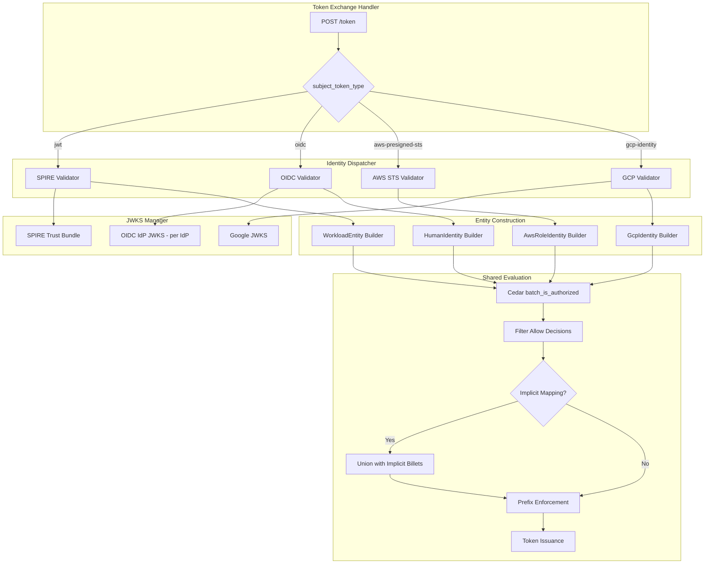

# Design Document — Multi-Source Identity & Unified Billet Resolution

## Overview

This design extends Quartermaster's identity validation layer from a single-source (SPIRE JWT-SVID) model to a multi-source identity model supporting four identity source types: SPIRE SVIDs, corporate OIDC tokens, AWS presigned STS requests, and GCP identity tokens. All sources feed into the same Cedar policy engine for billet resolution, with an optional implicit billet mapping layer for OIDC IdP sources.

The core architectural change is introducing an `IdentityDispatcher` that routes incoming tokens by `subject_token_type` to source-specific validators, each producing a typed `AuthenticatedIdentity` enum variant. This variant is then transformed into a source-specific Cedar principal entity and evaluated through the existing `LocalAuthorizer` for billet resolution.

### Key Design Decisions

1. **Enum-based dispatch over trait objects**: Use a concrete `AuthenticatedIdentity` enum rather than a trait object to represent validated identities. This enables exhaustive matching and compile-time completeness checking for source-specific logic.

2. **Shared Cedar evaluation path**: After identity validation and entity construction, all sources converge on the same `batch_is_authorized` call. No source-specific authorization logic.

3. **JWKS management as a shared service**: A single `JwksManager` handles key material for all JWT-based sources (SPIRE, OIDC IdPs, Google). Source-specific refresh cadences and staleness thresholds are configured per-source.

4. **Implicit billets as a post-evaluation overlay**: Implicit billet mapping happens *after* Cedar evaluation and is unioned with Cedar results, with prefix enforcement stripping any Cedar results that would conflict with implicit prefixes.

5. **SPIRE becomes optional**: The system starts with whatever identity sources are configured. At least one must be present.

## Architecture



### Component Interaction Flow

1. **Token Exchange Handler** receives the request, extracts `subject_token_type`
2. **Identity Dispatcher** routes to the appropriate validator
3. **Source-specific Validator** verifies the token (signature, expiry, audience) and returns an `AuthenticatedIdentity`
4. **Entity Builder** constructs the appropriate Cedar principal entity from the authenticated identity
5. **Cedar Evaluator** evaluates `assumeBillet` for all known billets (unchanged from current)
6. **Implicit Billet Mapper** (for OIDC sources with implicit claims) derives billets from group claims
7. **Prefix Enforcement** strips any Cedar-evaluated billets that collide with reserved implicit prefixes
8. **Token Issuer** builds the JWT with the `identity` claim and appropriate `sub` format

## Components and Interfaces

### 1. AuthenticatedIdentity Enum

```rust
/// The result of successfully validating an upstream identity token.
/// Each variant carries source-specific claims needed for Cedar entity construction.
#[derive(Debug, Clone)]
pub enum AuthenticatedIdentity {
    Spire(SpireIdentity),
    Oidc(OidcIdentity),
    AwsSts(AwsStsIdentity),
    Gcp(GcpIdentity),
}

#[derive(Debug, Clone)]
pub struct SpireIdentity {
    pub spiffe_id: String,
    pub trust_domain: String,
    pub environment: String,
    pub region: String,
    pub audience: Vec<String>,
}

#[derive(Debug, Clone)]
pub struct OidcIdentity {
    pub email: String,
    pub idp_prefix: String,
    /// All extracted claims keyed by claim name (e.g., "groups", "roles", custom claims).
    /// The entity builder pulls from this map; the Cedar entity flattens all values into `groups`.
    pub claims: HashMap<String, Vec<String>>,
    pub subject: String,
}

#[derive(Debug, Clone)]
pub struct AwsStsIdentity {
    pub account_id: String,
    pub role_arn: String,
    pub role_name: String,
    pub role_path: String,
    pub session_name: String,
}

#[derive(Debug, Clone)]
pub struct GcpIdentity {
    pub project_id: String,
    pub email: String,
    pub zone: String,
    pub unique_id: String,
}
```

### 2. IdentityDispatcher Trait

```rust
/// Dispatches token validation to source-specific validators based on subject_token_type.
#[async_trait]
pub trait IdentityDispatcher: Send + Sync {
    async fn validate(
        &self,
        subject_token: &str,
        subject_token_type: &str,
    ) -> Result<AuthenticatedIdentity, IdentityError>;
}
```

### 3. Source-Specific Validators

```rust
/// OIDC IdP token validator — identifies the IdP by issuer, verifies signature via cached JWKS.
#[async_trait]
pub trait OidcValidator: Send + Sync {
    async fn validate(&self, token: &str) -> Result<OidcIdentity, IdentityError>;
}

/// AWS presigned STS validator — calls the presigned URL, parses GetCallerIdentity response.
#[async_trait]
pub trait AwsStsValidator: Send + Sync {
    async fn validate(&self, presigned_url: &str) -> Result<AwsStsIdentity, IdentityError>;
}

/// GCP identity token validator — verifies against Google's JWKS, extracts claims.
#[async_trait]
pub trait GcpValidator: Send + Sync {
    async fn validate(&self, token: &str) -> Result<GcpIdentity, IdentityError>;
}
```

### 4. JwksManager

```rust
/// Manages JWKS for all JWT-based identity sources.
/// Each source has independent refresh cadence and staleness threshold.
pub struct JwksManager {
    sources: HashMap<String, JwksSource>,
}

pub struct JwksSource {
    pub keys: Arc<RwLock<Vec<TrustBundleKey>>>,
    pub discovery_url: String,
    pub refresh_interval: Duration,
    pub max_staleness: Duration,
    pub last_refresh: Arc<RwLock<Instant>>,
}
```

### 5. Implicit Billet Mapper

```rust
/// Derives implicit billets from IdP token claims based on configured claim mappings.
pub struct ImplicitBilletMapper {
    /// Map from IdP prefix → list of claim mappings
    mappings: HashMap<String, Vec<ImplicitClaimMapping>>,
    /// Set of all reserved billet prefixes (from all implicit_claims configs)
    reserved_prefixes: HashSet<String>,
}

pub struct ImplicitClaimMapping {
    pub claim_name: String,
    pub billet_prefix: String,
    pub in_tokens: bool,
}

/// Result of implicit mapping, separating token-visible vs admin-only billets.
pub struct ImplicitBilletResult {
    /// Billets that should appear in issued JWTs/certs (in_tokens = true)
    pub token_billets: Vec<String>,
    /// All implicit billets including admin-only (for Cedar admin evaluation)
    pub all_billets: Vec<String>,
}
```

### 6. Generalized Entity Builder

```rust
/// Builds Cedar principal entities from any AuthenticatedIdentity variant.
pub struct MultiSourceEntityBuilder {
    /// Existing EntityBuilder for SPIRE-sourced identities
    spire_builder: EntityBuilder,
}

impl MultiSourceEntityBuilder {
    pub fn build_principal(&self, identity: &AuthenticatedIdentity, selectors: &[String]) -> CedarPrincipal;
}

/// A Cedar principal entity for any identity source.
pub enum CedarPrincipal {
    Workload(WorkloadEntity),
    Human(HumanEntity),
    AwsRole(AwsRoleEntity),
    GcpWorkload(GcpWorkloadEntity),
}
```

### 7. Generalized Billet Resolver

The `ResolverInput` is generalized to accept any identity type:

```rust
pub struct MultiSourceResolverInput {
    pub identity: AuthenticatedIdentity,
    pub audience: String,
    pub request_time: DateTime<Utc>,
    /// The subject string for caching (formatted per Requirement 6)
    pub subject: String,
    /// Source type string for context
    pub source_type: String,
}
```

### 8. Configuration Types (New)

```rust
#[derive(Debug, Clone, Deserialize)]
pub struct IdentityConfig {
    pub spire: Option<SpireSourceConfig>,
    pub oidc: Vec<OidcSourceConfig>,
    pub aws_sts: Option<AwsStsSourceConfig>,
    pub gcp: Option<GcpSourceConfig>,
}

#[derive(Debug, Clone, Deserialize)]
pub struct OidcSourceConfig {
    pub prefix: String,
    pub issuer: String,
    pub client_ids: Vec<String>,
    pub jwks_refresh_interval: Duration,
    pub max_staleness: Duration,
    pub implicit_claims: Vec<ImplicitClaimConfig>,
}

#[derive(Debug, Clone, Deserialize)]
pub struct ImplicitClaimConfig {
    pub claim: String,
    pub billet_prefix: String,
    pub in_tokens: bool,
}

#[derive(Debug, Clone, Deserialize)]
pub struct AwsStsSourceConfig {
    pub enabled: bool,
    pub allowed_accounts: Option<Vec<String>>,
}

#[derive(Debug, Clone, Deserialize)]
pub struct GcpSourceConfig {
    pub enabled: bool,
    pub audience: String,
    pub allowed_projects: Option<Vec<String>>,
    pub jwks_refresh_interval: Duration,
    pub max_staleness: Duration,
}
```

## Data Models

### Cedar Schema Extensions

New entity types added to the `Quartermaster` namespace:

```cedar
namespace Quartermaster {
    // Existing types remain unchanged
    entity Workload = { ... };
    entity K8sWorkload in [Workload] = { ... };
    entity Ec2Workload in [Workload] = { ... };
    entity GcpWorkload in [Workload] = { ... };
    entity Billet = { ... };

    // NEW: Human identity from corporate OIDC IdPs
    // `groups` contains the flattened union of all mapped claim values (groups, roles, custom claims)
    entity HumanIdentity = {
        email: String,
        idp_prefix: String,
        groups: Set<String>,
    };

    // NEW: AWS role identity from presigned STS
    entity AwsRoleIdentity = {
        account_id: String,
        role_arn: String,
        role_name: String,
        role_path: String,
    };

    // NEW: GCP workload/service account identity
    entity GcpIdentity = {
        project_id: String,
        email: String,
        zone: String,
    };

    // MODIFIED: assumeBillet now accepts all principal types
    action assumeBillet appliesTo {
        principal: [Workload, K8sWorkload, Ec2Workload, GcpWorkload,
                    HumanIdentity, AwsRoleIdentity, GcpIdentity],
        resource: [Billet],
        context: {
            environment: String,
            region: String,
            request_time: String,
            source_type: String,      // NEW: "spire", "oidc", "aws-sts", "gcp"
            source_cloud: String,
            selectors: Set<String>,
        }
    };
}
```

### JWT Claims Extension (Identity Claim)

The issued Quartermaster JWT gains an `identity` claim:

```json
{
  "iss": "https://quartermaster.example.com",
  "sub": "human:alice@corp.example.com",
  "aud": "sts.amazonaws.com",
  "billets": ["billing-writer", "okta-role:admin"],
  "identity": {
    "type": "human",
    "email": "alice@corp.example.com",
    "idp": "okta",
    "groups": ["billing-ops", "engineering"]
  },
  "iat": 1750370000,
  "exp": 1750370300,
  "jti": "unique-token-id"
}
```

### Subject Formatting Rules

| Source Type | `sub` Format | Example |
|-------------|-------------|---------|
| SPIRE | SPIFFE ID | `spiffe://example.com/ns/finance/workload/payments` |
| OIDC | `human:<email>` | `human:alice@corp.example.com` |
| AWS STS | `aws:<account_id>:<role_name>` | `aws:123456789012:billing-service` |
| GCP | `gcp:<project_id>:<email>` | `gcp:my-project:sa@proj.iam.gserviceaccount.com` |

### Audit Event Generalization

```rust
#[derive(Debug, Clone, Serialize)]
pub struct AuditEvent {
    pub subject: String,           // replaces spiffe_id
    pub source_type: String,       // "spire", "oidc", "aws-sts", "gcp"
    pub billets: Vec<String>,
    pub implicit_billets: Vec<String>,  // NEW: implicit billets separately tracked
    pub cedar_billets: Vec<String>,     // NEW: Cedar-evaluated billets
    pub audience: Option<String>,
    pub jti: Option<String>,
    pub timestamp: DateTime<Utc>,
    pub success: bool,
    pub error: Option<String>,
    // Source-specific fields
    pub identity_details: IdentityAuditDetails,
}

#[derive(Debug, Clone, Serialize)]
#[serde(tag = "type")]
pub enum IdentityAuditDetails {
    Spire { spiffe_id: String },
    Oidc { email: String, idp_prefix: String, groups: Vec<String> },
    AwsSts { account_id: String, role_arn: String },
    Gcp { project_id: String, service_account_email: String },
}
```

### Configuration Validation Rules

At startup, the system validates:
1. At least one identity source is configured
2. All IdP `prefix` values are unique
3. All `billet_prefix` values across all implicit claim mappings are globally unique
4. Prefixes match `[a-z0-9][a-z0-9-]*`
5. OIDC issuer URLs are valid (parseable as URLs)
6. No prefix conflicts between IdP prefixes and billet prefixes

### Cache Key Generalization

| Source Type | Cache Key |
|-------------|-----------|
| SPIRE | `spiffe://example.com/workload + audience` |
| OIDC | `human:alice@corp.example.com + audience` |
| AWS STS | `aws:123456789012:billing-service + audience` |
| GCP | `gcp:my-project:sa@proj.iam.gserviceaccount.com + audience` |

The cache key is always `subject + audience`, where `subject` is the formatted `sub` claim.


## Correctness Properties

*A property is a characteristic or behavior that should hold true across all valid executions of a system — essentially, a formal statement about what the system should do. Properties serve as the bridge between human-readable specifications and machine-verifiable correctness guarantees.*

### Property 1: Configuration Validation Correctness

*For any* `IdentityConfig` instance, the validation function SHALL reject the configuration if and only if any of: (a) no identity sources are configured, (b) two OIDC sources share the same `prefix`, (c) two implicit claim mappings across all IdPs share the same `billet_prefix`, (d) any prefix does not match `[a-z0-9][a-z0-9-]*`, or (e) any OIDC issuer URL is not a valid URL. Otherwise the configuration SHALL be accepted.

**Validates: Requirements 1.3**

### Property 2: OIDC Validation Correctness

*For any* OIDC token with random claims, signing keys, issuer values, audience values, and expiry times, validation SHALL accept the token if and only if: (a) the token's `iss` matches a configured IdP's issuer URL, (b) the token signature is verifiable against that IdP's cached JWKS, (c) the token's `aud` includes one of the IdP's configured `client_ids`, and (d) the token has not expired.

**Validates: Requirements 2.1, 2.2, 2.3, 2.4, 2.5, 2.6**

### Property 3: GCP Token Validation Correctness

*For any* GCP identity token with random claims, signing keys, audience values, and expiry times, validation SHALL accept the token if and only if: (a) the signature is verifiable against Google's JWKS, (b) the `aud` claim matches the configured Quartermaster audience, and (c) the token has not expired. On success, all required claims (sub, email, project_id, zone) SHALL be correctly extracted.

**Validates: Requirements 9.1, 9.2, 9.3, 9.5**

### Property 4: Entity Construction Preserves Attributes

*For any* `AuthenticatedIdentity` variant (Spire, Oidc, AwsSts, Gcp), constructing the corresponding Cedar principal entity SHALL preserve all source-specific attributes from the input identity without loss or mutation, and the Cedar context SHALL include a `source_type` field matching the identity variant (e.g., `"spire"`, `"oidc"`, `"aws-sts"`, `"gcp"`).

**Validates: Requirements 3.3, 3.4, 3.5, 3.6**

### Property 5: Subject Formatting Correctness

*For any* `AuthenticatedIdentity`, the formatted `sub` claim SHALL follow the pattern: SPIRE → the literal SPIFFE ID, OIDC → `human:<email>`, AWS STS → `aws:<account_id>:<role_name>`, GCP → `gcp:<project_id>:<email>`. The formatting function SHALL be injective (distinct identities produce distinct subjects).

**Validates: Requirements 6.6**

### Property 6: Identity Claim Construction

*For any* `AuthenticatedIdentity`, the constructed `identity` claim in the issued JWT SHALL include a `type` field matching the source (`"workload"`, `"human"`, `"aws_role"`, `"gcp_workload"`) and all source-specific fields from the identity (e.g., `email` and `groups` for OIDC, `account_id` and `role_arn` for AWS STS).

**Validates: Requirements 6.1, 6.2, 6.3, 6.4, 6.5**

### Property 7: Implicit Billet Derivation

*For any* set of `ImplicitClaimMapping` entries and random claim values (lists of strings), the implicit billet mapper SHALL produce exactly one billet per claim value per mapping, formatted as `<billet_prefix>:<claim_value>`. Multiple mappings produce independent sets that are unioned together.

**Validates: Requirements 4.1, 4.7**

### Property 8: Token Billet Assembly

*For any* combination of Cedar-evaluated billets, implicit billet results (with `in_tokens` flags), and reserved prefix set, the final token billet list SHALL equal: (Cedar billets MINUS any billet whose name starts with a reserved prefix) UNION (implicit billets where `in_tokens = true`). No billet from Cedar evaluation with a reserved prefix SHALL appear in the final token.

**Validates: Requirements 4.2, 4.5, 5.1, 5.2, 5.4**

### Property 9: Audit Event Construction

*For any* `AuthenticatedIdentity` and resolution result (with Cedar billets and implicit billets), the constructed audit event SHALL include: the correct `source_type`, the formatted `subject`, all billets separated into `cedar_billets` and `implicit_billets`, and the source-specific identity details matching the identity variant.

**Validates: Requirements 10.1, 10.2, 10.3, 10.4, 10.5**

### Property 10: ARN Parsing

*For any* valid IAM role ARN of the form `arn:aws:iam::<account_id>:role/<path>/<role_name>` or `arn:aws:sts::<account_id>:assumed-role/<role_name>/<session_name>`, parsing SHALL extract the correct `account_id`, `role_name`, `role_path`, and `session_name` components. The parser SHALL reject ARNs that do not match expected formats.

**Validates: Requirements 8.3**

### Property 11: Presigned STS URL Validation

*For any* URL string, the presigned URL validator SHALL accept if and only if: (a) the host is `sts.amazonaws.com` or a regional STS endpoint matching `sts.<region>.amazonaws.com`, (b) the query parameters include `Action=GetCallerIdentity`, and (c) the `X-Amz-Date` plus `X-Amz-Expires` indicate the URL has not expired. All other URLs SHALL be rejected.

**Validates: Requirements 8.5, 8.6**

## Error Handling

### Identity Validation Errors

| Error Condition | HTTP Status | Error Code | Description |
|----------------|-------------|------------|-------------|
| Unknown `subject_token_type` | 400 | `invalid_request` | Unrecognized token type parameter |
| No configured source matches token | 401 | `invalid_token` | Token issuer doesn't match any configured IdP |
| Signature verification failed | 401 | `invalid_token` | Token signature cannot be verified |
| Token expired | 401 | `invalid_token` | Token `exp` is in the past |
| Audience mismatch | 401 | `invalid_token` | Token audience not in allowed list |
| JWKS stale (> max_staleness) | 503 | `service_unavailable` | Cannot verify tokens from this IdP |
| AWS STS presigned URL invalid | 401 | `invalid_token` | URL doesn't target STS or is expired |
| AWS STS call failed | 401 | `invalid_token` | STS returned an error response |
| AWS account not in allowlist | 401 | `invalid_token` | Account not in `allowed_accounts` |
| GCP project not in allowlist | 401 | `invalid_token` | Project not in `allowed_projects` |

### Billet Resolution Errors (Unchanged)

| Error Condition | HTTP Status | Error Code |
|----------------|-------------|------------|
| No billets resolved (all Deny) | 403 | `insufficient_scope` |
| PolicySet not initialized | 503 | `service_unavailable` |
| Cedar evaluation internal error | 503 | `service_unavailable` |

### Configuration Errors (Startup)

| Error Condition | Behavior |
|----------------|----------|
| No identity sources configured | Startup fails with config error |
| Duplicate IdP prefix | Startup fails with config error |
| Duplicate `billet_prefix` | Startup fails with config error |
| Invalid prefix pattern | Startup fails with config error |
| Invalid OIDC issuer URL | Startup fails with config error |

### Graceful Degradation

- **JWKS refresh failure**: Continue with cached keys, log warning. Only reject after `max_staleness` exceeded.
- **Selector enrichment failure (SPIRE)**: Proceed with empty selectors (existing behavior, unchanged).
- **Cache failure**: Fall through to full evaluation (existing behavior, unchanged).
- **Individual source unavailable**: Other sources continue operating. Only the failing source rejects tokens.

## Testing Strategy

### Dual Testing Approach

This feature uses both example-based unit tests and property-based tests for comprehensive coverage:

- **Property-based tests** validate universal invariants across randomly generated inputs (100+ iterations per property)
- **Unit tests** cover specific examples, integration points, and error conditions
- **Integration tests** verify the end-to-end flow with mocked external services

### Property-Based Testing Configuration

- **Library**: `proptest` (already in dev-dependencies)
- **Minimum iterations**: 100 per property test
- **Tag format**: `Feature: multi-source-identity, Property {N}: {title}`

Each correctness property from the design maps to a single `proptest!` test block:

| Property | Test Strategy |
|----------|--------------|
| P1: Config Validation | Generate random `IdentityConfig` with controlled validity dimensions |
| P2: OIDC Validation | Generate JWTs with random claims, sign with EC keys, test with matching/non-matching JWKS |
| P3: GCP Validation | Same pattern as P2 but targeting GCP-specific claims and audience |
| P4: Entity Construction | Generate random `AuthenticatedIdentity` variants, verify attribute preservation |
| P5: Subject Formatting | Generate random identities, verify format patterns and injectivity |
| P6: Identity Claim | Generate random identities, build claims, verify all fields present |
| P7: Implicit Derivation | Generate random claim mappings and values, verify billet names |
| P8: Token Assembly | Generate random Cedar/implicit billet sets with reserved prefixes, verify final output |
| P9: Audit Events | Generate random identities and resolution results, verify audit event completeness |
| P10: ARN Parsing | Generate random valid ARNs, verify round-trip parsing |
| P11: URL Validation | Generate random URLs with controlled validity dimensions |

### Unit Test Coverage

Key areas for example-based unit tests:

- **OIDC dispatcher**: Correct IdP selection by issuer matching
- **AWS STS response parsing**: Sample XML responses from GetCallerIdentity
- **JWKS staleness logic**: Time-based threshold behavior
- **Admin API prefix rejection**: Reserved prefix enforcement in billet CRUD
- **Token exchange handler dispatch**: Correct routing by `subject_token_type`
- **Implicit billet `in_tokens=false` exclusion**: Verify stripped from JWT but available for admin auth
- **Error responses**: Each error condition returns correct HTTP status and error body

### Integration Test Coverage

- End-to-end token exchange with each identity source (mocked external services)
- Cedar policy evaluation with new entity types (`HumanIdentity`, `AwsRoleIdentity`, `GcpIdentity`)
- Multi-source scenario: same Quartermaster instance handling requests from different source types concurrently
- JWKS refresh lifecycle: initial fetch → use → refresh → staleness → rejection
