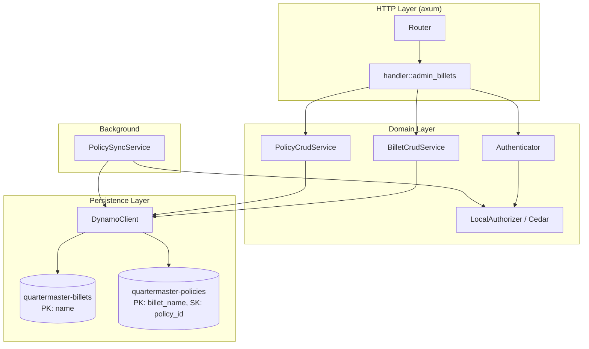

# Design Document — Nested Billets API & Scoped Admin Authorization

## Overview

This design restructures the Quartermaster admin API to nest policies under their owning billet, introduces cascade deletion, scoped per-billet admin authorization, and changes the billet existence model from "derived from policies" to "explicitly created." The DynamoDB schema for policies changes from a single-key (`policy_id`) table to a composite-key table partitioned by `billet_name`.

### Key Changes from Current Design

1. **Policies become sub-resources of billets** — CRUD moves from `/admin/policies` to `/admin/billets/{name}/policies/{id}`
2. **DynamoDB policies table** — partition key changes from `policy_id` to `billet_name`, with `policy_id` as sort key
3. **Billet existence** — the billets table is now the single source of truth; `PolicySyncService` scans billets (not policy resource scopes) for the known billet set
4. **Cascade delete** — deleting a billet removes all policies in its partition
5. **Resource scope validation** — policy creation/update validates that the Cedar `resource` scope references only the owning billet
6. **PUT /admin/billets/{name}** — new endpoint for metadata updates
7. **Scoped admin authorization** — all admin actions use the target billet as the Cedar resource, enabling per-billet delegation
8. **Handler consolidation** — `admin_policies` handler is removed; all admin billet + policy routes live in `admin_billets`

## Architecture



### Request Flow

1. Request arrives at `/admin/billets/{name}/policies` (or billet-level route)
2. `admin_billets` handler extracts path parameters and auth header
3. `Authenticator::authenticate` verifies JWT and calls `LocalAuthorizer::is_authorized_admin` with the **target billet** as the Cedar resource
4. Handler delegates to `BilletCrudService` or `PolicyCrudService`
5. Service validates input, calls `DynamoClient` for persistence
6. `PolicySyncService` picks up changes on next sync cycle

## Components and Interfaces

### Handler Layer: `handler::admin_billets`

The `admin_policies` module is removed. All admin routes are served from a single `admin_billets` module. Routes:

| Method | Path | Handler | Auth Action |
|--------|------|---------|-------------|
| POST | `/admin/billets` | `create_billet` | `createBillet` |
| GET | `/admin/billets` | `list_billets` | `listBillets` |
| GET | `/admin/billets/{name}` | `get_billet` | `readBillet` |
| PUT | `/admin/billets/{name}` | `update_billet` | `updateBillet` |
| DELETE | `/admin/billets/{name}` | `delete_billet` | `deleteBillet` |
| POST | `/admin/billets/{name}/policies` | `create_policy` | `createPolicy` |
| GET | `/admin/billets/{name}/policies` | `list_policies` | `readBillet` |
| GET | `/admin/billets/{name}/policies/{id}` | `get_policy` | `readBillet` |
| PUT | `/admin/billets/{name}/policies/{id}` | `update_policy` | `updatePolicy` |
| DELETE | `/admin/billets/{name}/policies/{id}` | `delete_policy` | `deletePolicy` |

### Domain Layer: `BilletCrudService`

Responsibilities:
- Create billet metadata (existing)
- Update billet metadata (new — PUT)
- Get billet with attached policies (changed — now includes policy list)
- List billets (changed — source of truth is billets table, no longer merges with policy-derived names)
- Cascade delete billet + all policies (changed)

New methods:

```rust
impl BilletCrudService {
    /// Updates a billet's metadata fields. Only fields present in the update are changed.
    pub async fn update(
        &self,
        name: &str,
        description: Option<&str>,
        aws_roles: Option<Vec<String>>,
        gcp_sas: Option<Vec<String>>,
    ) -> Result<BilletMetadata, BilletCrudError>;

    /// Gets a billet with its attached policies.
    pub async fn get_with_policies(
        &self,
        name: &str,
    ) -> Result<BilletWithPolicies, BilletCrudError>;

    /// Deletes a billet and all its attached policies (cascade).
    pub async fn delete_cascade(&self, name: &str) -> Result<(), BilletCrudError>;
}
```

### Domain Layer: `PolicyCrudService`

Changes from current design:
- All operations now require `billet_name` as the first parameter (partition context)
- `create` validates billet existence and Cedar resource scope
- `update` validates Cedar resource scope matches owning billet
- Removes the standalone `delete` that operates by `policy_id` alone

```rust
impl PolicyCrudService {
    /// Creates a policy under a billet. Validates billet exists, Cedar syntax, and resource scope.
    pub async fn create(
        &self,
        billet_name: &str,
        statement: &str,
        description: &str,
    ) -> Result<PolicyCreateResponse, PolicyCrudError>;

    /// Lists all policies for a billet.
    pub async fn list_for_billet(
        &self,
        billet_name: &str,
    ) -> Result<Vec<PolicyRecord>, PolicyCrudError>;

    /// Gets a single policy by billet + id.
    pub async fn get(
        &self,
        billet_name: &str,
        policy_id: &str,
    ) -> Result<PolicyRecord, PolicyCrudError>;

    /// Updates a policy's statement/description. Validates resource scope.
    pub async fn update(
        &self,
        billet_name: &str,
        policy_id: &str,
        statement: &str,
        description: &str,
    ) -> Result<PolicyRecord, PolicyCrudError>;

    /// Deletes a single policy.
    pub async fn delete(
        &self,
        billet_name: &str,
        policy_id: &str,
    ) -> Result<(), PolicyCrudError>;
}
```

New error variant:

```rust
pub enum PolicyCrudError {
    InvalidStatement(String),
    InvalidResourceScope(String),  // NEW: resource scope doesn't match owning billet
    BilletNotFound(String),        // NEW: owning billet doesn't exist
    NotFound(String),
    InternalError(String),
}
```

### Resource Scope Validation

A new function `validate_resource_scope(statement: &str, billet_name: &str) -> Result<(), PolicyCrudError>` parses the Cedar policy and checks:

1. The statement parses as a valid `PolicySet`
2. For each policy in the set that has `action == Action::"assumeBillet"`:
   - The `resource` scope must be `== Billet::"<billet_name>"` (exact match to the owning billet)
   - An unconstrained `resource` (i.e., `resource`) is rejected for `assumeBillet` actions
   - A reference to a different billet is rejected

This uses `cedar_policy::PolicySet` parsing and inspects the AST's resource constraint.

### DynamoDB Layer: `DynamoClient` Trait

New and changed methods:

```rust
#[async_trait]
pub trait DynamoClient: Send + Sync {
    // Existing policy methods change signature:

    /// Creates a policy with composite key (billet_name PK, policy_id SK).
    async fn create_policy(
        &self,
        billet_name: &str,
        policy_id: &str,
        statement: &str,
        description: &str,
    ) -> Result<(), DynamoError>;

    /// Gets a single policy by composite key.
    async fn get_policy(
        &self,
        billet_name: &str,
        policy_id: &str,
    ) -> Result<Option<PolicyRecord>, DynamoError>;

    /// Updates a policy by composite key.
    async fn update_policy(
        &self,
        billet_name: &str,
        policy_id: &str,
        statement: &str,
        description: &str,
    ) -> Result<(), DynamoError>;

    /// Deletes a single policy by composite key.
    async fn delete_policy(
        &self,
        billet_name: &str,
        policy_id: &str,
    ) -> Result<(), DynamoError>;

    /// Queries all policies for a billet (DynamoDB Query on PK).
    async fn list_policies_for_billet(
        &self,
        billet_name: &str,
    ) -> Result<Vec<PolicyRecord>, DynamoError>;

    /// Full table scan — used only by PolicySyncService.
    async fn scan_all_policies(&self) -> Result<Vec<PolicyRecord>, DynamoError>;

    /// Deletes all policies for a billet (Query + BatchWriteItem).
    async fn delete_policies_for_billet(
        &self,
        billet_name: &str,
    ) -> Result<u32, DynamoError>;

    // Billet metadata methods (unchanged):
    async fn get_billet_metadata(&self, name: &str) -> Result<Option<BilletMetadata>, DynamoError>;
    async fn put_billet_metadata(&self, metadata: BilletMetadata) -> Result<(), DynamoError>;
    async fn delete_billet_metadata(&self, name: &str) -> Result<(), DynamoError>;
    async fn list_billet_metadata(&self) -> Result<Vec<BilletMetadata>, DynamoError>;
}
```

### PolicySyncService Changes

- `sync_once` now calls `scan_all_policies()` (full scan, same as before but renamed for clarity)
- `known_billets()` now scans the **billets table** (`list_billet_metadata`) rather than parsing `Billet::"X"` from policy statements
- The regex-based billet extraction is removed

```rust
impl PolicySyncService {
    async fn sync_once(&self) -> Result<(), String> {
        // 1. Scan all policies → build PolicySet
        let records = self.dynamo_client.scan_all_policies().await?;
        let policy_set = Self::parse_policies(&records)?;

        // 2. Scan billets table → build known billet set
        let billet_records = self.dynamo_client.list_billet_metadata().await?;
        let known_billets: HashSet<String> = billet_records.iter().map(|b| b.name.clone()).collect();

        // 3. Atomically swap both
        // ...
    }
}
```

### Cedar Authorization — Scoped Admin Actions

The Cedar schema adds an `updateBillet` action. All admin handlers pass the **target billet name** as the Cedar resource to `Authenticator::authenticate`:

```rust
// In handler:
state.admin_authenticator
    .authenticate(&auth_header, "updateBillet", &billet_name)
    .await?;
```

The bootstrap `quartermaster-admin` policy remains:
```cedar
permit(
    principal == Quartermaster::Billet::"quartermaster-admin",
    action,
    resource
);
```

Scoped delegation example:
```cedar
permit(
    principal == Quartermaster::Billet::"billing-team-admin",
    action in [
        Quartermaster::Action::"readBillet",
        Quartermaster::Action::"updateBillet",
        Quartermaster::Action::"createPolicy",
        Quartermaster::Action::"updatePolicy",
        Quartermaster::Action::"deletePolicy"
    ],
    resource == Quartermaster::Billet::"billing-writer"
);
```

## Data Models

### DynamoDB: `quartermaster-policies` Table (New Schema)

| Attribute | Type | Key |
|-----------|------|-----|
| `billet_name` | String | Partition Key (PK) |
| `policy_id` | String (UUID) | Sort Key (SK) |
| `statement` | String | — |
| `description` | String | — |
| `created_at` | String (ISO 8601) | — |
| `updated_at` | String (ISO 8601) | — |

Access patterns:
- **Query by billet**: `PK = billet_name` → list policies, cascade delete
- **Get single policy**: `PK = billet_name, SK = policy_id`
- **Full scan**: PolicySyncService reads all partitions to build the in-memory PolicySet

### DynamoDB: `quartermaster-billets` Table (Unchanged)

| Attribute | Type | Key |
|-----------|------|-----|
| `name` | String | Partition Key |
| `description` | String | — |
| `associated_aws_roles` | List<String> | — |
| `associated_gcp_sas` | List<String> | — |
| `updated_at` | String (ISO 8601) | — |

### Rust Structs

```rust
/// PolicyRecord with billet_name field (reflects new composite key).
#[derive(Debug, Clone)]
pub struct PolicyRecord {
    pub billet_name: String,
    pub policy_id: String,
    pub statement: String,
    pub description: String,
    pub created_at: String,
    pub updated_at: String,
}

/// Response for GET /admin/billets/{name} — includes policies.
#[derive(Debug, Serialize)]
pub struct BilletWithPolicies {
    pub name: String,
    pub description: String,
    pub associated_aws_roles: Vec<String>,
    pub associated_gcp_sas: Vec<String>,
    pub updated_at: String,
    pub policies: Vec<PolicySummary>,
}

#[derive(Debug, Serialize)]
pub struct PolicySummary {
    pub id: String,
    pub statement: String,
    pub description: String,
}

/// Request body for PUT /admin/billets/{name}.
#[derive(Debug, Deserialize)]
pub struct UpdateBilletRequest {
    pub description: Option<String>,
    pub associated_aws_roles: Option<Vec<String>>,
    pub associated_gcp_sas: Option<Vec<String>>,
}
```


## Correctness Properties

*A property is a characteristic or behavior that should hold true across all valid executions of a system — essentially, a formal statement about what the system should do. Properties serve as the bridge between human-readable specifications and machine-verifiable correctness guarantees.*

### Property 1: Metadata update preserves provided fields and leaves others unchanged

*For any* existing billet and any subset of optional update fields (description, associated_aws_roles, associated_gcp_sas), updating the billet with those fields SHALL result in the provided fields being set to the new values while un-provided fields retain their previous values.

**Validates: Requirements 1.1, 1.2**

### Property 2: Get billet returns metadata and all attached policies

*For any* billet with N attached policies (N ≥ 0), retrieving that billet SHALL return its metadata fields (name, description, associated_aws_roles, associated_gcp_sas) and a policies array of exactly N elements, where each element contains the policy's id, statement, and description.

**Validates: Requirements 2.1, 2.2, 2.3**

### Property 3: Cascade delete removes billet and all attached policies

*For any* existing (non-protected) billet with N attached policies, deleting that billet SHALL result in both the billet metadata and all N policy records being removed — subsequent lookups of the billet and any of its policies SHALL return not-found.

**Validates: Requirements 3.1, 3.2**

### Property 4: Resource scope validation rejects mismatched billet references

*For any* Cedar policy statement containing an `assumeBillet` action, if the resource scope references a billet name different from the owning billet (or is unconstrained), the system SHALL reject the statement. If the resource scope references exactly the owning billet, the system SHALL accept it (assuming valid syntax).

**Validates: Requirements 4.5, 7.3**

### Property 5: Policy listing is isolated by billet partition

*For any* set of policies distributed across multiple billets, listing policies for a specific billet SHALL return exactly the policies stored under that billet's partition and no policies from other billets.

**Validates: Requirements 5.1, 9.3**

### Property 6: Known billets derived from billets table, not policy scopes

*For any* set of billet records in the billets table, after sync the known_billets set SHALL equal exactly the set of billet names from the billets table — regardless of which billets are referenced in policy resource scopes.

**Validates: Requirements 10.2, 10.3**

### Property 7: Scoped Cedar admin policies correctly restrict per-billet access

*For any* Cedar admin policy that scopes permissions to a specific billet, authorization SHALL allow the specified actions on that billet and deny those same actions on any other billet.

**Validates: Requirements 11.1, 11.2**

## Error Handling

### HTTP Error Responses

All errors follow the existing OAuth 2.0 error response convention (`DomainError` → JSON with `error` and `error_description`):

| Scenario | HTTP Status | Error Code |
|----------|-------------|------------|
| Missing/invalid Authorization header | 401 | `invalid_token` |
| JWT expired | 401 | `invalid_token` |
| Cedar authorization denied | 403 | `insufficient_scope` |
| Billet not found | 404 | `not_found` |
| Policy not found | 404 | `not_found` |
| Invalid Cedar statement syntax | 400 | `invalid_request` |
| Resource scope mismatch | 400 | `invalid_request` |
| Billet already exists (create) | 409 | `conflict` |
| Protected billet deletion attempt | 403 | `insufficient_scope` |
| DynamoDB unavailable | 503 | `service_unavailable` |

### Cascade Delete Error Handling

The cascade delete operation performs:
1. Query all policies for the billet (DynamoDB Query)
2. BatchWriteItem to delete all policies
3. Delete billet metadata

If step 2 fails partway through (BatchWriteItem returns unprocessed items), the service retries unprocessed items up to 3 times with exponential backoff. If retries exhaust, return 503 and the billet metadata is **not** deleted — leaving the system in a state where some policies may have been deleted but the billet still exists. This is recoverable by retrying the delete.

### PolicySyncService Failure Handling

- If `scan_all_policies` fails: continue with last PolicySet, log warning
- If `list_billet_metadata` fails: continue with last known_billets set, log warning
- Both failures on first sync: service reports degraded (503 on billet resolution)

## Testing Strategy

### Property-Based Tests (proptest)

The project already uses `proptest` (declared in `[dev-dependencies]`). Each property maps to a single proptest test with minimum 100 iterations.

**Library**: `proptest` (already in Cargo.toml)
**Configuration**: `ProptestConfig { cases: 100, .. }`
**Tag format**: `// Feature: nested-billets, Property N: <property text>`

Properties 1–7 above are implemented as proptest tests using mock DynamoDB clients:

1. **Metadata update field merge**: Generate `Option<String>` for description, `Option<Vec<String>>` for roles/SAs. Apply update to a random initial state. Assert provided fields changed, others unchanged.
2. **Get billet with policies**: Generate 0..20 random policies under a billet. Call `get_with_policies`. Assert response contains all.
3. **Cascade delete**: Generate 0..20 policies under a billet. Call `delete_cascade`. Assert subsequent gets return not-found.
4. **Resource scope validation**: Generate Cedar statements with parameterized resource scopes (matching billet, different billet, unconstrained). Assert correct accept/reject.
5. **Policy list isolation**: Generate policies across 2+ billets. List for one billet. Assert only that billet's policies returned.
6. **Known billets from billets table**: Generate random billets in billets table and different billets referenced in policy scopes. Sync. Assert known_billets == billets table set.
7. **Scoped admin authorization**: Generate scoped Cedar policies for random billet names. Evaluate against matching and non-matching resources. Assert correct allow/deny.

### Unit Tests (example-based)

- Handler route tests using `axum-test`: verify HTTP status codes, response shapes, auth header extraction
- `PolicyCrudService` tests: happy path create/update/delete, error cases (not found, invalid statement)
- `BilletCrudService` tests: happy path CRUD, protected billet guard, update merge logic
- `DynamoClient` mock tests: verify correct key structure in calls

### Integration Tests

- Full request flow through router with mock DynamoDB
- PolicySyncService sync cycle with billets table as source of truth
- BatchWriteItem retry logic for cascade delete

### Edge Case Coverage (via property generators)

Edge cases are covered by property-based test generators producing:
- Empty strings for billet names → rejected by validation
- Whitespace-only names → rejected
- Zero attached policies → cascade delete is a no-op for policies
- Very long Cedar statements → valid if syntactically correct
- Unicode characters in descriptions
- Maximum BatchWriteItem size (25 items per batch) → tests the batching logic
