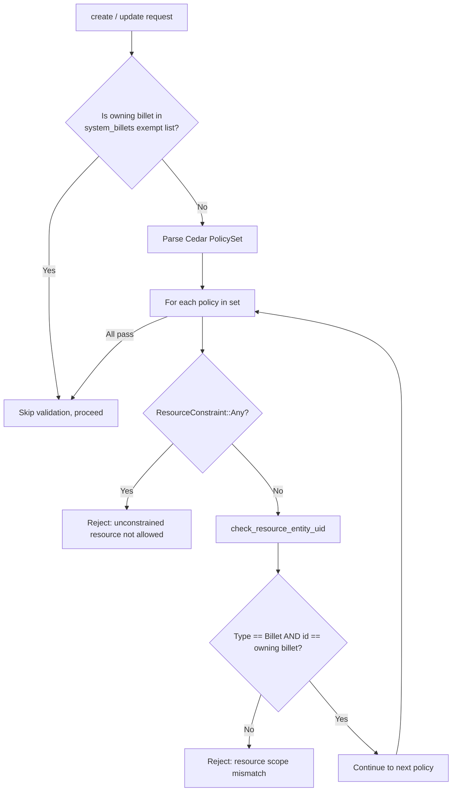

# Design Document — Uniform Resource Scope Validation

## Overview

This design extends the existing `validate_resource_scope` function in `PolicyCrudService` to enforce resource scope validation on **all** policy actions, not just `assumeBillet`. The core invariant is: every policy stored under billet X must have `resource == Billet::"X"`.

The change is minimal in surface area — remove a conditional bypass, add a configurable system billet exemption list, and update error messages to be action-agnostic. The validation logic itself (`check_resource_entity_uid`) remains unchanged.

### Key Design Decisions

1. **Remove the `action_is_assume_billet` gate** — validation applies to all actions uniformly.
2. **System billet exemption checked first** — before parsing and iterating policies, short-circuit if the owning billet is in the exempt list.
3. **Configurable exempt list** — stored in application config with a sensible default (`["quartermaster-admin", "quartermaster-guardrails"]`).
4. **Error messages made generic** — replace "assumeBillet policies must…" with action-agnostic wording.
5. **No changes to read/sync paths** — validation is write-time only (create + update).

## Architecture

The change is scoped to a single module (`src/domain/admin/policies.rs`) with a small config addition.



### Current vs. Proposed Flow

| Step | Current | Proposed |
|------|---------|----------|
| 1 | Parse PolicySet | Parse PolicySet |
| 2 | For each policy: skip if action ≠ assumeBillet | *(removed)* |
| 3 | Check ResourceConstraint | For each policy: check ResourceConstraint |
| 4 | — | System billet check happens *before* step 1 |

## Components and Interfaces

### Modified: `PolicyCrudService` (`src/domain/admin/policies.rs`)

#### `validate_resource_scope` (public, static)

**Current signature:**
```rust
pub fn validate_resource_scope(statement: &str, billet_name: &str) -> Result<(), PolicyCrudError>
```

**Proposed signature (unchanged externally):**
```rust
pub fn validate_resource_scope(statement: &str, billet_name: &str) -> Result<(), PolicyCrudError>
```

**Internal changes:**
- Remove the `if !Self::action_is_assume_billet(policy.action_constraint()) { continue; }` line.
- All policies in the set are now validated regardless of action.

#### `check_resource_entity_uid` (private, static)

**Changes:** Update error message strings only. Replace `"assumeBillet policy resource must be of type Billet"` with `"policy resource must be of type Billet"`.

#### `action_is_assume_billet` (private, static)

**Status:** Dead code after this change. Will be removed.

#### `create` method

**Changes:** Replace the current `quartermaster-guardrails` check with a system billet exemption check:

```rust
// Current:
if billet_name != "quartermaster-guardrails" {
    Self::validate_resource_scope(statement, billet_name)?;
}

// Proposed:
if !Self::is_system_billet(billet_name) {
    Self::validate_resource_scope(statement, billet_name)?;
}
```

The `validate_forbid_only` check for guardrails remains — that's a separate concern (guardrails must be forbid-only).

#### `update` method

Same change as `create`: replace hardcoded `quartermaster-guardrails` check with `is_system_billet`.

#### New: `is_system_billet` (instance method)

The system billet check uses the config-driven list from the start. The `PolicyCrudService` gains access to the list via its constructor (or via a module-level config reference). The const serves only as the serde default:

```rust
/// Default system billets exempt from resource scope validation.
const DEFAULT_SYSTEM_BILLETS: &[&str] = &["quartermaster-admin", "quartermaster-guardrails"];

fn default_system_billets() -> Vec<String> {
    DEFAULT_SYSTEM_BILLETS.iter().map(|s| s.to_string()).collect()
}
```

The `PolicyCrudService` stores the list and exposes a check:

```rust
pub struct PolicyCrudService {
    data_store: Arc<dyn DataStore>,
    system_billets: Vec<String>,
}

impl PolicyCrudService {
    pub fn new(data_store: Arc<dyn DataStore>, system_billets: Vec<String>) -> Self {
        Self { data_store, system_billets }
    }

    /// Returns true if the given billet name is in the system billet exempt list.
    fn is_system_billet(&self, billet_name: &str) -> bool {
        self.system_billets.iter().any(|s| s == billet_name)
    }
}
```

This avoids a follow-up refactor — one field in Config, one extra constructor arg, same default behavior.

### Modified: `Config` (`src/config/mod.rs`)

Add the field with a serde default so existing configs don't break:

```rust
/// System billets exempt from resource scope validation.
/// Defaults to ["quartermaster-admin", "quartermaster-guardrails"] if omitted.
#[serde(default = "default_system_billets")]
pub system_billets: Vec<String>,
```

```rust
fn default_system_billets() -> Vec<String> {
    vec![
        "quartermaster-admin".to_string(),
        "quartermaster-guardrails".to_string(),
    ]
}
```

Operators override via TOML only when they have custom system billets beyond the defaults:

```toml
# Optional — only needed if you have custom system billets beyond the defaults
# system_billets = ["quartermaster-admin", "quartermaster-guardrails", "my-custom-system-billet"]
```

## Data Models

### Configuration

The system billets list is config-driven from day one, with a serde default so existing deployments don't need to change anything:

```toml
# Optional — only needed if you have custom system billets beyond the defaults
# system_billets = ["quartermaster-admin", "quartermaster-guardrails", "my-custom-system-billet"]
```

**Rust struct field in `Config`:**

```rust
#[serde(default = "default_system_billets")]
pub system_billets: Vec<String>,
```

```rust
fn default_system_billets() -> Vec<String> {
    vec![
        "quartermaster-admin".to_string(),
        "quartermaster-guardrails".to_string(),
    ]
}
```

The `PolicyCrudService` receives `config.system_billets` at construction time — no secondary lookup needed.

### No Data Store Changes

The `PolicyRecord` schema in the DataStore is unchanged. This feature modifies write-time validation only — no new fields, no migrations.

### Error Messages

| Current message | Proposed message |
|---|---|
| `"assumeBillet policies must specify a resource scope (resource == Billet::"<name>"); unconstrained resource is not allowed"` | `"policies must specify resource == Billet::<owning billet>; unconstrained resource is not allowed"` |
| `"assumeBillet policy resource must be of type Billet, found '{}'"` | `"policy resource must be of type Billet, found '{}'"` |
| `"resource scope references billet '{}' but policy belongs to billet '{}'"` | *(unchanged — already generic)* |
| `"assumeBillet policies must use resource == Billet::"<name>" with the owning billet name"` | `"policies must use resource == Billet::<owning billet> with the owning billet name"` |


## Correctness Properties

*A property is a characteristic or behavior that should hold true across all valid executions of a system — essentially, a formal statement about what the system should do. Properties serve as the bridge between human-readable specifications and machine-verifiable correctness guarantees.*

### Property 1: Valid resource scope passes for any action

*For any* non-system billet name and *for any* valid Cedar policy statement where the resource constraint equals `Billet::"<owning_billet>"`, `validate_resource_scope` SHALL return `Ok(())` regardless of the action in the policy (assumeBillet, createPolicy, updatePolicy, deletePolicy, etc.).

**Validates: Requirements 1.1, 5.2**

### Property 2: Invalid resource scope rejected for any action

*For any* non-system billet name and *for any* valid Cedar policy statement where the resource constraint is either unconstrained (`Any`) or references a billet different from the owning billet, `validate_resource_scope` SHALL return an error — regardless of the action in the policy.

**Validates: Requirements 1.2, 1.3**

### Property 3: System billet exemption

*For any* billet name in the system billets exempt list and *for any* valid Cedar policy statement (including those with unconstrained resource or mismatched billet references), resource scope validation SHALL be skipped and the policy SHALL be accepted.

**Validates: Requirements 2.1, 2.2, 2.3**

### Property 4: Principal is unconstrained

*For any* non-system billet and *for any* Cedar policy where the resource correctly references the owning billet, validation SHALL pass regardless of what principal is specified (any billet, any entity, unconstrained principal).

**Validates: Requirements 4.1, 4.2**

### Property 5: Multi-statement rejection

*For any* Cedar policy set containing two or more statements where at least one statement has an invalid resource scope, `validate_resource_scope` SHALL reject the entire policy set.

**Validates: Requirements 1.4**

## Error Handling

### Validation Errors (HTTP 400)

| Condition | Error variant | Message |
|---|---|---|
| Cedar syntax invalid | `InvalidStatement` | `"invalid Cedar statement: {parse_error}"` |
| Unconstrained resource on non-system billet | `InvalidResourceScope` | `"policies must specify resource == Billet::<owning billet>; unconstrained resource is not allowed"` |
| Resource type is not Billet | `InvalidResourceScope` | `"policy resource must be of type Billet, found '{type}'"` |
| Resource references wrong billet | `InvalidResourceScope` | `"resource scope references billet '{other}' but policy belongs to billet '{name}'"` |
| Guardrail policy has permit effect | `InvalidStatement` | `"guardrail policies must be forbid-only; permit policies are not allowed on the quartermaster-guardrails billet"` |

### Unchanged Error Paths

- `BilletNotFound` (404): owning billet doesn't exist in DataStore
- `NotFound` (404): policy ID doesn't exist on update/delete
- `InternalError` (500): DataStore communication failure

### Error Ordering

Validation runs in this order (first failure wins):
1. Cedar syntax validation (`validate_cedar_statement`)
2. Forbid-only check (if billet is `quartermaster-guardrails`)
3. System billet exemption check — if exempt, skip step 4
4. Resource scope validation (`validate_resource_scope`)
5. Billet existence check (DataStore call)

## Testing Strategy

### Property-Based Tests

Property-based testing is appropriate here. The `validate_resource_scope` function is a pure function with clear input/output behavior, a large input space (arbitrary Cedar policy strings with varying actions, principals, and resources), and universal invariants.

**Library:** `proptest` (Rust PBT library)

**Configuration:** Minimum 100 iterations per property test.

**Tag format:** `Feature: principal-scope-validation, Property {N}: {description}`

Each correctness property maps to one property-based test:

| Property | Generator strategy | Assertion |
|---|---|---|
| 1: Valid resource passes | Random action ∈ {assumeBillet, createPolicy, updatePolicy, deletePolicy, readBillet, updateBillet, deleteBillet} × random billet name → build Cedar with `resource == Billet::"<name>"` | `validate_resource_scope` returns `Ok(())` |
| 2: Invalid resource rejected | Random action × (random mismatched billet name OR unconstrained resource) | `validate_resource_scope` returns `Err(InvalidResourceScope(_))` |
| 3: System billet exemption | Random policy content (valid/invalid resource) × billet ∈ system billets | Exemption check skips validation → `Ok(())` at call site |
| 4: Principal unconstrained | Random principal entity (any type, any name, unconstrained) × correct resource | `validate_resource_scope` returns `Ok(())` |
| 5: Multi-statement rejection | PolicySet with ≥1 valid + ≥1 invalid statement | `validate_resource_scope` returns `Err(InvalidResourceScope(_))` |

### Unit Tests (Example-Based)

- Verify both `create` and `update` reject invalid resource scope (Requirement 5, wiring test)
- Verify `validate_forbid_only` still rejects permit on guardrails billet
- Verify default system billets list contains expected entries
- Verify `action_is_assume_billet` is removed (compile-time — dead code warning or deletion)

### Integration Tests

- Verify `PolicySyncService` loads policies without resource scope validation (Requirement 6.1)
- End-to-end: create a policy with `action == createPolicy` and correct resource on a normal billet → 201 Created
- End-to-end: create a policy with mismatched resource on a normal billet → 400

### What Is NOT Tested with PBT

- DataStore interactions (external service)
- HTTP layer / handler routing
- PolicySyncService behavior (integration concern)
- Documentation requirements (3.1, 3.2, 6.3)
