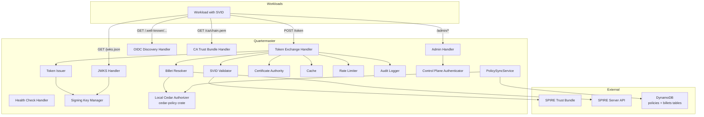
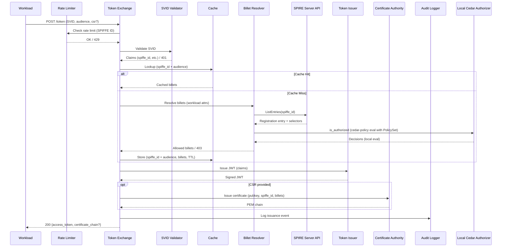

# Design Document — Quartermaster

## Overview

Quartermaster is a stateless workload identity federation broker implemented in Rust. It accepts SPIRE JWT-SVIDs, evaluates Cedar policies locally via the `cedar-policy` crate (with policies synced from DynamoDB) to resolve billet holdings, and issues short-lived JWTs and X.509 certificates that workloads use for cross-cloud role assumption (OIDC federation) and billet-gated mTLS.

The prototype uses:
- `axum` for HTTP serving
- `spiffe` crate for SVID validation
- `cedar-policy` crate for in-process Cedar policy evaluation (policies synced from DynamoDB)
- AWS SDK for Rust (DynamoDB) for policy CRUD and billet metadata CRUD (control plane operations)
- `jsonwebtoken` for JWT signing/verification
- `rcgen` + `ring` for certificate issuance
- Static signing key, in-memory cache, and local CA

### Design Rationale

The system is decomposed into focused, testable components behind traits. External dependencies (DynamoDB, SPIRE) are accessed through abstracted trait interfaces to enable unit testing with mocks and to support future backend swaps (e.g., KMS-backed signing, Redis cache, AWS Private CA). The HTTP layer is thin — it delegates to domain logic that is independent of transport. Cedar policy evaluation is performed in-process via the `cedar-policy` crate, with the PolicySyncService scanning the DynamoDB policies table on startup and every N seconds. This eliminates per-request network calls on the authorization hot path while keeping DynamoDB as the durable store for policies.

---

## Architecture

### High-Level System Architecture



### Request Flow (Token Exchange)



### Rust Crate Structure

```
src/
  main.rs                    # Entrypoint, config loading, DI wiring
  lib.rs                     # Library root, re-exports

  config/
    mod.rs                   # Configuration struct, loader

  server/
    mod.rs                   # HTTP server setup (axum), route registration
    middleware.rs            # Logging, recovery, request ID (tower layers)

  handler/
    mod.rs                   # Handler module
    token.rs                 # POST /token handler
    oidc.rs                  # GET /.well-known/openid-configuration
    jwks.rs                  # GET /jwks.json
    ca.rs                    # GET /ca/chain.pem
    health.rs                # GET /healthz
    billets.rs               # GET /billets/{name} (data-plane billet metadata)
    admin_billets.rs         # /admin/billets CRUD handlers
    admin_policies.rs        # /admin/policies CRUD handlers

  domain/
    svid/
      mod.rs                 # SVID validation logic + trait
    billet/
      mod.rs                 # Billet resolution orchestration + trait
      selector.rs            # Selector enrichment via SPIRE Server API
      entity_builder.rs      # Platform detection + ephemeral entity construction
    token/
      mod.rs                 # JWT construction and signing + trait
    cert/
      mod.rs                 # Certificate issuance + trait
    cache/
      mod.rs                 # Cache trait
      memory.rs              # In-memory backend
    ratelimit/
      mod.rs                 # Rate limiter trait + in-memory impl
    audit/
      mod.rs                 # Audit logger trait + JSON impl
    admin/
      mod.rs                 # Control plane module
      authenticator.rs       # Control plane JWT auth + local Cedar admin authorization
      billets.rs             # Billet CRUD service
      policies.rs            # Policy CRUD service

  cedar/
    mod.rs                   # Local Cedar authorizer (uses cedar-policy crate directly)

  dynamo/
    mod.rs                   # DynamoClient trait + AWS SDK DynamoDB implementation (policy CRUD + billet metadata CRUD)

  sync/
    mod.rs                   # PolicySyncService (background DynamoDB scan, PolicySet construction, billet name extraction, atomic swap)

  spireapi/
    mod.rs                   # SPIRE Server API client (ListEntries for selector retrieval)

  signing/
    mod.rs                   # Signing key manager trait
    static_key.rs            # Static key implementation (prototype)

  oidc/
    mod.rs                   # OIDC discovery document builder
```

---

## Components and Interfaces

### Core Interfaces

```rust
// domain/svid/mod.rs

use std::time::SystemTime;

/// Claims represents the validated claims from a SPIRE JWT-SVID.
#[derive(Debug, Clone)]
pub struct Claims {
    pub spiffe_id: String,
    pub trust_domain: String,
    pub environment: String,
    pub region: String,
    pub audience: Vec<String>,
    pub expires_at: SystemTime,
}

/// Validator validates SPIRE JWT-SVIDs and extracts claims.
#[async_trait::async_trait]
pub trait Validator: Send + Sync {
    /// Validate verifies the SVID signature, expiry, issuer, and audience.
    /// Returns parsed claims on success, or an error with category (expired, bad sig, unknown trust domain).
    async fn validate(&self, raw_token: &str) -> Result<Claims, SvidError>;
}
```

```rust
// domain/billet/mod.rs

/// Resolution represents the outcome of billet resolution for a workload.
#[derive(Debug, Clone)]
pub struct Resolution {
    pub billets: Vec<String>,
    pub cache_hit: bool,
}

/// ResolverInput contains the workload attributes needed for Cedar evaluation.
#[derive(Debug, Clone)]
pub struct ResolverInput {
    pub spiffe_id: String,
    pub trust_domain: String,
    pub environment: String,
    pub region: String,
    pub audience: String,
    pub request_time: chrono::DateTime<chrono::Utc>,
    pub source_cloud: String,
    pub selectors: Vec<String>,
}

/// Resolver determines which billets a workload holds.
#[async_trait::async_trait]
pub trait Resolver: Send + Sync {
    /// Resolve evaluates Cedar policies locally and returns the set of allowed billets.
    /// Returns an empty Vec (not None) when no billets are allowed.
    async fn resolve(&self, input: ResolverInput) -> Result<Resolution, BilletError>;
}
```

```rust
// domain/billet/selector.rs

/// SelectorEnricher retrieves SPIRE workload selectors for a given SPIFFE ID.
#[async_trait::async_trait]
pub trait SelectorEnricher: Send + Sync {
    /// Fetches selectors from the SPIRE Server API for the given SPIFFE ID.
    /// Returns an empty Vec if the SPIRE Server API is unreachable or no entry exists (graceful degradation).
    async fn fetch_selectors(&self, spiffe_id: &str) -> Result<Vec<String>, SelectorError>;
}
```

```rust
// domain/token/mod.rs

/// IssueRequest contains the parameters for JWT issuance.
#[derive(Debug, Clone)]
pub struct IssueRequest {
    pub spiffe_id: String,
    pub audience: String,
    pub billets: Vec<String>,
}

/// IssueResponse contains the issued JWT and metadata.
#[derive(Debug, Clone)]
pub struct IssueResponse {
    pub access_token: String,
    pub issued_token_type: String,
    pub token_type: String,
    pub expires_in: u64,
    pub jti: String,
}

/// Issuer creates signed Quartermaster JWTs.
#[async_trait::async_trait]
pub trait Issuer: Send + Sync {
    /// Issue creates a signed JWT with the given claims.
    async fn issue(&self, req: IssueRequest) -> Result<IssueResponse, TokenError>;
}
```

```rust
// domain/cert/mod.rs

/// IssueRequest contains the parameters for certificate issuance.
#[derive(Debug)]
pub struct CertIssueRequest {
    pub csr_der: Vec<u8>,
    pub spiffe_id: String,
    pub billets: Vec<String>,
}

/// IssueResponse contains the issued certificate chain.
#[derive(Debug, Clone)]
pub struct CertIssueResponse {
    pub leaf_pem: Vec<u8>,
    pub intermediate_pem: Vec<u8>,
    pub chain_pem: Vec<u8>, // leaf + intermediate concatenated
}

/// Authority issues short-lived X.509 certificates.
#[async_trait::async_trait]
pub trait Authority: Send + Sync {
    /// Issue creates a certificate using the public key from the CSR,
    /// populating identity and billets from authenticated context.
    async fn issue(&self, req: CertIssueRequest) -> Result<CertIssueResponse, CertError>;

    /// Returns the CA certificate chain in PEM format.
    fn chain_pem(&self) -> &[u8];
}
```

```rust
// domain/cache/mod.rs

use std::time::Duration;

/// Entry represents a cached billet resolution result.
#[derive(Debug, Clone)]
pub struct CacheEntry {
    pub billets: Vec<String>,
    pub stored_at: chrono::DateTime<chrono::Utc>,
}

/// Cache defines the abstract interface for billet resolution caching.
/// Implementations must be safe for concurrent use (Send + Sync).
#[async_trait::async_trait]
pub trait Cache: Send + Sync {
    /// Get retrieves a cached entry. Returns None if not found or expired.
    async fn get(&self, spiffe_id: &str, audience: &str) -> Result<Option<CacheEntry>, CacheError>;

    /// Set stores a billet resolution result with the given TTL.
    async fn set(&self, spiffe_id: &str, audience: &str, billets: Vec<String>, ttl: Duration) -> Result<(), CacheError>;

    /// Delete removes a cached entry.
    async fn delete(&self, spiffe_id: &str, audience: &str) -> Result<(), CacheError>;
}
```

```rust
// domain/ratelimit/mod.rs

/// Limiter enforces per-identity request rate limits.
#[async_trait::async_trait]
pub trait Limiter: Send + Sync {
    /// Allow checks if a request from the given SPIFFE ID is within rate limits.
    /// Returns true if allowed, false if rate limited.
    async fn allow(&self, spiffe_id: &str) -> Result<bool, RateLimitError>;
}
```

```rust
// signing/mod.rs

use jsonwebtoken::{EncodingKey, DecodingKey, Header};
use serde_json::Value;

/// Manager manages signing keys and publishes JWKS.
pub trait SigningManager: Send + Sync {
    /// Returns the current encoding key for JWT creation.
    fn encoding_key(&self) -> &EncodingKey;

    /// Returns the JWT header (includes kid, alg).
    fn header(&self) -> &Header;

    /// Returns the current JWKS as a JSON value.
    fn jwks(&self) -> &Value;

    /// Returns the current key's ID.
    fn key_id(&self) -> &str;
}
```

```rust
// domain/audit/mod.rs

use chrono::{DateTime, Utc};

/// Event represents a token issuance audit event.
#[derive(Debug, Clone, serde::Serialize)]
pub struct AuditEvent {
    pub spiffe_id: String,
    #[serde(skip_serializing_if = "Vec::is_empty")]
    pub billets: Vec<String>,
    #[serde(skip_serializing_if = "Option::is_none")]
    pub audience: Option<String>,
    #[serde(skip_serializing_if = "Option::is_none")]
    pub jti: Option<String>,
    pub timestamp: DateTime<Utc>,
    pub success: bool,
    #[serde(skip_serializing_if = "Option::is_none")]
    pub error: Option<String>,
}

/// Logger records audit events.
pub trait AuditLogger: Send + Sync {
    /// Log records an audit event.
    fn log(&self, event: AuditEvent);
}
```

```rust
// domain/admin/authenticator.rs

/// Authenticator validates Quartermaster JWTs on admin requests and evaluates
/// admin authorization via local Cedar policy evaluation.
#[async_trait::async_trait]
pub trait Authenticator: Send + Sync {
    /// Authenticate validates the Bearer token, extracts billets, and evaluates
    /// whether any of the caller's billets permit the requested action
    /// on the target resource. Returns the authenticated SPIFFE ID on success.
    async fn authenticate(&self, auth_header: &str, action: &str, resource: &str) -> Result<String, AdminAuthError>;
}
```

### DynamoDB Client Interface (CRUD Operations)

```rust
// dynamo/mod.rs

/// DynamoDB client for policy CRUD and billet metadata CRUD operations.
/// Authorization evaluation is handled locally by the cedar-policy crate (see cedar/ module).
#[async_trait::async_trait]
pub trait DynamoClient: Send + Sync {
    // Policy CRUD
    /// Lists all policy records from the quartermaster-policies DynamoDB table.
    async fn list_policies(&self) -> Result<Vec<PolicyRecord>, DynamoError>;

    /// Creates a policy record in the quartermaster-policies DynamoDB table.
    async fn create_policy(&self, id: &str, statement: &str, description: &str) -> Result<(), DynamoError>;

    /// Updates an existing policy record.
    async fn update_policy(&self, id: &str, statement: &str, description: &str) -> Result<(), DynamoError>;

    /// Deletes a policy record from the quartermaster-policies DynamoDB table.
    async fn delete_policy(&self, id: &str) -> Result<(), DynamoError>;

    // Billet metadata CRUD
    /// Retrieves a specific billet metadata record by name.
    async fn get_billet_metadata(&self, name: &str) -> Result<Option<BilletMetadata>, DynamoError>;

    /// Creates or updates a billet metadata record in the quartermaster-billets DynamoDB table.
    async fn put_billet_metadata(&self, metadata: BilletMetadata) -> Result<(), DynamoError>;

    /// Removes a billet metadata record from the quartermaster-billets DynamoDB table.
    async fn delete_billet_metadata(&self, name: &str) -> Result<(), DynamoError>;

    /// Lists all billet metadata records from the quartermaster-billets DynamoDB table.
    async fn list_billet_metadata(&self) -> Result<Vec<BilletMetadata>, DynamoError>;

    // Health
    /// Checks connectivity to DynamoDB.
    async fn ping(&self) -> Result<(), DynamoError>;
}

/// PolicyRecord represents a Cedar policy stored in the quartermaster-policies DynamoDB table.
#[derive(Debug, Clone)]
pub struct PolicyRecord {
    pub policy_id: String,
    pub statement: String,
    pub description: String,
    pub created_at: String,
    pub updated_at: String,
}

/// BilletMetadata represents billet metadata stored in the quartermaster-billets DynamoDB table.
/// Note: Billet names for authorization are derived from the PolicySet, not from this table.
/// This table stores descriptive metadata only.
#[derive(Debug, Clone)]
pub struct BilletMetadata {
    pub name: String,
    pub description: String,
    pub associated_aws_roles: Vec<String>,
    pub associated_gcp_sas: Vec<String>,
    pub updated_at: String,
}
```

### PolicySyncService

```rust
// sync/mod.rs

use std::sync::Arc;
use tokio::sync::RwLock;
use cedar_policy::PolicySet;
use std::collections::HashSet;

/// PolicySyncState holds the atomically-swappable policy state.
pub struct PolicySyncState {
    pub policy_set: PolicySet,
    pub known_billets: HashSet<String>,
}

/// PolicySyncService runs a background task that:
/// 1. On startup: full scan of quartermaster-policies table → parse all statements into PolicySet → extract known billet names
/// 2. Every policy_sync_interval seconds: repeat scan and atomically swap the PolicySet and billet set
/// 3. On DynamoDB failure: continue with last successfully loaded PolicySet, log warning, report degraded only if no PolicySet has ever been loaded
///
/// Billet names are derived by parsing all policies and extracting every `Billet::"X"` entity ID
/// referenced in resource scopes.
pub struct PolicySyncService {
    state: Arc<RwLock<Option<PolicySyncState>>>,
    dynamo_client: Arc<dyn DynamoClient>,
    sync_interval_secs: u64,
}

impl PolicySyncService {
    /// Returns true if a PolicySet has been loaded at least once.
    pub async fn is_initialized(&self) -> bool;

    /// Returns the current known billet names (derived from policies).
    pub async fn known_billets(&self) -> HashSet<String>;

    /// Returns a clone of the current PolicySet for evaluation.
    pub async fn policy_set(&self) -> Option<PolicySet>;

    /// Starts the background sync loop (call once at startup).
    pub fn start(self: Arc<Self>) -> tokio::task::JoinHandle<()>;
}
```

### Local Cedar Authorizer Interface

```rust
// cedar/mod.rs

use cedar_policy::{Decision, Request, Entities};

/// PlatformType identifies the workload platform for entity type selection.
#[derive(Debug, Clone, PartialEq)]
pub enum PlatformType {
    Base,       // Workload
    K8s,        // K8sWorkload
    Ec2,        // Ec2Workload
    Gcp,        // GcpWorkload
}

/// WorkloadEntity represents an ephemeral Quartermaster workload entity for local Cedar evaluation.
#[derive(Debug, Clone)]
pub struct WorkloadEntity {
    pub entity_type: PlatformType,
    pub spiffe_id: String,
    pub trust_domain: String,
    pub environment: String,
    pub region: String,
    pub selectors: Vec<String>,

    // K8s-specific
    pub namespace: Option<String>,
    pub service_account: Option<String>,
    pub pod_labels: Vec<String>,
    pub container_name: Option<String>,
    pub node_name: Option<String>,

    // EC2-specific
    pub instance_id: Option<String>,
    pub account_id: Option<String>,
    pub ami_id: Option<String>,
    pub instance_tags: Vec<String>,
    pub security_groups: Vec<String>,

    // GCP-specific
    pub project_id: Option<String>,
    pub zone: Option<String>,
    pub service_account_email: Option<String>,
    pub instance_name: Option<String>,
}

/// AuthzDecision represents a single authorization decision from local Cedar evaluation.
#[derive(Debug, Clone)]
pub struct AuthzDecision {
    pub resource: String,   // Billet entity ID
    pub decision: Decision, // Allow or Deny
}

/// BatchAuthzRequest contains the parameters for a batch authorization evaluation.
/// When building the Cedar Entities context from this request, the entity builder must
/// register the principal with its parent hierarchy (e.g., K8sWorkload in [Workload])
/// so that Cedar policies using `principal is Workload` match platform subtypes.
#[derive(Debug, Clone)]
pub struct BatchAuthzRequest {
    pub principal: WorkloadEntity,
    pub action: String,
    pub resources: Vec<String>,   // Billet entity IDs
    pub context: CommonContext,
}

/// CommonContext mirrors the Cedar CommonContext type.
#[derive(Debug, Clone)]
pub struct CommonContext {
    pub environment: String,
    pub region: String,
    pub request_time: String,
    pub source_cloud: String,
    pub selectors: Vec<String>,
}

/// AdminAuthzRequest contains the parameters for an admin authorization evaluation.
#[derive(Debug, Clone)]
pub struct AdminAuthzRequest {
    pub principals: Vec<String>,  // Billet names (from JWT billets claim)
    pub action: String,           // e.g., "createBillet", "deleteBillet", "createPolicy", etc.
    pub resource: String,         // Target resource entity ID
    pub context: CommonContext,
}

/// LocalAuthorizer provides Cedar policy evaluation using the cedar-policy crate directly.
/// PolicySet is maintained by the PolicySyncService; evaluation is in-process with no network calls.
#[async_trait::async_trait]
pub trait LocalAuthorizer: Send + Sync {
    /// Evaluates multiple authorization requests for workload billet assumption.
    /// Constructs Cedar entities with parent hierarchy: platform-specific entities
    /// (K8sWorkload, Ec2Workload, GcpWorkload) are registered with the base Workload
    /// entity as a parent, so that `principal is Workload` policies match all subtypes.
    /// Uses the PolicySet from PolicySyncService and constructs ephemeral Entities
    /// (workload entity + bare Billet entity IDs as resources).
    async fn batch_is_authorized(&self, req: BatchAuthzRequest) -> Result<Vec<AuthzDecision>, CedarError>;

    /// Evaluates whether any of the caller's billets permit the admin action.
    async fn is_authorized_admin(&self, req: AdminAuthzRequest) -> Result<bool, CedarError>;
}
```

```rust
// spireapi/mod.rs

/// RegistrationEntry represents a SPIRE registration entry with its selectors.
#[derive(Debug, Clone)]
pub struct RegistrationEntry {
    pub spiffe_id: String,
    pub selectors: Vec<String>, // e.g., ["k8s:ns:finance", "k8s:sa:payments-sa", "k8s:pod-label:project:payments"]
}

/// Client provides access to the SPIRE Server registration API.
#[async_trait::async_trait]
pub trait SpireApiClient: Send + Sync {
    /// Retrieves registration entries matching the given SPIFFE ID.
    /// Returns None if no entry exists.
    async fn list_entries_by_spiffe_id(&self, spiffe_id: &str) -> Result<Option<RegistrationEntry>, SpireApiError>;

    /// Checks connectivity to the SPIRE Server API.
    async fn ping(&self) -> Result<(), SpireApiError>;
}
```

---

## Data Models

### Cedar Schema (Formal)

The Cedar schema defines the entity types, actions, and context structure for all Quartermaster authorization decisions (stored in DynamoDB, synced to in-memory PolicySet). Workload entities are **ephemeral** — they are never persisted. They are constructed fresh at authorization-time from SVID claims and SPIRE selectors based on detected platform type. Billet entities are **bare entity IDs** at evaluation time — metadata lives in DynamoDB and is not part of the Cedar schema.

```cedar
namespace Quartermaster {
    type CommonContext = {
        environment: String,
        region: String,
        request_time: String,
        source_cloud: String,
        selectors: Set<String>,
    };

    entity Workload = {
        spiffe_id: String,
        trust_domain: String,
        environment: String,
        region: String,
        selectors: Set<String>,
    };

    entity K8sWorkload in [Workload] = {
        spiffe_id: String,
        trust_domain: String,
        environment: String,
        region: String,
        selectors: Set<String>,
        namespace: String,
        service_account: String,
        pod_labels: Set<String>,
        container_name: String,
        node_name: String,
    };

    entity Ec2Workload in [Workload] = {
        spiffe_id: String,
        trust_domain: String,
        environment: String,
        region: String,
        selectors: Set<String>,
        instance_id: String,
        account_id: String,
        ami_id: String,
        instance_tags: Set<String>,
        security_groups: Set<String>,
    };

    entity GcpWorkload in [Workload] = {
        spiffe_id: String,
        trust_domain: String,
        environment: String,
        region: String,
        selectors: Set<String>,
        project_id: String,
        zone: String,
        service_account_email: String,
        instance_name: String,
    };

    entity Billet;

    entity Policy = {
        id: String,
        description: String,
    };

    action assumeBillet appliesTo {
        principal: [Workload, K8sWorkload, Ec2Workload, GcpWorkload],
        resource: [Billet],
        context: CommonContext,
    };

    action readBillet appliesTo {
        principal: [Billet],
        resource: [Billet],
        context: CommonContext,
    };

    action createBillet appliesTo {
        principal: [Billet],
        resource: [Billet],
        context: CommonContext,
    };

    action deleteBillet appliesTo {
        principal: [Billet],
        resource: [Billet],
        context: CommonContext,
    };

    action createPolicy appliesTo {
        principal: [Billet],
        resource: [Policy],
        context: CommonContext,
    };

    action updatePolicy appliesTo {
        principal: [Billet],
        resource: [Policy],
        context: CommonContext,
    };

    action deletePolicy appliesTo {
        principal: [Billet],
        resource: [Policy],
        context: CommonContext,
    };
}
```

**Key design decisions:**

- **Workload subtypes are ephemeral**: They are constructed at authorization-time from SVID claims + SPIRE selectors, never stored. This avoids synchronization issues and ensures authorization always reflects current attestation state.
- **Billet entity is bare**: The `entity Billet;` declaration has NO attributes in the Cedar schema. Metadata (description, associated_aws_roles, associated_gcp_sas) lives in the quartermaster-billets DynamoDB table and is served by the metadata endpoint only. At evaluation time, billets are just entity IDs.
- **PolicySyncService derives billet names from policies**: The set of known billets is extracted from the PolicySet by parsing resource scopes for `Billet::"X"` references. This eliminates the need for a separate entity store.
- **Platform detection via selector prefix priority**: Detection uses priority order (`k8s:` > `aws:` > `gcp:` > base Workload) because a workload on EKS will have both `k8s:` and `aws:` selectors; the k8s attestor is most specific. All selectors (regardless of detected type) remain in the entity's `selectors` attribute and context for cross-platform policy use.
- **Entity parent hierarchy for Cedar `in` semantics**: Platform-specific entities (e.g., `K8sWorkload::"spiffe://..."`) are registered with `Workload::"spiffe://..."` as a parent in the Cedar entities context. In Cedar, `entity K8sWorkload in [Workload]` means entity hierarchy (group membership), not OOP inheritance — for a policy like `permit(principal is Workload, ...)` to match a `K8sWorkload` entity, the entity must be explicitly registered with `Workload` as a parent in the entities set passed to the evaluator.
- **Billet as both resource and principal**: For `assumeBillet`, workloads are principals and billets are resources. For admin actions (`createBillet`, `deleteBillet`, `createPolicy`, `updatePolicy`, `deletePolicy`), billets are principals — this enables the dogfooded admin authorization model.
- **CommonContext shared across all actions**: The same context structure is available for both workload-to-billet and admin authorization, enabling policies that reference environment, region, and selectors.
- **No AVP dependency**: All Cedar evaluation is local via the `cedar-policy` crate. DynamoDB is the single backing store for both policies and billet metadata. No AVP pricing, no entity store, no avp-local-agent.

### Ephemeral Workload Entity Construction

When a token exchange request arrives, the Billet Resolver constructs an ephemeral entity as follows:

1. **Extract common attributes** from SVID claims: `spiffe_id`, `trust_domain`, `environment`, `region`
2. **Fetch selectors** from SPIRE Server API for the workload's SPIFFE ID
3. **Detect platform** from selector prefixes using priority order:
   - If ANY selector prefixed with `k8s:` → `K8sWorkload` (highest priority — k8s attestor is most specific)
   - Else if ANY selector prefixed with `aws:` → `Ec2Workload`
   - Else if ANY selector prefixed with `gcp:` → `GcpWorkload`
   - Else → base `Workload`
   
   > **Rationale**: A pod on EKS has both `k8s:` and `aws:` selectors (because the k8s attestor attests the workload AND the node has AWS IID attestation). The workload is fundamentally a Kubernetes workload that happens to run on AWS infrastructure. The non-primary platform selectors are still available in `entity.selectors` and `context.selectors`, so cross-platform policies remain possible — they just don't change the entity type.
4. **Extract platform-specific attributes** from selectors:
   - K8s: `k8s:ns:<value>` → namespace, `k8s:sa:<value>` → service_account, `k8s:pod-label:<key>:<value>` → pod_labels, `k8s:container-name:<value>` → container_name, `k8s:node-name:<value>` → node_name
   - EC2: `aws:iid:instance-id:<value>` → instance_id, `aws:iid:account-id:<value>` → account_id, `aws:iid:image-id:<value>` → ami_id, `aws:iid:instance-tag:<key>:<value>` → instance_tags, `aws:iid:security-group-id:<value>` → security_groups
   - GCP: `gcp:iit:project-id:<value>` → project_id, `gcp:iit:zone:<value>` → zone, `gcp:iit:service-account:<value>` → service_account_email, `gcp:iit:instance-name:<value>` → instance_name
5. **Register entity with parent hierarchy** in the Cedar entities context:
   - Register the specific entity (e.g., `K8sWorkload::"spiffe://example.com/ns/finance/workload/payments"`)
   - Declare it `in [Workload::"spiffe://example.com/ns/finance/workload/payments"]` (parent relationship)
   - This ensures Cedar policies using `principal is Workload` match all platform subtypes via Cedar's entity hierarchy semantics (the `in` keyword denotes group membership / parent relationships, not OOP inheritance)
   - The entities passed to the Cedar evaluator must include BOTH entity entries and the parent relationship
6. **Pass entity + context** to local Cedar authorizer (cedar-policy crate) for batch evaluation

### Admin Authorization Model (Dogfooding)

Instead of checking JWT claims directly for a specific billet like `quartermaster-admin`, ALL control plane operations go through local Cedar policy evaluation (policies synced from DynamoDB):

1. The caller's JWT is validated (signature + expiry)
2. The billets in the JWT become the **principals** (each as `Quartermaster::Billet::"<billet-name>"`)
3. The admin action (`createBillet`, `deleteBillet`, `createPolicy`, `updatePolicy`, `deletePolicy`) becomes the **Cedar action**
4. The target resource (the billet or policy being acted upon) becomes the **Cedar resource**
5. The local Cedar authorizer evaluates whether any of the caller's billets are permitted to perform the action on the target

This means:
- `quartermaster-admin` is just the initial bootstrap billet with a broad Cedar policy granting all admin actions
- Operators can create more granular admin billets (e.g., `billet-ops` that can only manage billets, `policy-ops` that can only manage policies)
- Admin authorization rules are themselves Cedar policies — fully auditable and modifiable at runtime

**Bootstrap policy example:**

```cedar
permit(
    principal == Quartermaster::Billet::"quartermaster-admin",
    action in [
        Quartermaster::Action::"createBillet",
        Quartermaster::Action::"deleteBillet",
        Quartermaster::Action::"createPolicy",
        Quartermaster::Action::"updatePolicy",
        Quartermaster::Action::"deletePolicy"
    ],
    resource
);
```

**Self-read policy (any billet can read its own metadata):**

```cedar
permit(
    principal,
    action == Quartermaster::Action::"readBillet",
    resource
) when {
    principal == resource
};
```

### Configuration

```rust
// config/mod.rs

use std::time::Duration;

/// Config holds all Quartermaster configuration.
#[derive(Debug, Clone, serde::Deserialize)]
pub struct Config {
    pub issuer: String,
    pub token_ttl: Duration,
    pub spire: SpireConfig,
    pub dynamo: DynamoConfig,
    pub signing: SigningConfig,
    pub ca: CaConfig,
    pub cache: CacheConfig,
    pub rate_limit: RateConfig,
    pub server: ServerConfig,
}

#[derive(Debug, Clone, serde::Deserialize)]
pub struct SpireConfig {
    pub trust_domain: String,
    pub jwks_path: String,    // Path or URL to SPIRE JWKS for SVID verification
    pub server_addr: String,  // Address of the SPIRE Server API for selector lookups
}

#[derive(Debug, Clone, serde::Deserialize)]
pub struct DynamoConfig {
    pub region: String,
    pub policies_table: String,          // default: "quartermaster-policies"
    pub billets_table: String,           // default: "quartermaster-billets"
    pub policy_sync_interval_secs: u64,  // default: 30
}

#[derive(Debug, Clone, serde::Deserialize)]
pub struct SigningConfig {
    pub algorithm: String,   // ES256, RS256
    pub key_path: String,    // Path to static key (prototype)
}

#[derive(Debug, Clone, serde::Deserialize)]
pub struct CaConfig {
    pub key_path: String,    // Path to CA private key (prototype)
    pub cert_path: String,   // Path to CA certificate
    pub issuer_cn: String,
    pub cert_ttl: Duration,  // Matches token_ttl
}

#[derive(Debug, Clone, serde::Deserialize)]
pub struct CacheConfig {
    pub backend: String,     // "memory" or "redis"
    pub ttl: Duration,
    pub redis: Option<RedisConfig>,
}

#[derive(Debug, Clone, serde::Deserialize)]
pub struct RedisConfig {
    pub addr: String,
    pub password: String,
    pub db: u32,
}

#[derive(Debug, Clone, serde::Deserialize)]
pub struct RateConfig {
    pub per_workload: u32,   // Requests per minute per SPIFFE ID
}

#[derive(Debug, Clone, serde::Deserialize)]
pub struct ServerConfig {
    pub addr: String,         // e.g., "0.0.0.0:8443"
    pub admin_addr: Option<String>, // e.g., "0.0.0.0:8444" (optional separate listener)
}
```

### Token Exchange Request/Response

```rust
// handler/token.rs

/// TokenExchangeRequest represents the parsed form parameters from POST /token.
#[derive(Debug)]
pub struct TokenExchangeRequest {
    pub grant_type: String,        // must be "urn:ietf:params:oauth:grant-type:token-exchange"
    pub subject_token: String,     // JWT-SVID
    pub subject_token_type: String, // must be "urn:ietf:params:oauth:token-type:jwt"
    pub audience: String,          // target STS endpoint
    pub csr: Option<Vec<u8>>,      // optional, base64-decoded PKCS#10
}

/// TokenExchangeResponse represents the JSON response for a successful exchange.
#[derive(Debug, serde::Serialize)]
pub struct TokenExchangeResponse {
    pub access_token: String,
    pub issued_token_type: String,
    pub token_type: String,
    pub expires_in: u64,
    #[serde(skip_serializing_if = "Option::is_none")]
    pub certificate_chain: Option<String>,
    #[serde(skip_serializing_if = "Option::is_none")]
    pub certificate_chain_url: Option<String>,
}

/// ErrorResponse represents a JSON error response.
#[derive(Debug, serde::Serialize)]
pub struct ErrorResponse {
    pub error: String,
    pub error_description: String,
}
```

### JWT Claims (Internal Representation)

```rust
// domain/token/mod.rs

/// Claims represents the Quartermaster JWT claims.
#[derive(Debug, Clone, serde::Serialize, serde::Deserialize)]
pub struct Claims {
    pub iss: String,
    pub sub: String,
    pub aud: String,
    pub billets: Vec<String>,
    pub iat: i64,
    pub exp: i64,
    pub jti: String,
}

impl Claims {
    /// Checks if the claims represent a non-expired, well-formed token.
    pub fn is_valid(&self) -> bool {
        let now = chrono::Utc::now().timestamp();
        !self.iss.is_empty()
            && !self.sub.is_empty()
            && !self.aud.is_empty()
            && !self.jti.is_empty()
            && self.iat <= now
            && self.exp > now
            && !self.billets.is_empty()
    }
}
```

### Admin API Models

```rust
// handler/admin_billets.rs / admin_policies.rs

/// CreateBilletRequest is the JSON body for POST /admin/billets.
#[derive(Debug, serde::Deserialize)]
pub struct CreateBilletRequest {
    pub name: String,
    pub description: Option<String>,
    pub associated_aws_roles: Option<Vec<String>>,
    pub associated_gcp_sas: Option<Vec<String>>,
}

/// BilletResponse is the JSON response for billet operations.
#[derive(Debug, serde::Serialize)]
pub struct BilletResponse {
    pub name: String,
    #[serde(skip_serializing_if = "Option::is_none")]
    pub description: Option<String>,
    #[serde(skip_serializing_if = "Vec::is_empty")]
    pub associated_aws_roles: Vec<String>,
    #[serde(skip_serializing_if = "Vec::is_empty")]
    pub associated_gcp_sas: Vec<String>,
}

/// CreatePolicyRequest is the JSON body for POST /admin/policies.
#[derive(Debug, serde::Deserialize)]
pub struct CreatePolicyRequest {
    pub statement: String,
    pub description: Option<String>,
}

/// UpdatePolicyRequest is the JSON body for PUT /admin/policies/{id}.
#[derive(Debug, serde::Deserialize)]
pub struct UpdatePolicyRequest {
    pub statement: String,
    pub description: Option<String>,
}

/// PolicyResponse is the JSON response for policy operations.
#[derive(Debug, serde::Serialize)]
pub struct PolicyResponse {
    pub id: String,
    #[serde(skip_serializing_if = "Option::is_none")]
    pub statement: Option<String>,
    #[serde(skip_serializing_if = "Option::is_none")]
    pub description: Option<String>,
}
```

### OIDC Discovery Document

```rust
// oidc/mod.rs

/// DiscoveryDocument represents the OpenID Connect discovery metadata.
#[derive(Debug, serde::Serialize)]
pub struct DiscoveryDocument {
    pub issuer: String,
    pub jwks_uri: String,
    pub response_types_supported: Vec<String>,
    pub subject_types_supported: Vec<String>,
    pub id_token_signing_alg_values_supported: Vec<String>,
    pub claims_supported: Vec<String>,
}
```

### Error Types

```rust
// domain/mod.rs

/// ErrorCode categorizes domain errors for HTTP mapping.
#[derive(Debug, Clone, Copy, PartialEq)]
pub enum ErrorCode {
    InvalidRequest,      // 400
    Unauthorized,        // 401
    Forbidden,           // 403
    NotFound,            // 404
    Conflict,            // 409
    RateLimited,         // 429
    ServiceUnavailable,  // 503
}

/// DomainError carries a code and descriptive message for handler mapping.
#[derive(Debug)]
pub struct DomainError {
    pub code: ErrorCode,
    pub message: String,
    pub cause: Option<Box<dyn std::error::Error + Send + Sync>>,
}

impl std::fmt::Display for DomainError {
    fn fmt(&self, f: &mut std::fmt::Formatter<'_>) -> std::fmt::Result {
        write!(f, "{}", self.message)
    }
}

impl std::error::Error for DomainError {
    fn source(&self) -> Option<&(dyn std::error::Error + 'static)> {
        self.cause.as_ref().map(|e| e.as_ref() as &dyn std::error::Error)
    }
}
```

---

## Correctness Properties

*A property is a characteristic or behavior that should hold true across all valid executions of a system — essentially, a formal statement about what the system should do. Properties serve as the bridge between human-readable specifications and machine-verifiable correctness guarantees.*

### Property 1: SVID Validation Correctness

*For any* JWT-SVID, the validator SHALL accept it if and only if: (a) the signature is verifiable against a key in the SPIRE trust bundle, (b) the token has not expired, (c) the issuer matches a configured trust domain, and (d) the audience includes Quartermaster's issuer identifier. Any violation of these conditions SHALL result in rejection.

**Validates: Requirements 1.1, 1.2, 1.3, 1.4**

### Property 2: JWT Issuance Round-Trip

*For any* valid issuance inputs (SPIFFE ID, audience, billets), issuing a JWT and then parsing the `access_token` field SHALL produce claims where: `iss` equals the configured issuer, `sub` equals the input SPIFFE ID, `aud` is exactly the single requested audience (no wildcards, no multiple values), `billets` equals the input billet set, and `exp - iat` equals the configured TTL.

**Validates: Requirements 4.1, 4.2, 4.3, 4.4, 4.5, 10.1, 10.2, 10.3, 14.6**

### Property 3: JWT ID Uniqueness

*For any* sequence of token issuances, all generated `jti` values SHALL be distinct.

**Validates: Requirements 4.6**

### Property 4: JWT Signature Verification Round-Trip

*For any* JWT issued by the Token Issuer, verifying its signature using the corresponding public key from the JWKS endpoint SHALL succeed, and the `kid` header in the JWT SHALL match a `kid` entry in the JWKS response.

**Validates: Requirements 16.1, 16.2, 7.2, 7.3**

### Property 5: Certificate Construction Correctness

*For any* valid CSR, SPIFFE ID, and set of billets, the issued X.509 certificate SHALL: (a) use the public key from the CSR, (b) set Subject CN to the SPIFFE ID, (c) include the SPIFFE ID as a URI SAN, (d) include exactly one `qm-billet://<domain>/<billet>` URI SAN per resolved billet, (e) set validity to the configured TTL, (f) set Key Usage to Digital Signature | Key Encipherment, (g) set Extended Key Usage to Client Auth + Server Auth, and (h) discard any Subject, SANs, or extensions present in the submitted CSR.

**Validates: Requirements 5.1, 5.2, 5.3, 5.4, 5.5, 5.6, 5.7, 5.9, 15.3, 15.4**

### Property 6: Certificate Serial Uniqueness

*For any* sequence of certificate issuances, all generated serial numbers SHALL be distinct.

**Validates: Requirements 5.8**

### Property 7: Certificate Chain Verification Round-Trip

*For any* certificate issued by the Certificate Authority, verifying the certificate chain against the trust bundle served at `/ca/chain.pem` SHALL succeed.

**Validates: Requirements 17.1**

### Property 8: Cross-Credential Consistency

*For any* token exchange that produces both a JWT and a certificate, the SPIFFE ID in the certificate's URI SAN SHALL equal the `sub` claim in the JWT, and the set of billets encoded as `qm-billet://` URI SANs SHALL equal the `billets` claim in the JWT.

**Validates: Requirements 17.2, 17.3**

### Property 9: Cache Round-Trip

*For any* SPIFFE ID, audience, and billet set, storing a cache entry and then retrieving it by the same (SPIFFE ID, audience) key before TTL expiry SHALL return the original billet set.

**Validates: Requirements 9.3, 9.10**

### Property 10: Cache Expiry Enforcement

*For any* cache entry stored with TTL D, retrieval at any time >= D after storage SHALL return no result (nil/miss).

**Validates: Requirements 9.5, 9.6**

### Property 11: Billet Resolution Filter Correctness

*For any* set of authorization decisions from the local Cedar evaluation, the Billet Resolver SHALL return exactly the set of billet names whose decision is "Allow" — no more, no less.

**Validates: Requirements 3.2**

### Property 12: Rate Limiter Enforcement

*For any* SPIFFE ID and configured limit N requests per minute, the first N requests within a one-minute window SHALL be allowed, and the (N+1)th request SHALL be rejected.

**Validates: Requirements 11.1**

### Property 13: OIDC Discovery Construction

*For any* Quartermaster configuration, the OIDC discovery document SHALL contain: `issuer` matching the configured issuer URL, `jwks_uri` pointing to the JWKS endpoint, `response_types_supported` containing `id_token`, `subject_types_supported` containing `public`, `id_token_signing_alg_values_supported` containing the configured algorithm, and `claims_supported` listing all required claims.

**Validates: Requirements 6.2, 6.3, 6.4, 6.5, 6.6, 6.7**

### Property 14: Admin Authentication Correctness

*For any* request to an `/admin/*` path with a Bearer JWT, authentication SHALL succeed if and only if: (a) the JWT signature is verifiable against Quartermaster's JWKS, (b) the token has not expired, and (c) the local Cedar evaluation returns "Allow" for at least one of the caller's billets when evaluated as principal against the requested admin action and target resource.

**Validates: Requirements 18.2, 18.3, 18.4**

### Property 15: CSR Self-Signature Verification

*For any* submitted CSR, the Certificate Authority SHALL accept it only if the CSR's self-signature is valid (proving possession of the corresponding private key). CSRs with invalid self-signatures SHALL be rejected.

**Validates: Requirements 15.1, 15.2**

### Property 16: Audit Log Valid JSON

*For any* audit event (success or failure), the emitted log entry SHALL be valid JSON containing at minimum a timestamp and the available context fields.

**Validates: Requirements 12.3**

### Property 17: Selector Enrichment Correctness

*For any* workload with SPIFFE ID S that has registration entry selectors [s1, s2, ...] in the SPIRE Server, those exact selectors SHALL appear as the `selectors` field (Set of strings) in the Cedar authorization request context passed to the local authorizer. If the SPIRE Server API is unreachable or no entry exists for S, the `selectors` field SHALL be an empty set and a warning SHALL be logged.

**Validates: Requirements 26.1, 26.2, 26.3, 26.4, 26.5**

### Property 18: Platform-Specific Entity Type Selection

*For any* set of SPIRE selectors, the Billet Resolver SHALL construct the correct entity type using priority order: if any selector is prefixed with `k8s:` then the entity type SHALL be `K8sWorkload` (highest priority); else if any selector is prefixed with `aws:` then the entity type SHALL be `Ec2Workload`; else if any selector is prefixed with `gcp:` then the entity type SHALL be `GcpWorkload`; otherwise the entity type SHALL be the base `Workload`. When multiple platform prefixes are present, the highest-priority platform wins and ALL selectors remain in the entity's `selectors` attribute. Platform-specific attributes SHALL be populated from the corresponding selectors. The entity SHALL be registered in the Cedar entities context with `Workload` as a parent so that `principal is Workload` policies match all subtypes.

**Validates: Requirements 27.1, 27.2, 27.3, 27.4, 27.5, 27.6, 27.8, 27.9**

---

## Error Handling

### Error Classification and HTTP Mapping

| Domain Error | HTTP Status | Condition |
|---|---|---|
| `ErrInvalidRequest` | 400 | Malformed request, missing required params, invalid CSR, invalid Cedar syntax |
| `ErrUnauthorized` | 401 | SVID validation failure (bad sig, expired, wrong issuer/audience), admin auth failure |
| `ErrForbidden` | 403 | No billets resolved (all Deny), admin token lacks required billet |
| `ErrNotFound` | 404 | Billet or policy not found in DynamoDB |
| `ErrConflict` | 409 | Billet name already exists |
| `ErrRateLimited` | 429 | Per-workload rate limit exceeded |
| `ErrServiceUnavailable` | 503 | PolicySet not initialized (DynamoDB sync failure on startup) with no cache hit, SPIRE trust bundle not loaded |

### Error Response Format

All errors are returned as JSON with consistent structure:

```json
{
  "error": "invalid_request",
  "error_description": "The 'audience' parameter is required"
}
```

Error codes follow OAuth 2.0 conventions where applicable (`invalid_request`, `invalid_grant`, `unauthorized_client`, `server_error`).

### Resilience Patterns

1. **Cache fallthrough**: When the distributed cache backend is unavailable, the system falls through to local Cedar policy evaluation for billet resolution rather than failing.
2. **DynamoDB sync failure**: When the PolicySyncService cannot scan DynamoDB and the PolicySet has not been initialized (first sync never succeeded), return 503. The health check endpoint also reports degraded state. If a PolicySet was previously loaded, evaluation continues with stale policies and a warning is logged.
3. **Graceful degradation**: Signing and CA operations are local — they continue functioning even when external dependencies are down. Only billet resolution requires a loaded PolicySet.
4. **SPIRE Server API degradation**: When the SPIRE Server API is unreachable or returns no entry for a workload's SPIFFE ID, billet resolution proceeds with an empty selectors set and logs a warning. This ensures selector enrichment is non-blocking.

### Panic Recovery

The HTTP server uses a recovery middleware that:
- Catches panics in handlers
- Logs the stack trace
- Returns HTTP 500 with a generic error message (no internal details leaked)

---

## Testing Strategy

### Test Framework and Libraries

| Purpose | Library |
|---|---|
| Unit tests | Rust stdlib `#[test]` |
| Property-based testing | `proptest` |
| Assertions | Rust stdlib `assert!` / `assert_eq!` |
| HTTP testing | `axum_test` or `reqwest` with test server |
| Mocking | Trait-based test doubles (hand-written or `mockall`) |
| Async testing | `tokio::test` |

### Property-Based Tests

Each correctness property maps to a single property-based test using `proptest`. Tests run a minimum of 100 iterations.

**Tag format**: `Feature: quartermaster, Property {N}: {title}`

| Property | Test Location | Generator Strategy |
|---|---|---|
| P1: SVID Validation | `src/domain/svid/tests.rs` | Generate random JWT payloads, random signing keys (some in trust bundle, some not), random expiry times, random issuers/audiences |
| P2: JWT Issuance Round-Trip | `src/domain/token/tests.rs` | Generate random SPIFFE IDs, audiences, billet sets; issue then parse |
| P3: JWT ID Uniqueness | `src/domain/token/tests.rs` | Issue N tokens, collect JTIs, verify uniqueness |
| P4: JWT Signature Round-Trip | `src/domain/token/tests.rs` | Issue tokens, verify using JWKS keys |
| P5: Certificate Construction | `src/domain/cert/tests.rs` | Generate random key pairs, CSRs with arbitrary subjects/SANs, random SPIFFE IDs and billet sets |
| P6: Certificate Serial Uniqueness | `src/domain/cert/tests.rs` | Issue N certs, collect serials, verify uniqueness |
| P7: Cert Chain Round-Trip | `src/domain/cert/tests.rs` | Issue certs, verify chain against CA trust bundle |
| P8: Cross-Credential Consistency | `src/handler/tests.rs` | Full exchange with random inputs, compare JWT and cert fields |
| P9: Cache Round-Trip | `src/domain/cache/tests.rs` | Generate random keys and billet sets, store then retrieve |
| P10: Cache Expiry | `src/domain/cache/tests.rs` | Store entries, advance time, verify miss |
| P11: Billet Resolution Filter | `src/domain/billet/tests.rs` | Generate random decision sets (mix of Allow/Deny), verify filter |
| P12: Rate Limiter | `src/domain/ratelimit/tests.rs` | Generate random burst patterns and limits |
| P13: OIDC Discovery | `src/oidc/tests.rs` | Generate random config values, verify document construction |
| P14: Admin Auth | `src/domain/admin/tests.rs` | Generate tokens with various billet combinations, mock local Cedar authorizer responses for different action/resource combinations, valid/invalid sigs |
| P15: CSR Self-Sig | `src/domain/cert/tests.rs` | Generate valid and corrupted CSRs |
| P16: Audit Log JSON | `src/domain/audit/tests.rs` | Generate random event structs, verify output is valid JSON |
| P17: Selector Enrichment | `src/domain/billet/selector_tests.rs` | Generate random SPIFFE IDs and selector sets, mock SPIRE Server API responses (success, unreachable, no entry), verify selectors appear in Cedar context |
| P18: Platform Entity Type | `src/domain/billet/entity_builder_tests.rs` | Generate random selector sets with various platform prefixes (k8s:, aws:, gcp:, mixed, none), verify correct entity type and attribute extraction |

### Unit Tests (Example-Based)

Unit tests cover:
- HTTP handler routing and content-type validation (Requirements 2.1-2.8)
- Specific error response codes and messages (Requirements 1.5-1.7, 3.3-3.4, 11.2, 15.5)
- Request parsing edge cases (empty body, wrong content-type, missing fields)
- Health check behavior under various dependency states (Requirement 13)
- Admin CRUD happy paths and error cases (Requirements 19-25)
- Admin authorization via local Cedar evaluation with various billet/action/resource combinations (Requirement 18)
- CA trust bundle endpoint response format (Requirement 8)
- Token response format fields (Requirement 14)
- Rate limiter 429 response with Retry-After header (Requirement 11.2)
- The `quartermaster-admin` billet deletion guard (Requirement 22.4)
- Platform-specific entity construction for each platform type (Requirement 27)
- Local Cedar syntax validation before DynamoDB writes (Requirements 23.6, 24.5)

### Integration Tests

Integration tests verify end-to-end flows with real HTTP (using `axum_test` or an in-process test server):
- Full token exchange flow (SVID → validate → resolve → issue JWT + cert)
- Admin CRUD operations against mocked DynamoClient (CRUD goes to DynamoDB, auth evaluation is local via cedar-policy)
- OIDC discovery + JWKS + token verification flow
- Certificate issuance + chain verification against CA endpoint
- Cache hit/miss behavior in the token exchange path
- PolicySyncService startup and refresh behavior with mocked DynamoClient

### Test Configuration

```rust
// Property tests run minimum 100 iterations
proptest! {
    // Feature: quartermaster, Property 2: JWT Issuance Round-Trip
    #[test]
    fn property_jwt_round_trip(
        spiffe_id in "[a-z]+://[a-z]+\\.[a-z]+/[a-z/]+",
        audience in "[a-z]+\\.[a-z]+\\.[a-z]+",
        billets in prop::collection::vec("[a-z-]+", 1..5),
    ) {
        // ... generator and property assertion
    }
}
```

---
