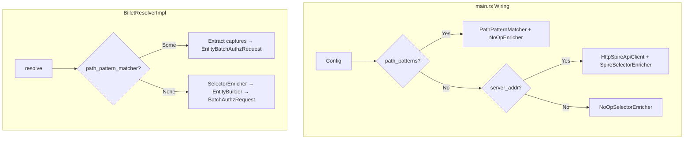
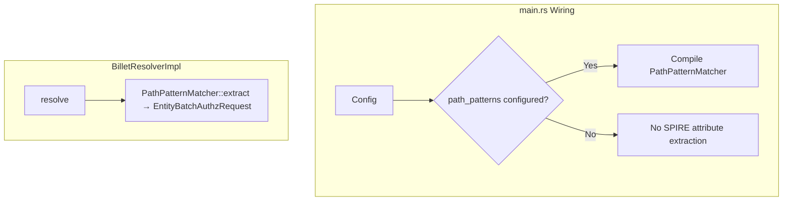

# Design Document — Remove SPIRE Server API Dependency

## Overview

This design covers the complete removal of the SPIRE Server API integration from Quartermaster. The `spireapi/` module, `SelectorEnricher` trait, `SpireSelectorEnricher`, `NoOpSelectorEnricher`, and all associated wiring are deleted. After this removal, the `PathPatternMatcher` (introduced by the `spiffe-path-patterns` spec) becomes the sole mechanism for extracting workload attributes from SPIRE-sourced identities.

This is a subtraction-only change. No new functionality is introduced. The codebase becomes simpler: the `BilletResolverImpl` loses its dual code-path structure and operates exclusively in path-pattern mode for SPIRE identities.

### Key Design Decisions

1. **Remove the dual code-path entirely**: `BilletResolverImpl` currently branches on `Option<PathPatternMatcher>` to choose between legacy selector enrichment and path-pattern mode. After removal, the path-pattern path is the only path — `path_pattern_matcher` becomes a required (non-`Option`) field.

2. **`EntityBuilder` remains but is no longer used by `BilletResolverImpl`**: The `EntityBuilder` struct in `entity_builder.rs` is still consumed by `MultiSourceEntityBuilder` in `src/domain/identity/entity.rs`. It stays in the codebase but is removed from `BilletResolverImpl`'s dependencies.

3. **`BatchAuthzRequest` and `batch_is_authorized` removed from `cedar/mod.rs`**: This struct and method served the legacy `WorkloadEntity`-based evaluation path. With path-pattern mode using `build_workload_entities_from_captures` and the entity-based authorization path (`EntityBatchAuthzRequest`), `BatchAuthzRequest` is dead code. Remove it along with `WorkloadEntity`, `PlatformType`, and `build_workload_entities`.

4. **`ResolverInput.selectors` field is removed**: This field was populated from SPIRE API results. In path-pattern mode, selectors in context are always empty (captures go directly onto the entity as attributes). The field becomes dead code and is deleted.

5. **`src/domain/identity/selector_enricher.rs` is also removed**: This duplicate module defines a simpler `SelectorEnricher` trait and `NoOpSelectorEnricher`. Both selector enricher files are deleted.

6. **Configuration simplification**: `server_addr` is removed from `SpireSourceConfig`. The mode-selection logic in `main.rs` collapses to: if path_patterns configured → compile matcher; else → no SPIRE attribute extraction (equivalent to old NoOp behavior but without the indirection).

## Architecture

### Before (Current State)



### After (Target State)



## Components and Interfaces

### Files Deleted

| File | Contents Removed |
|------|-----------------|
| `src/spireapi/mod.rs` | `HttpSpireApiClient`, `SpireApiClient` trait, `RegistrationEntry`, `SpireApiError` |
| `src/domain/billet/selector.rs` | `SelectorEnricher` trait, `SpireSelectorEnricher`, `NoOpSelectorEnricher`, `SelectorError` |
| `src/domain/identity/selector_enricher.rs` | Duplicate `SelectorEnricher` trait, `NoOpSelectorEnricher` |

### Files Modified

| File | Change Summary |
|------|---------------|
| `src/lib.rs` | Remove `pub mod spireapi;` |
| `src/domain/billet/mod.rs` | Remove `pub mod selector;`, remove `selector_enricher` field, remove `entity_builder` field, remove `selectors` from `ResolverInput`, remove legacy branch in `resolve()`, simplify constructors |
| `src/domain/identity/mod.rs` | Remove `pub mod selector_enricher;` |
| `src/config/identity.rs` | Remove `server_addr` from `SpireSourceConfig` |
| `src/cedar/mod.rs` | Remove `BatchAuthzRequest`, `batch_is_authorized` method, `WorkloadEntity`, `PlatformType`, and `build_workload_entities` — all dead code after the legacy resolution path is removed |
| `src/main.rs` | Remove all SPIRE API wiring: `HttpSpireApiClient` import/construction, `SpireSelectorEnricher`/`NoOpSelectorEnricher` imports/construction, mode-selection logic, `EntityBuilder` usage in resolver construction |
| `docs/configuration.md` | Remove `server_addr` from all config examples, remove mention of "selector enrichment" |
| `example/config.toml` | Remove `server_addr` comment from SPIRE section |
| `Cargo.toml` | Audit and remove unused dependencies (likely none — `reqwest` is used elsewhere) |

### `BilletResolverImpl` — Simplified Interface

**Before:**
```rust
pub struct BilletResolverImpl {
    selector_enricher: Arc<dyn SelectorEnricher>,
    entity_builder: EntityBuilder,
    authorizer: Arc<dyn LocalAuthorizer>,
    cache: Arc<dyn Cache>,
    policy_sync: Arc<PolicySyncService>,
    cache_ttl: Duration,
    path_pattern_matcher: Option<Arc<PathPatternMatcher>>,
}
```

**After:**
```rust
pub struct BilletResolverImpl {
    authorizer: Arc<dyn LocalAuthorizer>,
    cache: Arc<dyn Cache>,
    policy_sync: Arc<PolicySyncService>,
    cache_ttl: Duration,
    path_pattern_matcher: Arc<PathPatternMatcher>,
}
```

**Constructor (after):**
```rust
impl BilletResolverImpl {
    pub fn new(
        authorizer: Arc<dyn LocalAuthorizer>,
        cache: Arc<dyn Cache>,
        policy_sync: Arc<PolicySyncService>,
        cache_ttl: Duration,
        path_pattern_matcher: Arc<PathPatternMatcher>,
    ) -> Self { ... }
}
```

### `ResolverInput` — Simplified

**Before:**
```rust
pub struct ResolverInput {
    pub spiffe_id: String,
    pub trust_domain: String,
    pub environment: String,
    pub region: String,
    pub audience: String,
    pub request_time: chrono::DateTime<chrono::Utc>,
    pub source_cloud: String,
    pub selectors: Vec<String>,
}
```

**After:**
```rust
pub struct ResolverInput {
    pub spiffe_id: String,
    pub trust_domain: String,
    pub environment: String,
    pub region: String,
    pub audience: String,
    pub request_time: chrono::DateTime<chrono::Utc>,
    pub source_cloud: String,
}
```

### `main.rs` Wiring — Simplified

The entire mode-selection block (lines 215–290 in current code) collapses to:

```rust
// Build PathPatternMatcher if SPIRE path patterns are configured
let path_pattern_matcher: Option<Arc<PathPatternMatcher>> =
    if let Some(ref identity_config) = config.identity {
        if let Some(ref spire_source) = identity_config.spire {
            if !spire_source.path_patterns.is_empty() {
                let matcher = PathPatternMatcher::compile(
                    &spire_source.trust_domain,
                    &spire_source.path_patterns,
                ).unwrap_or_else(|errors| {
                    panic!("invalid path patterns: {}", errors.iter().map(|e| e.to_string()).collect::<Vec<_>>().join("; "));
                });
                for warning in matcher.warnings() {
                    tracing::warn!("{}", warning);
                }
                Some(Arc::new(matcher))
            } else {
                None
            }
        } else {
            None
        }
    } else {
        None
    };

// Initialize BilletResolverImpl — requires path_pattern_matcher when SPIRE is active
let resolver: Arc<dyn Resolver> = Arc::new(BilletResolverImpl::new(
    Arc::clone(&local_authorizer),
    Arc::clone(&cache),
    Arc::clone(&policy_sync),
    Duration::from_secs(config.cache.ttl_secs),
    path_pattern_matcher.unwrap_or_else(|| {
        // No patterns configured: create a matcher with zero patterns (extract returns empty HashMap)
        Arc::new(PathPatternMatcher::compile(&"", &[]).unwrap())
    }),
));
```

### `SpireSourceConfig` — Simplified

**Before:**
```rust
pub struct SpireSourceConfig {
    pub trust_domain: String,
    pub jwks_path: String,
    pub server_addr: Option<String>,
    pub audience: String,
    pub x509_bundle_path: Option<String>,
    pub path_patterns: Vec<PathPatternConfig>,
}
```

**After:**
```rust
pub struct SpireSourceConfig {
    pub trust_domain: String,
    pub jwks_path: String,
    pub audience: String,
    pub x509_bundle_path: Option<String>,
    pub path_patterns: Vec<PathPatternConfig>,
}
```

## Data Models

No new data models are introduced. The following are removed:

- `RegistrationEntry` (from `spireapi/mod.rs`)
- `SpireApiError` (from `spireapi/mod.rs`)
- `SelectorError` (from `domain/billet/selector.rs`)
- `ResolverInput.selectors` field

## Error Handling

### Removed Error Paths

1. **SPIRE API connection failures** — `SpireApiError::ConnectionFailed` no longer exists. The system never makes HTTP calls to a SPIRE server.
2. **Selector enrichment failures** — The graceful-degradation logic in `BilletResolverImpl::resolve()` that catches `SelectorError` and falls back to empty selectors is removed.
3. **Legacy `server_addr` default (`http://localhost:8081`)** — No longer constructed when legacy `[spire]` config exists without `[identity.spire]`.

### Remaining Error Paths (Unchanged)

- `PathPatternMatcher::compile` failures → panic at startup (fail-fast, existing behavior)
- `PathPatternMatcher::extract` returns empty HashMap for non-matching paths → Cedar evaluates with no attributes → likely Deny (existing behavior)
- Cache failures → fall through to full resolution (existing behavior)
- Cedar evaluation errors → `BilletError::InternalError` (existing behavior)

## Testing Strategy

### Approach

This is a **removal spec** — the primary verification is that the codebase compiles, all remaining tests pass, and no functionality regression occurs for the path-pattern code path.

**Property-based testing is NOT applicable** for this feature. This spec deletes code and simplifies constructors; it introduces no new pure functions, data transformations, or input-dependent logic. The testing strategy relies on:

1. **Compilation verification**: `cargo build` succeeds after all deletions
2. **Existing test suite**: `cargo test` passes — the path-pattern mode tests in `billet/mod.rs` already cover the surviving code path
3. **Test cleanup**: Remove tests that exercise deleted code (selector enrichment mocks, SPIRE API client tests)
4. **Manual review**: Verify `docs/configuration.md` and `example/config.toml` no longer reference `server_addr`

### Tests Removed

- All tests in `src/spireapi/mod.rs` (unit tests for `HttpSpireApiClient`, error display, etc.)
- All tests in `src/domain/billet/selector.rs` (mock SPIRE API client interactions)
- All tests in `src/domain/identity/selector_enricher.rs`
- Tests in `src/domain/billet/mod.rs` that use `MockSelectorEnricher` with the legacy resolver constructor

### Tests Modified

- `src/domain/billet/mod.rs` resolver tests: update to use the new simplified constructor (no `selector_enricher`, no `entity_builder` argument). Keep all path-pattern mode tests intact.
- `src/cedar/mod.rs`: Remove `BatchAuthzRequest` tests and `batch_is_authorized` tests (dead code after this removal).

### Tests Retained (Unmodified)

- Path-pattern matcher tests in `src/domain/identity/path_pattern.rs`
- `EntityBuilder` tests in `src/domain/billet/entity_builder.rs` (still used by `MultiSourceEntityBuilder`)
- All non-SPIRE-API related tests (OIDC, AWS STS, GCP, admin, cedar, etc.)

### Dependency Audit

| Dependency | Used by SPIRE API? | Used elsewhere? | Action |
|-----------|--------------------|-----------------|---------| 
| `reqwest` | Yes (`HttpSpireApiClient`) | Yes (OIDC JWKS fetching, AWS STS validation) | **Keep** |
| `async-trait` | Yes (`SpireApiClient` trait) | Yes (many other traits) | **Keep** |
| `mockall` (dev) | Yes (`MockSpireApiClient`) | Yes (many other mocks) | **Keep** |

No dependencies are expected to be removable. The `reqwest` crate is used by JWKS fetching and other HTTP clients. All other dependencies have broader usage.
