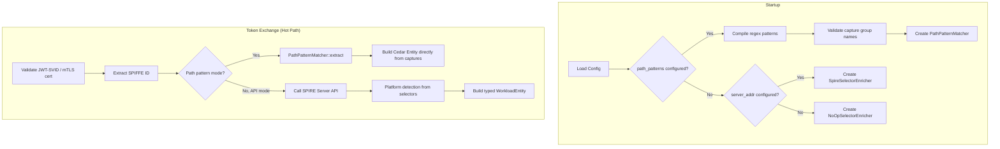
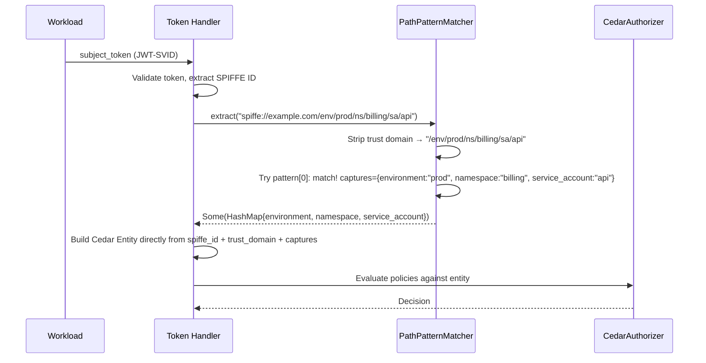

# Design Document — SPIFFE ID Path Pattern Extraction

## Overview

This feature replaces the SPIRE Server API dependency with a configuration-driven regex pattern matching system that extracts workload attributes directly from SPIFFE ID paths. Operators define `[[identity.spire.path_patterns]]` entries with named capture groups, and the system parses SPIFFE ID paths locally at token-exchange time — eliminating network round-trips to the SPIRE Server on the hot path.

The design introduces a `PathPatternMatcher` component that compiles regex patterns at startup and produces a `HashMap<String, String>` of captured attributes for each authenticated SPIFFE identity. These attributes are placed directly on a unified `Quartermaster::Workload` Cedar entity, removing the need for platform-specific subtypes (`K8sWorkload`, `Ec2Workload`, `GcpWorkload`) when path patterns are configured.

### Key Design Decisions

1. **Unified `Workload` entity type**: When path patterns are active, all SPIRE identities produce a `Quartermaster::Workload` entity with dynamic attributes from regex captures. The platform-subtype hierarchy (K8s/EC2/GCP) is an artifact of SPIRE API selector enrichment and is unnecessary when the SPIFFE ID path itself encodes the relevant metadata.

2. **First-match-wins ordering**: Patterns are evaluated sequentially. This gives operators explicit control over precedence when paths could match multiple patterns (e.g., a catch-all pattern at the end).

3. **Fail-fast startup validation**: All regex patterns are compiled and capture group names validated at startup. Invalid config prevents the server from starting — no runtime surprises.

4. **Backward-compatible mode selection**: The system uses path patterns when configured, falls back to SPIRE API enrichment when `server_addr` is present without patterns, and uses a no-op enricher when neither is configured. Existing deployments continue working unchanged.

5. **Open attribute model**: Cedar entities carry whatever attributes the regex captures produce. Policies reference attributes with `principal.attribute_name` and Cedar's standard behavior handles missing attributes (condition evaluates to error → deny).

6. **Bypass `WorkloadEntity` struct entirely**: The path-pattern code path builds Cedar `Entity` objects directly from `(spiffe_id, trust_domain, captures)` without going through `WorkloadEntity`. The existing `WorkloadEntity` struct — with its platform-specific `Option` fields for K8s/EC2/GCP — only serves the legacy SPIRE API selector-enrichment path. This avoids populating dead fields and keeps the two paths cleanly separated.

## Architecture





### Mode Selection Logic

| `path_patterns` | `server_addr` | Behavior |
|----------------|---------------|----------|
| Non-empty | Any | PathPatternMatcher (no API calls) |
| Empty/absent | Present | SpireSelectorEnricher (API calls) |
| Empty/absent | Absent | NoOpSelectorEnricher (spiffe_id + trust_domain only) |

## Components and Interfaces

### 1. PathPatternConfig (`src/config/identity.rs`)

Extension to `SpireSourceConfig` for pattern configuration:

```rust
/// SPIRE identity source configuration.
#[derive(Debug, Clone, Deserialize)]
pub struct SpireSourceConfig {
    pub trust_domain: String,
    pub jwks_path: String,
    pub server_addr: Option<String>,
    pub audience: String,
    pub x509_bundle_path: Option<String>,

    /// Path patterns for extracting attributes from SPIFFE ID paths.
    /// When non-empty, SPIRE Server API calls are skipped entirely.
    #[serde(default)]
    pub path_patterns: Vec<PathPatternConfig>,
}

/// A single SPIFFE ID path pattern with a regex containing named capture groups.
#[derive(Debug, Clone, Deserialize)]
pub struct PathPatternConfig {
    /// Regex pattern with named capture groups (e.g., `(?P<namespace>[^/]+)`).
    /// Applied to the SPIFFE ID path (after stripping `spiffe://<trust_domain>`).
    pub pattern: String,
}
```

### 2. PathPatternMatcher (`src/domain/identity/path_pattern.rs`)

Core component that compiles and evaluates path patterns:

```rust
use regex::Regex;
use std::collections::HashMap;

/// Compiled path patterns for extracting attributes from SPIFFE ID paths.
/// Immutable after construction (built once at startup).
#[derive(Debug, Clone)]
pub struct PathPatternMatcher {
    /// Compiled regex patterns in evaluation order.
    patterns: Vec<CompiledPattern>,
    /// The trust domain to strip from SPIFFE IDs before matching.
    trust_domain: String,
}

#[derive(Debug, Clone)]
struct CompiledPattern {
    regex: Regex,
    /// Names of the capture groups in this pattern (for fast attribute extraction).
    capture_names: Vec<String>,
}

/// Errors from path pattern compilation/validation.
#[derive(Debug, Clone, PartialEq, Eq)]
pub enum PathPatternError {
    /// The regex pattern is invalid.
    InvalidRegex { pattern: String, reason: String },
    /// A capture group name is not a valid Cedar attribute name.
    InvalidCaptureName { pattern: String, name: String, reason: String },
    /// Pattern has no named capture groups (warning-level, not fatal).
    NoCaptures { pattern: String },
}

impl PathPatternMatcher {
    /// Compiles path patterns from configuration. Returns errors for invalid patterns.
    /// Patterns with zero named captures produce a warning but are still compiled.
    pub fn compile(
        trust_domain: &str,
        configs: &[PathPatternConfig],
    ) -> Result<Self, Vec<PathPatternError>> { ... }

    /// Extracts attributes from a SPIFFE ID by matching against compiled patterns.
    /// Returns the captured attributes from the first matching pattern,
    /// or an empty map if no pattern matches.
    pub fn extract(&self, spiffe_id: &str) -> HashMap<String, String> { ... }

    /// Returns warnings for patterns that compiled but have no named captures.
    pub fn warnings(&self) -> Vec<PathPatternError> { ... }
}
```

### 3. Direct Cedar Entity Construction from Captures (`src/cedar/mod.rs`)

When path patterns are active, entity construction **bypasses `WorkloadEntity` entirely**. The `WorkloadEntity` struct with its platform-specific `Option` fields (`namespace`, `instance_id`, `project_id`, etc.) exists to support the legacy SPIRE API selector-enrichment path. In path-pattern mode, those fields are dead weight — the Cedar entity is built directly from `(spiffe_id, trust_domain, HashMap<String, String>)`.

This keeps the path-pattern path simple: no intermediary struct, no unused fields, no platform detection logic. The existing `WorkloadEntity` + `EntityBuilder` + `build_workload_entities` remain for the legacy API mode only.

```rust
/// Builds Cedar entities for a workload authenticated via path pattern extraction.
/// Bypasses WorkloadEntity entirely — constructs the Cedar Entity directly from captures.
///
/// Entity type is always Quartermaster::Workload (no platform subtypes, no parent hierarchy).
/// Attributes: spiffe_id, trust_domain, plus all key-value pairs from captures.
/// Selectors: always empty (no SPIRE API call).
pub fn build_workload_entities_from_captures(
    spiffe_id: &str,
    trust_domain: &str,
    captures: &HashMap<String, String>,
) -> Result<Vec<Entity>, CedarError> {
    let principal_uid = make_entity_uid("Workload", spiffe_id)?;

    let mut attrs: HashMap<String, RestrictedExpression> = HashMap::new();
    attrs.insert(
        "spiffe_id".to_string(),
        RestrictedExpression::new_string(spiffe_id.to_string()),
    );
    attrs.insert(
        "trust_domain".to_string(),
        RestrictedExpression::new_string(trust_domain.to_string()),
    );

    // Add all captured attributes as String values
    for (name, value) in captures {
        attrs.insert(
            name.clone(),
            RestrictedExpression::new_string(value.clone()),
        );
    }

    // No parent hierarchy — path-pattern entities are always base Workload
    let entity = Entity::new(principal_uid, attrs, HashSet::new())
        .map_err(|e| CedarError::EvaluationFailed(format!("Failed to create entity: {e}")))?;

    Ok(vec![entity])
}
```

**Key difference from legacy path**: The existing `build_workload_entities(&WorkloadEntity)` constructs a typed entity (K8sWorkload/Ec2Workload/GcpWorkload) with parent hierarchy pointing to a base Workload entity. `build_workload_entities_from_captures` produces a single flat `Workload` entity with no parents and dynamic attributes. The two paths are completely independent — no shared intermediary struct.

### 4. SelectorEnricher Trait and NoOp Implementation

```rust
/// Trait for enriching SPIRE identities with selector information.
#[async_trait]
pub trait SelectorEnricher: Send + Sync {
    /// Returns selectors for the given SPIFFE ID.
    async fn get_selectors(&self, spiffe_id: &str) -> Vec<String>;
}

/// No-op enricher that returns no selectors.
/// Used when path patterns are configured or when no server_addr is set.
pub struct NoOpSelectorEnricher;

#[async_trait]
impl SelectorEnricher for NoOpSelectorEnricher {
    async fn get_selectors(&self, _spiffe_id: &str) -> Vec<String> {
        vec![]
    }
}
```

### 5. Startup Validation (`src/config/identity.rs`)

Extended `IdentityConfig::validate()` to validate path patterns:

```rust
impl SpireSourceConfig {
    /// Validates path patterns at startup.
    /// Returns compiled PathPatternMatcher on success, or errors on failure.
    pub fn validate_path_patterns(&self) -> Result<Option<PathPatternMatcher>, Vec<PathPatternError>> {
        if self.path_patterns.is_empty() {
            return Ok(None);
        }
        PathPatternMatcher::compile(&self.trust_domain, &self.path_patterns)
            .map(Some)
    }
}
```

## Data Models

### Configuration (TOML)

```toml
[identity.spire]
trust_domain = "example.com"
jwks_path = "/run/spire/agent/jwks.json"
audience = "quartermaster.example.com"
# server_addr is omitted — not needed with path patterns

[[identity.spire.path_patterns]]
pattern = "^/env/(?P<environment>[^/]+)/project/(?P<project>[^/]+)/ns/(?P<namespace>[^/]+)/sa/(?P<service_account>[^/]+)$"

[[identity.spire.path_patterns]]
pattern = "^/ns/(?P<namespace>[^/]+)/sa/(?P<service_account>[^/]+)/workload/(?P<workload>[^/]+)$"

[[identity.spire.path_patterns]]
pattern = "^/agent/(?P<agent_type>[^/]+)/(?P<agent_id>.+)$"
```

### Entity Attribute Flow

| SPIFFE ID | Matching Pattern | Resulting Entity Attributes |
|-----------|-----------------|---------------------------|
| `spiffe://example.com/env/prod/project/billing/ns/payments/sa/api` | Pattern 1 | `spiffe_id`, `trust_domain`, `environment="prod"`, `project="billing"`, `namespace="payments"`, `service_account="api"` |
| `spiffe://example.com/ns/default/sa/nginx/workload/frontend` | Pattern 2 | `spiffe_id`, `trust_domain`, `namespace="default"`, `service_account="nginx"`, `workload="frontend"` |
| `spiffe://example.com/agent/node/host-abc` | Pattern 3 | `spiffe_id`, `trust_domain`, `agent_type="node"`, `agent_id="host-abc"` |
| `spiffe://example.com/unknown/path` | None | `spiffe_id`, `trust_domain` only |

### Cedar Policy Examples

```cedar
// Policy using captured attributes from path pattern
permit(
    principal is Quartermaster::Workload,
    action == Quartermaster::Action::"assumeBillet",
    resource == Quartermaster::Billet::"prod-billing"
)
when {
    principal.environment == "prod" &&
    principal.namespace == "billing"
};

// Policy that works regardless of which pattern matched
permit(
    principal is Quartermaster::Workload,
    action == Quartermaster::Action::"assumeBillet",
    resource
)
when {
    principal.trust_domain == "example.com" &&
    principal has namespace &&
    principal.namespace == "monitoring"
};
```

### Capture Group Name Validation

Valid Cedar attribute names: `^[a-zA-Z_][a-zA-Z0-9_]*$`

| Capture Group Name | Valid? | Reason |
|-------------------|--------|--------|
| `namespace` | ✓ | Alphanumeric |
| `service_account` | ✓ | Underscore allowed |
| `pod-name` | ✗ | Hyphens not valid in Cedar attributes |
| `123start` | ✗ | Must start with letter or underscore |
| `_private` | ✓ | Underscore-prefixed allowed |

## Correctness Properties

*A property is a characteristic or behavior that should hold true across all valid executions of a system — essentially, a formal statement about what the system should do. Properties serve as the bridge between human-readable specifications and machine-verifiable correctness guarantees.*

### Property 1: Config deserialization round-trip

*For any* valid TOML configuration containing `[[identity.spire.path_patterns]]` entries with arbitrary pattern strings, deserializing into `SpireSourceConfig` SHALL produce a struct where `path_patterns.len()` equals the number of entries and each `path_patterns[i].pattern` equals the original string value.

**Validates: Requirements 1.1**

### Property 2: First-match-wins ordering

*For any* ordered list of compiled patterns and any SPIFFE ID path, `PathPatternMatcher::extract` SHALL return the captures from the first pattern that matches the path — equivalent to iterating patterns in index order and returning on the first successful match.

**Validates: Requirements 1.2**

### Property 3: Capture groups become entity attributes

*For any* valid regex pattern with N named capture groups that matches a given SPIFFE ID path, the resulting entity attribute map SHALL contain exactly N entries (in addition to `spiffe_id` and `trust_domain`), where each key is a capture group name and each value is the corresponding captured substring.

**Validates: Requirements 1.3, 2.3**

### Property 4: No-match produces minimal entity

*For any* SPIFFE ID path that matches none of the configured patterns, the resulting entity SHALL have exactly two attributes: `spiffe_id` (equal to the full SPIFFE ID) and `trust_domain` (equal to the configured trust domain), with no additional captured attributes.

**Validates: Requirements 1.4, 2.2**

### Property 5: Entity type is always Workload in path-pattern mode

*For any* SPIFFE ID processed through path pattern extraction (regardless of whether a pattern matches or what attributes are captured), the Cedar entity type SHALL be `Quartermaster::Workload` — never a platform-specific subtype.

**Validates: Requirements 2.1**

### Property 6: Selectors are always empty in path-pattern mode

*For any* SPIFFE ID processed through path pattern mode, the `selectors` field on the resulting entity and context SHALL be an empty set.

**Validates: Requirements 2.5**

### Property 7: Pattern validation rejects invalid patterns

*For any* regex string that is not valid regex syntax, `PathPatternMatcher::compile` SHALL return an error containing the invalid pattern and a descriptive reason. *For any* regex with a named capture group whose name does not match `^[a-zA-Z_][a-zA-Z0-9_]*$`, compilation SHALL return an error identifying the invalid capture name.

**Validates: Requirements 5.1, 5.3**

## Error Handling

### Startup Errors (Fatal)

| Condition | Behavior | Error Message |
|-----------|----------|---------------|
| Invalid regex syntax in pattern | Startup failure | `"invalid path pattern regex '...': <regex error>"` |
| Capture group name not valid Cedar attribute | Startup failure | `"capture group '<name>' in pattern '...' is not a valid Cedar attribute name: must match [a-zA-Z_][a-zA-Z0-9_]*"` |
| Empty `path_patterns` array (explicit empty) | No error (treated as absent) | N/A |

### Startup Warnings (Non-Fatal)

| Condition | Behavior | Warning Message |
|-----------|----------|----------------|
| Pattern has zero named capture groups | Log warning, pattern still compiled | `"path pattern '...' has no named capture groups — it will match but extract no attributes"` |
| `server_addr` configured alongside `path_patterns` | Log info | `"server_addr is ignored when path_patterns are configured"` |

### Runtime Behavior (No Errors)

| Condition | Behavior |
|-----------|----------|
| SPIFFE ID doesn't contain trust domain | `extract()` returns empty map (path is empty string) |
| No pattern matches the path | Empty captures → entity has only spiffe_id + trust_domain |
| Pattern matches but optional group doesn't capture | Group absent from captures map (not included) |
| Cedar policy references missing attribute | Cedar evaluates condition to error → deny (standard behavior) |

### Design Principle

Path pattern extraction is infallible at runtime. All validation happens at startup. The `extract()` method returns a `HashMap<String, String>` — never an error. If no pattern matches, the map is empty. This keeps the hot path simple and panic-free.

## Testing Strategy

### Unit Tests

- `PathPatternMatcher::compile` with valid patterns: produces correct number of compiled patterns
- `PathPatternMatcher::compile` with invalid regex: returns `InvalidRegex` error with details
- `PathPatternMatcher::compile` with invalid capture names (hyphens, digits-first): returns `InvalidCaptureName` error
- `PathPatternMatcher::compile` with no-capture pattern: succeeds but `warnings()` returns `NoCaptures`
- `PathPatternMatcher::extract` with matching first pattern: returns correct captures
- `PathPatternMatcher::extract` with matching second pattern (first doesn't match): returns captures from second
- `PathPatternMatcher::extract` with no matching patterns: returns empty map
- `PathPatternMatcher::extract` with SPIFFE ID from different trust domain: returns empty map
- `SpireSourceConfig` deserialization: TOML with path_patterns deserializes correctly
- `SpireSourceConfig` deserialization: TOML without path_patterns defaults to empty vec
- Mode selection: path_patterns present → PathPatternMatcher created
- Mode selection: no path_patterns + server_addr → SpireSelectorEnricher
- Mode selection: no path_patterns + no server_addr → NoOpSelectorEnricher
- Cedar entity construction from captures: attributes appear on entity
- Cedar entity construction: entity type is always `Workload`
- Cedar entity construction: empty captures → only spiffe_id + trust_domain

### Property-Based Tests

Property-based tests use the `proptest` crate (already in dev-dependencies). Each property test runs a minimum of 100 iterations.

| Property | Test Approach | Generator Strategy |
|----------|--------------|-------------------|
| P1: Config round-trip | Generate random valid pattern strings, build config, serialize to TOML, deserialize, compare | `proptest::collection::vec(arb_regex_string(), 0..5)` |
| P2: First-match-wins | Generate 2-3 patterns where multiple could match same path, verify first match's captures are returned | Custom strategy: generate overlapping patterns + a path that matches multiple |
| P3: Captures become attributes | Generate a regex with N named groups, generate a matching path string, verify N attributes present | Custom strategy: build regex from parts with known capture groups, generate matching segments |
| P4: No-match minimal entity | Generate patterns, then generate a path guaranteed not to match any, verify empty captures | Strategy: generate patterns then produce path with random prefix not in any pattern |
| P5: Entity type always Workload | Generate arbitrary SPIFFE IDs and captures, build entity, check type | `(arb_spiffe_id(), arb_captures_map())` |
| P6: Selectors always empty | Generate entities through path-pattern path, verify selectors empty | Same as P5, check selectors field |
| P7: Invalid patterns rejected | Generate strings that are not valid regex (unmatched parens, etc.), verify compile returns error | Strategy: inject regex syntax errors into otherwise valid patterns |

### Integration Tests

- End-to-end: configure path patterns, submit JWT-SVID with matching SPIFFE ID, verify Cedar evaluation uses captured attributes
- End-to-end: configure path patterns, submit SPIFFE ID that matches no pattern, verify authorization uses minimal entity
- Backward compatibility: configure without path patterns + server_addr, verify SPIRE API is called (mock)
- Cedar policy evaluation: policy referencing `principal.namespace` allows when namespace matches, denies otherwise

### Test Configuration

```rust
// Tag format for property tests:
// Feature: spiffe-path-patterns, Property {N}: {description}

proptest! {
    #![proptest_config(ProptestConfig::with_cases(100))]

    #[test]
    fn prop_first_match_wins(patterns in arb_overlapping_patterns(), path in arb_matching_path()) {
        // Feature: spiffe-path-patterns, Property 2: First-match-wins ordering
        ...
    }

    #[test]
    fn prop_captures_become_attributes(
        groups in proptest::collection::vec("[a-z_][a-z0-9_]{0,10}", 1..5),
        values in proptest::collection::vec("[a-zA-Z0-9]{1,20}", 1..5),
    ) {
        // Feature: spiffe-path-patterns, Property 3: Capture groups become entity attributes
        ...
    }
}
```
