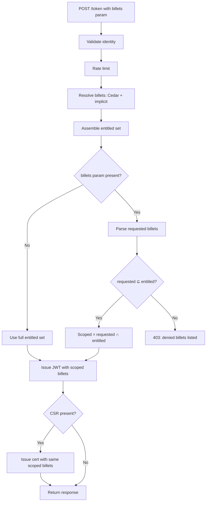
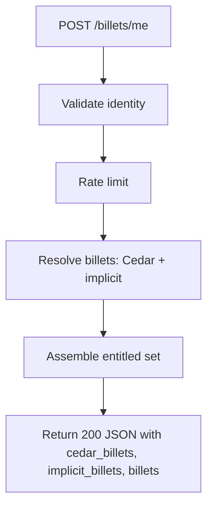

# Design Document — Token Scoping & Billet Discovery

## Overview

This design adds opt-in billet scoping to the existing token exchange flow and introduces a new discovery endpoint. The core idea is simple: clients can request a subset of their entitled billets, and the system intersects the request with the entitled set. If the intersection is valid, the JWT (and optional certificate) contains only the scoped billets. If any requested billet is not entitled, the request is rejected with a 403 listing the denied billets.

Additionally, a `POST /billets/me` endpoint lets callers discover their entitled billets before making a scoped request, enabling informed least-privilege decisions.

### Key Design Decisions

1. **Intersection semantics** — `billets` parameter narrows only; the scoped set is always `requested ∩ entitled`. This makes the operation safe by construction.
2. **Fail-closed on unknown billets** — If any requested billet is not in the entitled set, return 403 with the denied list. No partial success.
3. **Scoping applies late** — Full Cedar resolution + implicit mapping runs first (producing the entitled set), then scoping narrows the result. This means caching and authorization logic is unchanged.
4. **Certificate consistency** — `CertIssueRequest.billets` always receives the same billet list as the JWT. Scoping is applied once, upstream of both issuance paths.
5. **Discovery is read-only** — `/billets/me` reuses identity validation and resolution but never calls the issuer or authority.
6. **Graceful empty discovery** — `/billets/me` returns 200 with empty arrays even when the caller has no billets. Discovery never fails with 403.

## Architecture

The scoping logic is a pure function inserted between billet assembly (step 7 in the current flow) and token issuance (step 9). The discovery endpoint reuses steps 1–7 but returns the resolution directly.





### Current vs. Proposed Token Flow

| Step | Current | Proposed |
|------|---------|----------|
| 1–6 | Validate → Rate limit → Resolve → Implicit | Unchanged |
| 7 | `assemble_token_billets()` → `final_billets` | Same — produces `entitled_billets` |
| 7.5 | *(new)* | If `billets` param present: parse, validate subset, intersect |
| 8–9 | Issue JWT with `final_billets` | Issue JWT with `scoped_billets` (or `entitled_billets` if no param) |
| 10 | Issue cert with `final_billets` | Issue cert with same `scoped_billets` |

## Components and Interfaces

### Modified: `TokenExchangeForm` (`src/handler/token.rs`)

Add the optional `billets` field:

```rust
#[derive(Debug, Deserialize)]
pub struct TokenExchangeForm {
    pub grant_type: Option<String>,
    pub subject_token: Option<String>,
    pub subject_token_type: Option<String>,
    pub audience: Option<String>,
    pub csr: Option<String>,
    /// Optional comma-separated list of billet names to scope the token to.
    pub billets: Option<String>,
}
```

### New: `parse_requested_billets` (pure function, `src/handler/token.rs`)

```rust
/// Parses a comma-separated billets string into a deduplicated Vec of trimmed billet names.
/// Returns None for empty/whitespace-only input.
fn parse_requested_billets(raw: &str) -> Option<Vec<String>> {
    let billets: Vec<String> = raw
        .split(',')
        .map(|s| s.trim().to_string())
        .filter(|s| !s.is_empty())
        .collect();
    if billets.is_empty() {
        None
    } else {
        Some(billets)
    }
}
```

### New: `scope_billets` (pure function, `src/domain/billet/mod.rs`)

```rust
/// Result of a scoping operation.
pub struct ScopeResult {
    /// The scoped billets (intersection of requested and entitled).
    pub billets: Vec<String>,
}

/// Error when requested billets are not a subset of entitled billets.
pub struct ScopeDenied {
    /// Billets that were requested but not in the entitled set.
    pub denied: Vec<String>,
}

/// Scopes an entitled billet set by intersecting with a requested set.
///
/// Returns Ok(intersection) if all requested billets are entitled.
/// Returns Err(denied list) if any requested billet is not entitled.
pub fn scope_billets(
    entitled: &[String],
    requested: &[String],
) -> Result<ScopeResult, ScopeDenied> {
    let entitled_set: HashSet<&str> = entitled.iter().map(|s| s.as_str()).collect();
    let denied: Vec<String> = requested
        .iter()
        .filter(|r| !entitled_set.contains(r.as_str()))
        .cloned()
        .collect();

    if denied.is_empty() {
        // All requested are entitled — return requested (preserving order)
        Ok(ScopeResult {
            billets: requested.to_vec(),
        })
    } else {
        Err(ScopeDenied { denied })
    }
}
```

### Modified: `token_exchange` handler (`src/handler/token.rs`)

Insert scoping logic between step 7 (assemble billets) and step 9 (issue JWT):

```rust
// 7.5 (NEW) Apply billet scoping if requested
let scoped_billets = if let Some(ref billets_param) = form.billets {
    match parse_requested_billets(billets_param) {
        Some(requested) => {
            match scope_billets(&final_billets, &requested) {
                Ok(result) => result.billets,
                Err(denied) => {
                    return Err(DomainError::insufficient_scope(
                        format!("requested billets not entitled: {}", denied.denied.join(", "))
                    ));
                }
            }
        }
        None => final_billets.clone(), // empty/whitespace billets param = no scoping
    }
} else {
    final_billets.clone()
};
```

Then use `scoped_billets` for both JWT and cert issuance (steps 9 and 10).

### New: `POST /billets/me` handler (`src/handler/billets_discovery.rs`)

```rust
/// Form body for the billet discovery request.
#[derive(Debug, Deserialize)]
pub struct BilletDiscoveryForm {
    pub subject_token: Option<String>,
    pub subject_token_type: Option<String>,
}

/// JSON response for billet discovery.
#[derive(Debug, Serialize)]
pub struct BilletDiscoveryResponse {
    pub billets: Vec<String>,
    pub implicit_billets: Vec<String>,
    pub cedar_billets: Vec<String>,
}

/// POST /billets/me — discover entitled billets without issuing a token.
pub async fn billet_discovery(
    State(state): State<Arc<AppState>>,
    headers: axum::http::HeaderMap,
    Form(form): Form<BilletDiscoveryForm>,
) -> Result<impl IntoResponse, DomainError> { ... }
```

The handler performs steps 1–7 of the token exchange (validate identity → rate limit → resolve billets → implicit mapping → assemble), then returns the response directly without calling `issuer.issue()` or `authority.issue()`.

### Modified: Router (`src/server/mod.rs`)

Register the new endpoint:

```rust
.route("/billets/me", post(handler::billets_discovery::billet_discovery))
```

### Modified: `src/handler/mod.rs`

Add the new module:

```rust
pub mod billets_discovery;
```

## Data Models

### Request: `POST /token` (extended)

| Field | Type | Required | Description |
|-------|------|----------|-------------|
| `grant_type` | string | yes | Must be `urn:ietf:params:oauth:grant-type:token-exchange` |
| `subject_token` | string | yes | Upstream identity proof |
| `subject_token_type` | string | yes | Token type URI |
| `audience` | string | yes | Target audience |
| `csr` | string | no | Base64 CSR for cert issuance |
| `billets` | string | no | **NEW** — Comma-separated billet names to scope to |

### Request: `POST /billets/me` (new)

| Field | Type | Required | Description |
|-------|------|----------|-------------|
| `subject_token` | string | yes | Upstream identity proof |
| `subject_token_type` | string | yes | Token type URI |

### Response: `POST /billets/me` (new)

```json
{
  "billets": ["billing-writer", "audit-reader", "okta-group:billing-ops"],
  "implicit_billets": ["okta-group:billing-ops"],
  "cedar_billets": ["billing-writer", "audit-reader"]
}
```

- `billets`: Union of cedar and implicit billets (the full entitled set, after `assemble_token_billets`)
- `cedar_billets`: Billets resolved via Cedar policy evaluation (pre-filtering)
- `implicit_billets`: Billets derived from IdP claims via implicit mapping

### Response: `POST /token` (unchanged structure)

The response schema is unchanged. The `access_token` JWT will contain fewer billets when scoping is applied, but the JSON envelope is identical.

### No Data Store Changes

This feature operates entirely at the request-handling layer. No new tables, records, or schema changes.

## Correctness Properties

*A property is a characteristic or behavior that should hold true across all valid executions of a system — essentially, a formal statement about what the system should do. Properties serve as the bridge between human-readable specifications and machine-verifiable correctness guarantees.*

### Property 1: Billet scoping is set intersection

*For any* entitled billet set and *for any* requested billet set where `requested ⊆ entitled`, the `scope_billets` function SHALL return exactly the requested set, and the result SHALL always be a subset of the entitled set.

**Validates: Requirements 1.2, 1.3, 1.6**

### Property 2: Denied billets are the set difference

*For any* entitled billet set and *for any* requested billet set where `requested ⊄ entitled`, the `scope_billets` function SHALL return an error containing exactly the billets in `requested \ entitled` (the set difference).

**Validates: Requirements 1.4**

### Property 3: Billet parameter parsing round-trip

*For any* list of non-empty, non-comma-containing billet name strings, joining them with commas and passing to `parse_requested_billets` SHALL produce the same list of strings (trimmed and deduplicated).

**Validates: Requirements 1.1**

### Property 4: Discovery response contains consistent sets

*For any* set of cedar billets and implicit billets, the `billets` field in the discovery response SHALL equal the output of `assemble_token_billets` applied to those inputs, and `cedar_billets` and `implicit_billets` SHALL faithfully reflect their respective source sets.

**Validates: Requirements 2.4**

### Property 5: Cross-credential billet consistency

*For any* token exchange request with both `billets` and `csr` parameters present, the billets passed to `CertIssueRequest` SHALL be identical to the billets included in the issued JWT.

**Validates: Requirements 3.1, 3.2**

## Error Handling

### New Error Paths

| Condition | HTTP Status | Error Code | Message |
|-----------|-------------|------------|---------|
| Requested billets not in entitled set | 403 | `insufficient_scope` | `"requested billets not entitled: billing-writer, admin-ops"` |
| Missing `subject_token` on `/billets/me` | 400 | `invalid_request` | `"subject_token is required"` |
| Missing `subject_token_type` on `/billets/me` | 400 | `invalid_request` | `"subject_token_type is required"` |
| Identity validation failure on `/billets/me` | 401 | `invalid_token` | Same as `/token` |
| Rate limit exceeded on `/billets/me` | 429 | `rate_limited` | `"rate limit exceeded"` |

### Unchanged Error Paths

All existing `/token` errors remain unchanged:
- 400 for invalid grant_type, missing required params, invalid CSR
- 401 for invalid/expired subject_token
- 403 for no billets resolved (Cedar all-deny)
- 429 for rate limiting
- 503 for uninitialized policy set or internal errors

### Edge Cases

| Case | Behavior |
|------|----------|
| `billets` param is empty string or whitespace | Treated as absent — no scoping applied |
| `billets` param contains duplicates | Deduplicated before intersection |
| Caller has no entitled billets + `/billets/me` | Returns 200 with empty arrays |
| Caller has no entitled billets + `/token` with `billets` param | 403 from existing billet resolution (before scoping logic runs) |

## Testing Strategy

### Property-Based Tests

Property-based testing is appropriate for this feature. The core `scope_billets` function and `parse_requested_billets` are pure functions with clear input/output behavior, a large input space (arbitrary string sets), and universal invariants (set intersection, set difference).

**Library:** `proptest` (Rust PBT library)

**Configuration:** Minimum 100 iterations per property test.

**Tag format:** `Feature: token-scoping, Property {N}: {description}`

Each correctness property maps to one property-based test:

| Property | Generator Strategy | Assertion |
|----------|-------------------|-----------|
| 1: Intersection | Generate random `entitled: HashSet<String>` and `requested` where `requested ⊆ entitled` | `scope_billets` returns Ok and result == requested; result ⊆ entitled |
| 2: Set difference | Generate random `entitled` and `requested` where `requested ⊄ entitled` | `scope_billets` returns Err with denied == requested \ entitled |
| 3: Parsing round-trip | Generate random Vec of valid billet names (no commas, no leading/trailing whitespace) | `parse_requested_billets(names.join(","))` == Some(names) |
| 4: Discovery response | Generate random cedar_billets and implicit_billets vecs | Response fields match `assemble_token_billets` output |
| 5: Cross-credential consistency | Generate random scoped billets list | Verify same list is passed to both IssueRequest.billets and CertIssueRequest.billets |

### Unit Tests (Example-Based)

- `parse_requested_billets("")` returns `None`
- `parse_requested_billets("  ,  , ")` returns `None`
- `parse_requested_billets("a, b ,c")` returns `Some(["a", "b", "c"])`
- `scope_billets(["a","b","c"], ["a","c"])` → `Ok(["a","c"])`
- `scope_billets(["a","b"], ["a","x"])` → `Err(denied: ["x"])`
- Token exchange without `billets` param → full entitled set in JWT
- Token exchange with valid `billets` param → only requested billets in JWT
- Token exchange with invalid `billets` param → 403 with denied list
- `/billets/me` with valid identity → 200 with correct JSON structure
- `/billets/me` with no entitled billets → 200 with empty arrays
- `/billets/me` missing subject_token → 400

### Integration Tests

- End-to-end: scoped token exchange with valid subset → JWT contains only requested billets
- End-to-end: scoped token exchange with CSR → cert SANs match JWT billets
- End-to-end: `/billets/me` with various identity sources (SPIRE, OIDC, AWS STS)
- Rate limiter applied to `/billets/me`

### What Is NOT Tested with PBT

- HTTP routing and middleware (integration concern)
- Identity validation logic (external token verification)
- Cedar policy evaluation (tested separately in billet resolver tests)
- Rate limiting behavior (stateful, integration concern)
- Audit logging (side-effect only)
