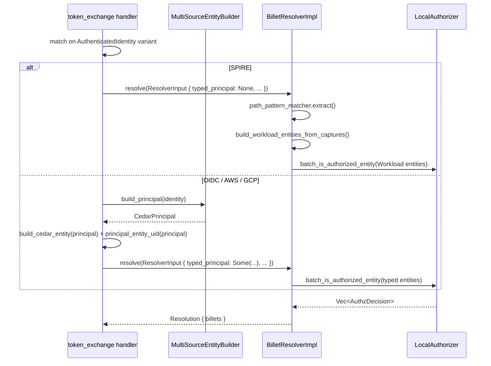

# Design Document — Wire Typed Cedar Entities into Billet Resolution

## Overview

This feature connects existing typed Cedar entity construction code to the live billet resolution path so that non-SPIRE identity sources (OIDC, AWS STS, GCP) produce properly typed Cedar entities with meaningful attributes for policy evaluation.

Currently, all identity sources are funneled through `BilletResolverImpl.resolve()` which unconditionally calls `build_workload_entities_from_captures()` — a function designed for SPIRE identities that extracts attributes from SPIFFE ID path patterns. Non-SPIRE sources pass in empty trust_domain/environment/region values, resulting in a generic `Workload` entity with no useful attributes.

The typed entity builders (`build_cedar_entity`, `HumanEntity`, `AwsRoleEntity`, `GcpWorkloadEntity`) already exist in `src/domain/identity/entity.rs` but are never invoked from the resolution path. This design wires them in, renames `HumanIdentity` to `OidcIdentity` for semantic accuracy, fixes the OIDC claims model to preserve claim origin, removes dead SPIRE entity code, and updates the Cedar schema.

### Design Goals

1. Non-SPIRE sources get fully-typed Cedar entities with source-specific attributes
2. SPIRE resolution remains unchanged (path-pattern extraction + `build_workload_entities_from_captures`)
3. OIDC claims model supports both simple group matching and origin-preserving matching
4. Dead code eliminated to reduce maintenance burden
5. Cedar schema accurately reflects all supported principal types

## Architecture

The change is primarily a wiring refactor at the boundary between identity authentication and billet resolution. The data flow changes from:

```
[All Sources] → token_exchange → build_resolver_input → BilletResolverImpl.resolve()
                                                              ↓
                                               build_workload_entities_from_captures (SPIRE-only logic)
```

To:

```
[SPIRE] → token_exchange → build_resolver_input → BilletResolverImpl.resolve()
                                                        ↓
                                         build_workload_entities_from_captures (unchanged)

[OIDC/AWS/GCP] → token_exchange → build_typed_resolver_input → TypedBilletResolver.resolve()
                                                                     ↓
                                                      MultiSourceEntityBuilder.build_principal()
                                                                     ↓
                                                      build_cedar_entity() + principal_entity_uid()
```

### Architectural Decision: Extend Resolver vs. Pre-build Entities in Handler

**Option A: Extend `BilletResolverImpl` to accept pre-built entities**
- Add a second resolution method or extend `ResolverInput` to carry optional pre-built entities
- The resolver branches: if entities provided, skip path-pattern extraction; otherwise use SPIRE path

**Option B: Branch in the handler, build entities there, pass to authorizer directly**
- The handler calls `MultiSourceEntityBuilder.build_principal()` + `build_cedar_entity()` for non-SPIRE sources
- Constructs `EntityBatchAuthzRequest` directly and calls the authorizer
- Resolver is only used for SPIRE

**Decision: Option A — Extend the Resolver trait**

Rationale:
- Keeps authorization orchestration (cache check → entity build → authorize → cache store) in one place
- The resolver already handles caching keyed by subject+audience — non-SPIRE sources benefit from the same cache
- Avoids duplicating the resolution orchestration logic (cache, known_billets check, error mapping) in the handler
- The `Resolver` trait remains the single entry point for all billet resolution

### Implementation Approach

Extend `ResolverInput` with an optional field carrying pre-built entities + principal metadata. When present, the resolver skips path-pattern extraction and uses the provided entities directly. The handler builds typed entities for non-SPIRE sources before calling `resolve()`.



## Components and Interfaces

### Modified: `ResolverInput`

```rust
/// Pre-built typed principal for non-SPIRE sources.
pub struct TypedPrincipal {
    /// Cedar entity type name (e.g., "OidcIdentity", "AwsRoleIdentity", "GcpIdentity")
    pub principal_type: String,
    /// Principal entity ID (e.g., email, role_arn)
    pub principal_id: String,
    /// Pre-built Cedar entities
    pub entities: Vec<Entity>,
    /// Source type for context (e.g., "oidc", "aws-sts", "gcp")
    pub source_type: String,
    /// Source cloud for context (e.g., "", "aws", "gcp")
    pub source_cloud: String,
}

pub struct ResolverInput {
    pub spiffe_id: String,
    pub trust_domain: String,
    pub environment: String,
    pub region: String,
    pub audience: String,
    pub request_time: chrono::DateTime<chrono::Utc>,
    pub source_cloud: String,
    /// When set, skips path-pattern extraction and uses these pre-built entities.
    pub typed_principal: Option<TypedPrincipal>,
}
```

### Modified: `BilletResolverImpl.resolve()`

The resolver gains a branch at the entity-construction step:

```rust
// If typed_principal is provided, use it directly (non-SPIRE path)
let (principal_type, principal_id, principal_entities, source_type, source_cloud) =
    if let Some(typed) = &input.typed_principal {
        (typed.principal_type.clone(), typed.principal_id.clone(),
         typed.entities.clone(), typed.source_type.clone(), typed.source_cloud.clone())
    } else {
        // Existing SPIRE path
        let captures = self.path_pattern_matcher.extract(&input.spiffe_id);
        let entities = build_workload_entities_from_captures(...)?;
        ("Workload".to_string(), input.spiffe_id.clone(), entities,
         "spire".to_string(), input.source_cloud.clone())
    };
```

### Modified: `token_exchange` handler

The handler builds typed entities for non-SPIRE sources before calling `resolve()`:

```rust
let typed_principal = match &identity {
    AuthenticatedIdentity::Spire(_) => None,
    other => {
        let principal = state.entity_builder.build_principal(other);
        let entity = build_cedar_entity(&principal)?;
        let uid = principal_entity_uid(&principal)?;
        Some(TypedPrincipal {
            principal_type: entity_type_name(&principal),
            principal_id: uid.id().to_string(),
            entities: vec![entity],
            source_type: source_type_for_identity(other).to_string(),
            source_cloud: source_cloud_for_identity(other).to_string(),
        })
    }
};
```

### Renamed: `HumanIdentity` → `OidcIdentity` (Cedar entity type)

| Before | After |
|--------|-------|
| `CedarPrincipal::Human(HumanEntity)` | `CedarPrincipal::Oidc(OidcEntity)` |
| `build_human_cedar_entity()` | `build_oidc_cedar_entity()` |
| `HumanEntity` struct | `OidcEntity` struct |
| Cedar type `Quartermaster::HumanIdentity` | Cedar type `Quartermaster::OidcIdentity` |

### Modified: `OidcEntity` struct

```rust
pub struct OidcEntity {
    pub email: String,
    pub idp_prefix: String,
    pub subject: String,
    pub subject_type: String,  // "human" or "service"
    pub groups: Vec<String>,   // flattened union (backward compat)
    pub claims: Vec<String>,   // "claim_name:value" format (origin-preserving)
}
```

### Modified: `build_oidc_entity()` (was `build_human_entity()`)

The builder now produces both flattened `groups` and origin-tagged `claims`:

```rust
fn build_oidc_entity(oidc: &OidcIdentity) -> OidcEntity {
    let mut groups: Vec<String> = oidc.claims.values().flatten().cloned().collect();
    groups.sort();
    groups.dedup();

    let mut claims: Vec<String> = oidc.claims.iter()
        .flat_map(|(claim_name, values)| {
            values.iter().map(move |v| format!("{claim_name}:{v}"))
        })
        .collect();
    claims.sort();
    claims.dedup();

    OidcEntity {
        email: oidc.email.clone(),
        idp_prefix: oidc.idp_prefix.clone(),
        subject: oidc.subject.clone(),
        subject_type: "human".to_string(), // default; future: configurable per IdP
        groups,
        claims,
    }
}
```

### Removed: Dead SPIRE Entity Code

| File | Removal |
|------|---------|
| `src/cedar/mod.rs` | `PlatformType` enum, `WorkloadEntity` struct |
| `src/domain/billet/entity_builder.rs` | Entire file deleted |
| `src/domain/identity/entity.rs` | `CedarPrincipal::Workload` variant, SPIRE arm in `build_principal`, `spire_builder` field, `selectors` parameter |

**Note:** `AppState.entity_builder` is KEPT — it's now used by the handler to build typed entities for non-SPIRE sources.

### `build_workload_entities_from_captures` stays

The function in `src/cedar/mod.rs` that builds SPIRE Workload entities from path-pattern captures remains unchanged. It is called directly by `BilletResolverImpl` for the SPIRE path without going through `MultiSourceEntityBuilder`.

## Data Models

### Cedar Entity Types

#### `OidcIdentity` (renamed from `HumanIdentity`)

| Attribute | Type | Description |
|-----------|------|-------------|
| `email` | String | Email from OIDC token |
| `idp_prefix` | String | Configured IdP prefix (e.g., "okta", "azure") |
| `subject` | String | OIDC `sub` claim |
| `subject_type` | String | `"human"` or `"service"` |
| `groups` | Set\<String\> | Flattened union of all claim values |
| `claims` | Set\<String\> | Origin-tagged values in `"claim_name:value"` format |

**Entity ID:** email address (e.g., `Quartermaster::OidcIdentity::"alice@corp.example.com"`)

#### `AwsRoleIdentity` (unchanged attributes)

| Attribute | Type | Description |
|-----------|------|-------------|
| `account_id` | String | AWS account ID |
| `role_arn` | String | Full IAM role ARN |
| `role_name` | String | Role name portion |
| `role_path` | String | IAM path |

**Entity ID:** role ARN (e.g., `Quartermaster::AwsRoleIdentity::"arn:aws:iam::123456789012:role/billing-service"`)

#### `GcpIdentity` (unchanged attributes)

| Attribute | Type | Description |
|-----------|------|-------------|
| `project_id` | String | GCP project ID |
| `email` | String | Service account email |
| `zone` | String | GCP zone |

**Entity ID:** service account email (e.g., `Quartermaster::GcpIdentity::"sa@proj.iam.gserviceaccount.com"`)

#### `Workload` (SPIRE, unchanged)

Built by `build_workload_entities_from_captures()` from path-pattern captures. Attributes vary by what the regex extracts (namespace, workload, environment, etc.).

### Cedar Schema (partial)

```cedarschema
entity OidcIdentity {
    email: String,
    idp_prefix: String,
    subject: String,
    subject_type: String,
    groups: Set<String>,
    claims: Set<String>,
};

entity AwsRoleIdentity {
    account_id: String,
    role_arn: String,
    role_name: String,
    role_path: String,
};

entity GcpIdentity {
    project_id: String,
    email: String,
    zone: String,
};

action "assumeBillet" appliesTo {
    principal: [Workload, OidcIdentity, AwsRoleIdentity, GcpIdentity],
    resource: [Billet],
};
```


## Correctness Properties

*A property is a characteristic or behavior that should hold true across all valid executions of a system — essentially, a formal statement about what the system should do. Properties serve as the bridge between human-readable specifications and machine-verifiable correctness guarantees.*

### Property 1: Entity type routing correctness

*For any* `AuthenticatedIdentity` variant (Oidc, AwsSts, or Gcp), building a `CedarPrincipal` via `build_principal()` and then obtaining the `EntityUid` via `principal_entity_uid()` SHALL produce an entity UID whose type name matches the expected Cedar type for that variant: Oidc → `"OidcIdentity"`, AwsSts → `"AwsRoleIdentity"`, Gcp → `"GcpIdentity"`.

**Validates: Requirements 1.1, 2.1**

### Property 2: OIDC entity claims transformation

*For any* `OidcIdentity` with an arbitrary claims map (mapping claim names to lists of string values), building the `OidcEntity` SHALL produce:
- `groups` equal to the sorted, deduplicated union of all values across all claims
- `claims` equal to the sorted, deduplicated set of all `"claim_name:value"` strings for every (claim_name, value) pair in the input
- `subject_type` equal to `"human"`
- `email`, `idp_prefix`, and `subject` matching the input identity fields

**Validates: Requirements 2.4, 3.1, 3.2**

### Property 3: Claims set completeness (no data loss)

*For any* `OidcIdentity` claims map and *for any* specific (claim_name, value) pair present in the input, the resulting `claims` set on the built entity SHALL contain the string `"claim_name:value"`, and the resulting `groups` set SHALL contain `value`.

**Validates: Requirements 3.1, 3.2**

### Property 4: Entity construction produces valid Cedar entities

*For any* non-SPIRE `AuthenticatedIdentity` (Oidc, AwsSts, or Gcp), calling `build_cedar_entity()` on the corresponding `CedarPrincipal` SHALL succeed (return `Ok`) and the resulting entity's UID SHALL match what `principal_entity_uid()` returns for the same principal.

**Validates: Requirements 1.2**

## Error Handling

### Entity Construction Failures

- `build_cedar_entity()` returns `Err(EntityBuildError)` if Cedar entity creation fails (e.g., invalid entity type name). The handler maps this to a 500 Internal Server Error via `DomainError::service_unavailable`.
- `principal_entity_uid()` returns `Err(EntityBuildError)` for invalid type names. Same error mapping.

### Resolution Path Errors

- If `typed_principal` is `Some` but entity list is empty (shouldn't happen with correct construction): the resolver proceeds to authorization which will produce all-Deny → `NoBilletsResolved` (403).
- Cache failures: unchanged behavior — fall through to full resolution.
- Authorizer failures: unchanged behavior — `BilletError::InternalError` → 503.

### Backward Compatibility

- Existing SPIRE resolution path is completely unchanged.
- The `ResolverInput.typed_principal` field is `Option` — existing callers that don't set it get the original behavior.
- Existing Cedar policies referencing `Workload` principals continue to work for SPIRE sources.

## Testing Strategy

### Property-Based Tests (using `proptest`)

Property-based tests validate the correctness properties above. Each test generates random identity inputs and verifies the universal properties hold.

- **Minimum 100 iterations** per property test
- **Tag format:** `Feature: typed-entities, Property {number}: {title}`
- **Library:** `proptest` (already available in Rust ecosystem, standard choice for Rust PBT)

Tests:
1. Generate random `AuthenticatedIdentity` variants → verify entity type routing (Property 1)
2. Generate random `OidcIdentity` with random claims maps → verify groups/claims transformation (Property 2)
3. Generate random `OidcIdentity` claims maps → verify no data loss for any individual claim entry (Property 3)
4. Generate random non-SPIRE identities → verify `build_cedar_entity` succeeds and UID matches (Property 4)

### Unit Tests (example-based)

- Verify `OidcIdentity` entity has all 6 expected attributes with specific known values
- Verify `AwsRoleIdentity` entity has all 4 expected attributes
- Verify `GcpIdentity` entity has all 3 expected attributes
- Verify the rename: no code references `HumanIdentity` in entity type strings
- Verify `build_resolver_input` for SPIRE still sets trust_domain/environment/region
- Verify `TypedPrincipal` is `None` for SPIRE in handler logic

### Integration Tests

- End-to-end token exchange with mock OIDC identity → verify Cedar authorizer receives `OidcIdentity` typed entity
- End-to-end token exchange with mock AWS STS identity → verify Cedar authorizer receives `AwsRoleIdentity` typed entity
- End-to-end resolution with cache → verify non-SPIRE sources benefit from caching
- Verify Cedar policy evaluation with typed principal attributes (e.g., `principal.groups.contains("billing-ops")`)

### Schema Validation Tests

- Load Cedar schema → verify `assumeBillet` accepts all 4 principal types
- Load Cedar schema → verify `OidcIdentity` declares all 6 attributes
- Load Cedar schema → verify `AwsRoleIdentity` declares all 4 attributes
- Load Cedar schema → verify `GcpIdentity` declares all 3 attributes

### Smoke Tests

- Application compiles without references to removed `PlatformType`, `WorkloadEntity`, `entity_builder.rs`
- `MultiSourceEntityBuilder::new()` no longer requires `EntityBuilder` parameter
- `build_principal()` no longer takes `selectors` parameter
