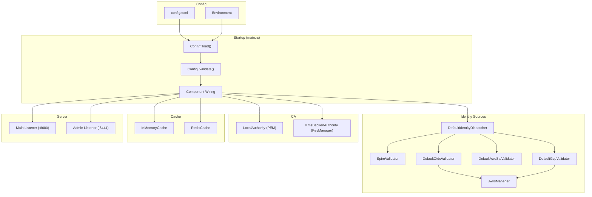

# Design Document — Server Wiring Gaps

## Overview

This design covers wiring all remaining implemented-but-disconnected features into Quartermaster's `main.rs` startup sequence. The gaps exist because domain modules (identity sources, Redis cache, KMS-delegated CA, etc.) were implemented in isolation with trait-based interfaces, but the top-level orchestration code in `main.rs` still uses hardcoded stubs or TODO placeholders.

The changes are confined to:
1. **Config parsing** — adding `identity: Option<IdentityConfig>` to `Config`, adding `policy_sync_interval_secs` to `DataStoreConfig`, adding `admin_addr` to `ServerConfig`.
2. **Startup wiring** — replacing placeholders in `main.rs` with config-driven construction.
3. **Server split** — conditional admin listener separation.
4. **CA abstraction** — introducing a `KmsBackedAuthority` that delegates signing to any `KeyManager`.

No new domain logic is introduced; this is purely integration/orchestration work connecting existing components.

## Architecture



### Decision Rationale

- **Cascading config fallback**: Legacy `[spire]`/`[dynamo]` sections remain supported to avoid breaking existing deployments. The new `[identity]` section takes precedence.
- **No-op enricher**: When SPIRE is not configured, a `NoOpSelectorEnricher` avoids optional-checking throughout the billet resolution path.
- **KmsBackedAuthority**: Rather than modifying `LocalAuthority` (which handles PEM parsing and CSR verification), a new `KmsBackedAuthority` struct delegates only the signing step to a `KeyManager`. This keeps separation of concerns clean.
- **Router split for admin**: The admin listener uses a separate `axum::Router` that includes only `/admin/*` routes. The main router conditionally excludes admin routes when split mode is active.

## Components and Interfaces

### 1. Config Changes

#### `Config` struct additions

```rust
// src/config/mod.rs
pub struct Config {
    // ... existing fields ...

    /// Multi-source identity configuration (optional; overrides legacy [spire] when present)
    pub identity: Option<IdentityConfig>,
}
```

#### `DataStoreConfig` field addition

```rust
// src/config/backends.rs
pub struct DataStoreConfig {
    // ... existing fields ...

    /// How often to sync policies (seconds). Default: 30.
    #[serde(default = "default_policy_sync_interval_secs")]
    pub policy_sync_interval_secs: u64,
}
```

#### `ServerConfig` field addition

```rust
// src/config/mod.rs
pub struct ServerConfig {
    pub host: String,
    pub port: u16,

    /// Optional separate bind address for admin routes (e.g., "0.0.0.0:8444").
    /// When set, admin routes are served exclusively on this listener.
    pub admin_addr: Option<String>,
}
```

### 2. Identity Wiring (main.rs)

The startup sequence for identity becomes:

```
1. Read config.identity (or fall back to legacy config.spire)
2. If identity.spire present OR legacy spire present:
     → Build SpireValidator
     → Build HttpSpireApiClient with configured address
3. If identity.oidc non-empty:
     → Build JwksManager with OIDC sources
     → Build DefaultOidcValidator
4. If identity.aws_sts.enabled:
     → Build DefaultAwsStsValidator
5. If identity.gcp.enabled:
     → Add Google JWKS to JwksManager
     → Build DefaultGcpValidator
6. Build DefaultIdentityDispatcher(spire, oidc, aws_sts, gcp)
7. Build ImplicitBilletMapper from oidc sources
8. Start JwksManager refresh tasks
```

### 3. No-Op Selector Enricher

```rust
// src/domain/billet/selector.rs
pub struct NoOpSelectorEnricher;

#[async_trait]
impl SelectorEnricher for NoOpSelectorEnricher {
    async fn fetch_selectors(&self, _spiffe_id: &str) -> Result<Vec<String>, SelectorError> {
        Ok(vec![])
    }
}
```

### 4. Redis Cache

A new `RedisCache` struct implementing the `Cache` trait, constructed from `RedisConfig.url`:

```rust
// src/domain/cache/redis.rs (new file)
pub struct RedisCache {
    client: redis::Client,
    connection_manager: redis::aio::ConnectionManager,
}

impl RedisCache {
    pub async fn new(url: &str) -> Result<Self, CacheError> { ... }
}

#[async_trait]
impl Cache for RedisCache {
    async fn get(...) -> Result<Option<CacheEntry>, CacheError> { ... }
    async fn set(...) -> Result<(), CacheError> { ... }
    async fn delete(...) -> Result<(), CacheError> { ... }
}
```

### 5. KMS-Backed Authority

```rust
// src/domain/cert/kms_authority.rs (new file)
pub struct KmsBackedAuthority {
    key_manager: Arc<dyn KeyManager>,
    ca_cert_pem: Vec<u8>,
    ca_cert_params: Arc<CertificateParams>,
    ttl: Duration,
}

impl KmsBackedAuthority {
    pub async fn new(
        key_manager: Arc<dyn KeyManager>,
        ca_cert_pem: &str,
        ttl: Duration,
    ) -> Result<Self, CertError> { ... }
}

#[async_trait]
impl Authority for KmsBackedAuthority {
    async fn issue(&self, req: CertIssueRequest) -> Result<CertIssueResponse, CertError> { ... }
    fn chain_pem(&self) -> &[u8] { ... }
}
```

The `KmsBackedAuthority` reuses CSR verification and certificate construction logic from `LocalAuthority`, but delegates the final signing operation to the `KeyManager` instead of a local PEM key. Implementation should either (a) extract shared logic (CSR verification, cert parameter construction) into helper functions called by both `LocalAuthority` and `KmsBackedAuthority`, or (b) have `KmsBackedAuthority` wrap a `LocalAuthority` with the signing step overridden. Either approach is acceptable — the choice is deferred to implementation.

### 6. Admin Router Split

```rust
// src/server/mod.rs additions

/// Builds the data-plane router (excludes admin when split mode is active).
pub fn build_main_router(state: Arc<AppState>, include_admin: bool) -> Router { ... }

/// Builds the admin-only router.
pub fn build_admin_router(state: Arc<AppState>) -> Router { ... }
```

### 7. Startup Validation Additions

The existing `Config::validate()` method is extended with:
- If `config.identity` is `Some`, call `identity.validate()` (already implemented in `IdentityConfig::validate()`).
- If `config.ca_backend` is `kms_delegated` without KMS sub-config → error (already implemented).
- If `config.signing_backend` is `kms_delegated` without KMS sub-config → error (already implemented).

### 8. Policy Sync Interval Resolution

A helper function resolves the sync interval with cascading priority:

```rust
fn resolve_policy_sync_interval(config: &Config) -> u64 {
    if let Some(ref ds) = config.datastore {
        ds.policy_sync_interval_secs
    } else if let Some(ref dynamo) = config.dynamo {
        dynamo.policy_sync_interval_secs
    } else {
        30 // default
    }
}
```

## Data Models

### Config TOML Structure (new `[identity]` section)

```toml
[identity]

[identity.spire]
trust_domain = "example.com"
jwks_path = "/run/spire/agent/jwks.json"
server_addr = "http://spire-server:8081"
audience = "quartermaster.example.com"

[[identity.oidc]]
prefix = "okta"
issuer = "https://mycompany.okta.com/oauth2/default"
client_ids = ["0oa1abc2def3ghi4j5k6"]
jwks_refresh_interval = "1h"
max_staleness = "24h"

[[identity.oidc.implicit_claims]]
claim = "groups"
billet_prefix = "okta-group"
in_tokens = false

[identity.aws_sts]
enabled = true
allowed_accounts = ["123456789012"]

[identity.gcp]
enabled = true
audience = "quartermaster.example.com"
jwks_refresh_interval = "1h"
max_staleness = "24h"
```

### DataStoreConfig Addition

```toml
[datastore]
backend = "dynamodb"
policy_sync_interval_secs = 60

[datastore.dynamodb]
region = "us-east-1"
```

### ServerConfig Addition

```toml
[server]
host = "0.0.0.0"
port = 8080
admin_addr = "0.0.0.0:8444"
```

### Redis Cache Entry Serialization

Cache entries are stored as JSON in Redis with a key format of `qm:cache:{subject}:{audience}`:

```json
{
  "billets": ["billing", "analytics"],
  "stored_at": "2024-01-15T10:30:00Z"
}
```

TTL is set via Redis's native key expiration (`SETEX`).

## Correctness Properties

*A property is a characteristic or behavior that should hold true across all valid executions of a system — essentially, a formal statement about what the system should do. Properties serve as the bridge between human-readable specifications and machine-verifiable correctness guarantees.*

### Property 1: Identity config deserialization round-trip

*For any* valid `IdentityConfig` value (with arbitrary OIDC sources, SPIRE config, AWS STS config, and GCP config), serializing it to TOML and deserializing it back SHALL produce a structurally equivalent configuration.

**Validates: Requirements 1.1**

### Property 2: Dispatcher validator presence matches enabled identity sources

*For any* valid `IdentityConfig`, after running the wiring logic, the `DefaultIdentityDispatcher` SHALL have `Some(validator)` for exactly those source types that are enabled/present in the config, and `None` for all others.

**Validates: Requirements 1.2, 1.3, 1.4, 1.6**

### Property 3: Policy sync interval cascading resolution

*For any* combination of `config.datastore.policy_sync_interval_secs` (present/absent) and `config.dynamo.policy_sync_interval_secs` (present/absent), the resolved interval SHALL equal the `datastore` value if present, else the `dynamo` value if present, else 30.

**Validates: Requirements 5.1, 5.2, 5.3**

### Property 4: Identity config validation rejects configs with no enabled sources

*For any* `IdentityConfig` where SPIRE is `None`, OIDC is empty, AWS STS is `None` or disabled, and GCP is `None` or disabled, validation SHALL return `NoSourcesConfigured` error.

**Validates: Requirements 7.1**

### Property 5: SPIRE API client address resolution

*For any* configuration where `identity.spire.server_addr` is present, the constructed `HttpSpireApiClient` SHALL use that address. *For any* configuration where only legacy SPIRE is present without `server_addr`, the default `http://localhost:8081` SHALL be used.

**Validates: Requirements 2.1, 2.2**

### Property 6: KMS-backed Authority certificate issuance

*For any* valid CSR and SPIFFE ID, a `KmsBackedAuthority` constructed with any conforming `KeyManager` SHALL produce a certificate with: subject CN equal to the SPIFFE ID, URI SANs containing the SPIFFE ID and all billets, and validity duration equal to the configured TTL.

**Validates: Requirements 4.1, 4.2**

## Error Handling

| Scenario | Behavior |
|----------|----------|
| `[identity]` configured but no sources enabled | Startup panics with descriptive error from `IdentityConfig::validate()` |
| `cache.backend == "redis"` but `[redis]` absent | Startup panics with "redis configuration is required..." |
| `[ca_backend]` is `kms_delegated` without KMS sub-config | Startup panics with descriptive error from `validate_signing_backend_config()` |
| `[signing_backend]` is `kms_delegated` without KMS sub-config | Startup panics with descriptive error |
| Redis connection fails at startup | Startup panics with connection error (fail-fast) |
| Redis connection fails at runtime | `Cache::get/set/delete` return `CacheError::BackendError`; callers degrade gracefully |
| KMS unavailable during CA cert issuance | `KmsBackedAuthority::issue()` returns `CertError::SigningFailed` |
| SPIRE API unreachable for selectors | `SelectorEnricher` returns empty selectors (existing graceful degradation) |
| Admin listener bind fails | Startup panics with bind error |
| Identity JWKS refresh fails | `JwksManager` logs warning, continues with stale keys up to `max_staleness`, then rejects tokens |
| Neither `[identity]` nor `[spire]` configured | Server starts; all token exchange requests get 401 (no validators in dispatcher) |

## Testing Strategy

### Unit Tests

- **Config deserialization**: Test that `[identity]` section deserializes correctly into `Config.identity` field.
- **ServerConfig admin_addr**: Test presence/absence of `admin_addr` in TOML.
- **DataStoreConfig sync interval**: Test default (30) and explicit values.
- **Policy sync interval resolution**: Test all three fallback paths (datastore → dynamo → default).
- **NoOpSelectorEnricher**: Test returns empty vec for any input.
- **Router split**: Test `build_main_router(include_admin: false)` returns 404 for `/admin/*`.
- **Router combined**: Test `build_main_router(include_admin: true)` serves admin routes.
- **Validation edge cases**: identity present with all disabled, kms_delegated without sub-config.

### Property-Based Tests

Property-based testing is appropriate for this feature because several wiring concerns involve pure configuration resolution functions with wide input spaces (varying config combinations).

**Library**: `proptest` (already in dev-dependencies)

**Configuration**: Minimum 100 iterations per property test.

**Tag format**: `Feature: wiring, Property {N}: {text}`

Tests to implement:
1. **Config identity round-trip** — generate arbitrary `IdentityConfig`, serialize/deserialize via TOML.
2. **Dispatcher wiring correctness** — generate identity configs with varying source combinations, run wiring helper, verify dispatcher state.
3. **Sync interval resolution** — generate all combinations of datastore/dynamo/neither, verify correct interval.
4. **Identity validation rejects empty** — generate configs where everything is disabled, verify error.
5. **SPIRE address selection** — generate configs with various SPIRE address combinations, verify resolution.
6. **KMS Authority cert issuance** — generate CSRs/SPIFFE IDs/billets, verify certificate properties (reuses existing proptest patterns from `src/domain/cert/mod.rs`).

### Integration Tests

- **Redis cache**: Requires a Redis instance (use `testcontainers` or skip in CI without Redis). Verify get/set/delete operations.
- **Admin listener separation**: Start full server with `admin_addr`, make HTTP requests to both ports, verify route isolation.
- **End-to-end token exchange**: With identity configured, verify full token exchange flow through dispatcher.
